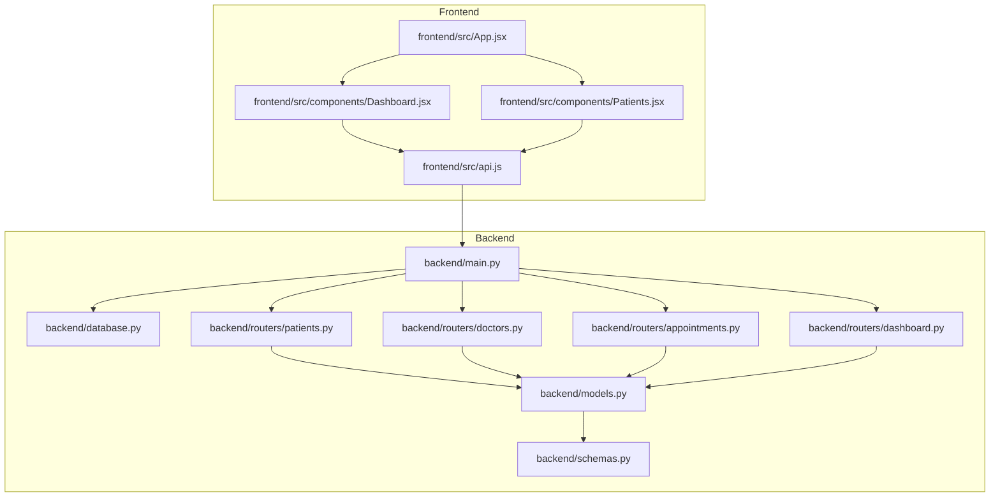
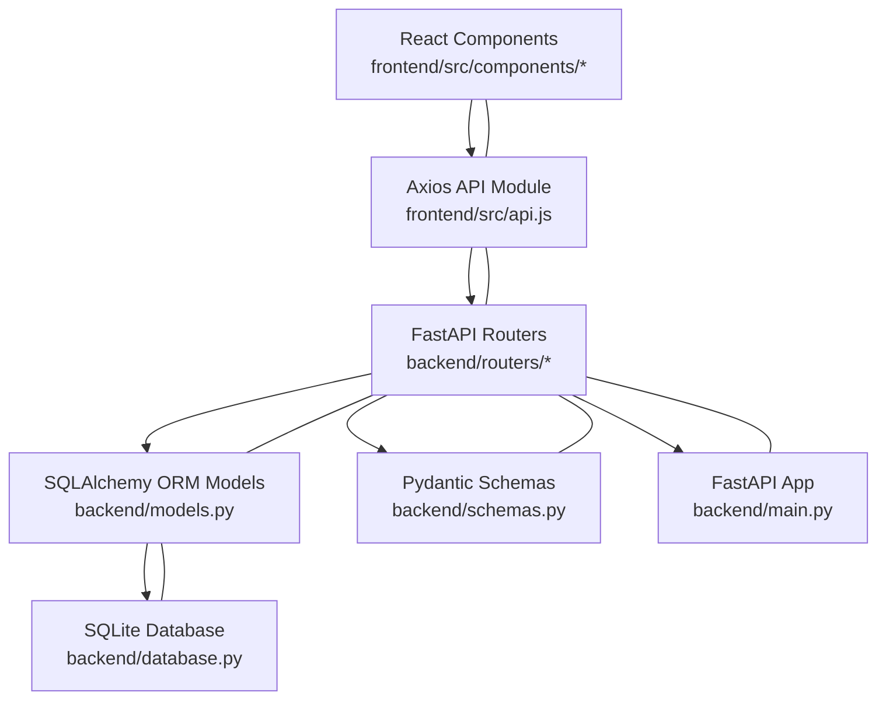
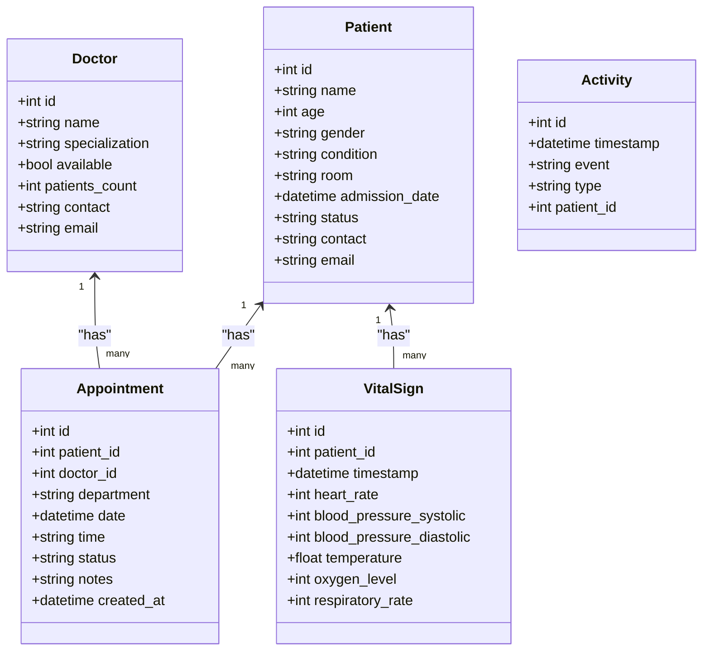
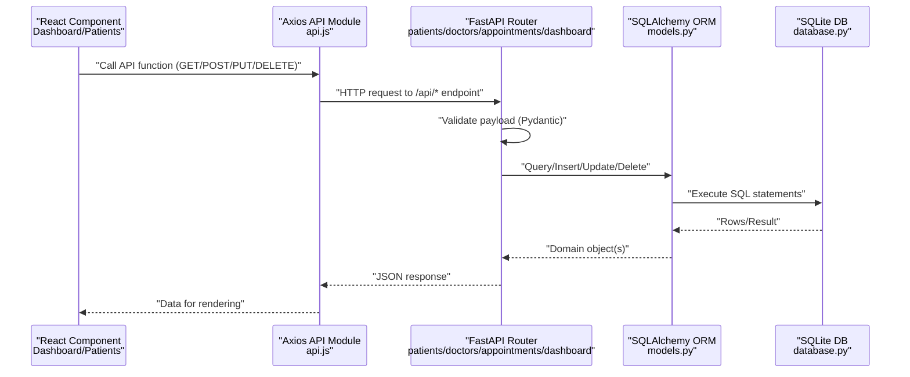
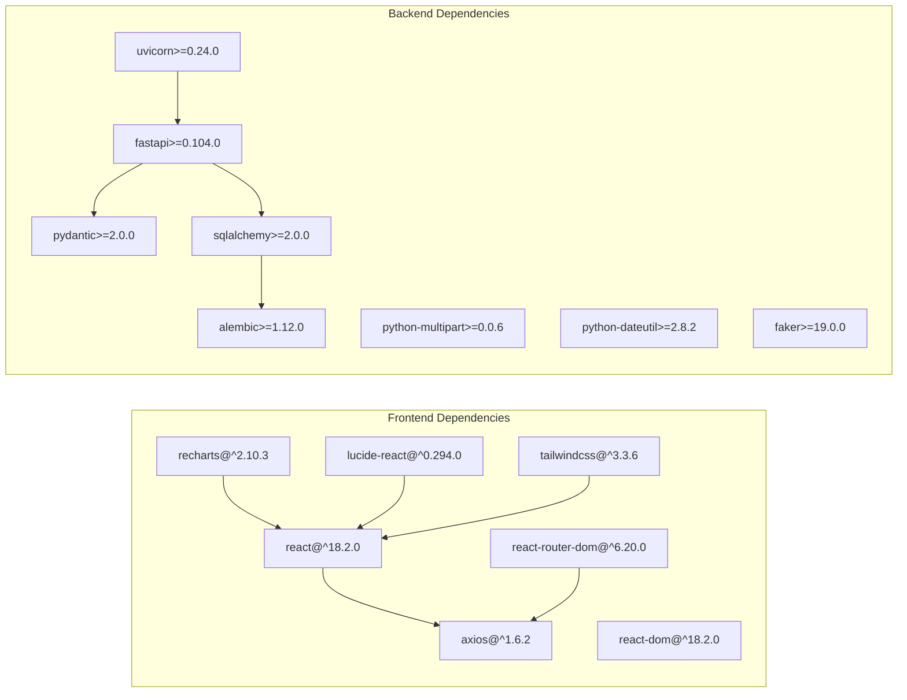

# Architecture Overview

<cite>
**Referenced Files in This Document**
- [README.md](file://README.md)
- [backend/main.py](file://backend/main.py)
- [backend/database.py](file://backend/database.py)
- [backend/models.py](file://backend/models.py)
- [backend/schemas.py](file://backend/schemas.py)
- [backend/routers/patients.py](file://backend/routers/patients.py)
- [backend/routers/doctors.py](file://backend/routers/doctors.py)
- [backend/routers/appointments.py](file://backend/routers/appointments.py)
- [backend/routers/dashboard.py](file://backend/routers/dashboard.py)
- [frontend/src/App.jsx](file://frontend/src/App.jsx)
- [frontend/src/api.js](file://frontend/src/api.js)
- [frontend/src/components/Dashboard.jsx](file://frontend/src/components/Dashboard.jsx)
- [frontend/src/components/Patients.jsx](file://frontend/src/components/Patients.jsx)
- [frontend/package.json](file://frontend/package.json)
- [backend/requirements.txt](file://backend/requirements.txt)
</cite>

## Table of Contents
1. [Introduction](#introduction)
2. [Project Structure](#project-structure)
3. [Core Components](#core-components)
4. [Architecture Overview](#architecture-overview)
5. [Detailed Component Analysis](#detailed-component-analysis)
6. [Dependency Analysis](#dependency-analysis)
7. [Performance Considerations](#performance-considerations)
8. [Troubleshooting Guide](#troubleshooting-guide)
9. [Conclusion](#conclusion)

## Introduction
This document presents the architecture of the Smart Healthcare Dashboard, a full-stack healthcare management system. The system follows an API-first design with:
- React 18 frontend using component-based architecture and routing
- FastAPI backend with modular router organization
- SQLAlchemy ORM models and Pydantic validation schemas
- TailwindCSS for styling and Recharts for visualizations

The backend exposes RESTful endpoints organized by domain (patients, doctors, appointments, vitals, dashboard), while the frontend consumes these APIs via Axios to render interactive dashboards and management views.

## Project Structure
The repository is split into two primary layers:
- Backend: FastAPI application with routers, models, schemas, and database configuration
- Frontend: React application with components, routing, and API service layer

**Diagram sources**
- [backend/main.py:1-43](file://backend/main.py#L1-L43)
- [backend/database.py:1-20](file://backend/database.py#L1-L20)
- [backend/models.py:1-75](file://backend/models.py#L1-L75)
- [backend/schemas.py:1-134](file://backend/schemas.py#L1-L134)
- [backend/routers/patients.py:1-95](file://backend/routers/patients.py#L1-L95)
- [backend/routers/doctors.py:1-70](file://backend/routers/doctors.py#L1-L70)
- [backend/routers/appointments.py:1-173](file://backend/routers/appointments.py#L1-L173)
- [backend/routers/dashboard.py:1-81](file://backend/routers/dashboard.py#L1-L81)
- [frontend/src/App.jsx:1-74](file://frontend/src/App.jsx#L1-L74)
- [frontend/src/api.js:1-56](file://frontend/src/api.js#L1-L56)
- [frontend/src/components/Dashboard.jsx:1-194](file://frontend/src/components/Dashboard.jsx#L1-L194)
- [frontend/src/components/Patients.jsx:1-119](file://frontend/src/components/Patients.jsx#L1-L119)

**Section sources**
- [README.md:106-136](file://README.md#L106-L136)
- [backend/main.py:1-43](file://backend/main.py#L1-L43)
- [frontend/src/App.jsx:1-74](file://frontend/src/App.jsx#L1-L74)

## Core Components
- Backend FastAPI application initializes CORS, creates database tables, and mounts routers for each domain.
- SQLAlchemy declarative base defines ORM models for Patient, Doctor, Appointment, VitalSign, and Activity.
- Pydantic schemas define validation and serialization for request/response payloads.
- Frontend React components implement controllers for data fetching and rendering, with Axios-based API service module.

Key implementation references:
- Backend entrypoint and CORS: [backend/main.py:1-43](file://backend/main.py#L1-L43)
- Database engine and dependency: [backend/database.py:1-20](file://backend/database.py#L1-L20)
- ORM models: [backend/models.py:1-75](file://backend/models.py#L1-L75)
- Validation schemas: [backend/schemas.py:1-134](file://backend/schemas.py#L1-L134)
- Frontend routing and sidebar: [frontend/src/App.jsx:1-74](file://frontend/src/App.jsx#L1-L74)
- Frontend API service: [frontend/src/api.js:1-56](file://frontend/src/api.js#L1-L56)

**Section sources**
- [backend/main.py:1-43](file://backend/main.py#L1-L43)
- [backend/database.py:1-20](file://backend/database.py#L1-L20)
- [backend/models.py:1-75](file://backend/models.py#L1-L75)
- [backend/schemas.py:1-134](file://backend/schemas.py#L1-L134)
- [frontend/src/App.jsx:1-74](file://frontend/src/App.jsx#L1-L74)
- [frontend/src/api.js:1-56](file://frontend/src/api.js#L1-L56)

## Architecture Overview
The system follows an API-first pattern:
- Frontend components call Axios-based API functions to fetch or mutate data.
- API functions target FastAPI routes grouped by domain.
- Routers handle request validation, query building, and database operations.
- SQLAlchemy models map to SQLite tables; Pydantic schemas enforce data contracts.

**Diagram sources**
- [frontend/src/components/Dashboard.jsx:1-194](file://frontend/src/components/Dashboard.jsx#L1-L194)
- [frontend/src/components/Patients.jsx:1-119](file://frontend/src/components/Patients.jsx#L1-L119)
- [frontend/src/api.js:1-56](file://frontend/src/api.js#L1-L56)
- [backend/routers/patients.py:1-95](file://backend/routers/patients.py#L1-L95)
- [backend/routers/doctors.py:1-70](file://backend/routers/doctors.py#L1-L70)
- [backend/routers/appointments.py:1-173](file://backend/routers/appointments.py#L1-L173)
- [backend/routers/dashboard.py:1-81](file://backend/routers/dashboard.py#L1-L81)
- [backend/models.py:1-75](file://backend/models.py#L1-L75)
- [backend/schemas.py:1-134](file://backend/schemas.py#L1-L134)
- [backend/database.py:1-20](file://backend/database.py#L1-L20)
- [backend/main.py:1-43](file://backend/main.py#L1-L43)

## Detailed Component Analysis

### Backend MVC Pattern Implementation
- Model: SQLAlchemy ORM classes define entity schemas and relationships.
- View: FastAPI routers expose endpoints returning JSON responses.
- Controller: Routers orchestrate validation (Pydantic), query construction, and persistence.

**Diagram sources**
- [backend/models.py:1-75](file://backend/models.py#L1-L75)

**Section sources**
- [backend/models.py:1-75](file://backend/models.py#L1-L75)
- [backend/schemas.py:1-134](file://backend/schemas.py#L1-L134)
- [backend/routers/patients.py:1-95](file://backend/routers/patients.py#L1-L95)
- [backend/routers/doctors.py:1-70](file://backend/routers/doctors.py#L1-L70)
- [backend/routers/appointments.py:1-173](file://backend/routers/appointments.py#L1-L173)
- [backend/routers/dashboard.py:1-81](file://backend/routers/dashboard.py#L1-L81)

### Data Flow: Frontend to Backend
The typical request flow from a React component to the backend:

**Diagram sources**
- [frontend/src/components/Dashboard.jsx:1-194](file://frontend/src/components/Dashboard.jsx#L1-L194)
- [frontend/src/components/Patients.jsx:1-119](file://frontend/src/components/Patients.jsx#L1-L119)
- [frontend/src/api.js:1-56](file://frontend/src/api.js#L1-L56)
- [backend/routers/patients.py:1-95](file://backend/routers/patients.py#L1-L95)
- [backend/routers/doctors.py:1-70](file://backend/routers/doctors.py#L1-L70)
- [backend/routers/appointments.py:1-173](file://backend/routers/appointments.py#L1-L173)
- [backend/routers/dashboard.py:1-81](file://backend/routers/dashboard.py#L1-L81)
- [backend/models.py:1-75](file://backend/models.py#L1-L75)
- [backend/database.py:1-20](file://backend/database.py#L1-L20)

### API-First Design and CORS
- API-first: Frontend components depend on clearly defined endpoints; API responses are consumed directly.
- CORS: Enabled for local development origins to allow cross-origin requests from the React dev server.

References:
- API endpoints and health checks: [backend/main.py:31-38](file://backend/main.py#L31-L38)
- CORS configuration: [backend/main.py:15-22](file://backend/main.py#L15-L22)
- Frontend API base URL: [frontend/src/api.js:3](file://frontend/src/api.js#L3)

**Section sources**
- [backend/main.py:15-22](file://backend/main.py#L15-L22)
- [backend/main.py:31-38](file://backend/main.py#L31-L38)
- [frontend/src/api.js:3](file://frontend/src/api.js#L3)

### Routing and Component Controllers
- Frontend routing: [frontend/src/App.jsx:53-71](file://frontend/src/App.jsx#L53-L71)
- Dashboard controller: [frontend/src/components/Dashboard.jsx:26-62](file://frontend/src/components/Dashboard.jsx#L26-L62)
- Patients controller: [frontend/src/components/Patients.jsx:5-30](file://frontend/src/components/Patients.jsx#L5-L30)
- API service module: [frontend/src/api.js:12-53](file://frontend/src/api.js#L12-L53)

**Section sources**
- [frontend/src/App.jsx:53-71](file://frontend/src/App.jsx#L53-L71)
- [frontend/src/components/Dashboard.jsx:26-62](file://frontend/src/components/Dashboard.jsx#L26-L62)
- [frontend/src/components/Patients.jsx:5-30](file://frontend/src/components/Patients.jsx#L5-L30)
- [frontend/src/api.js:12-53](file://frontend/src/api.js#L12-L53)

## Dependency Analysis
Technology stack and module-level dependencies:
- Frontend: React 18, Vite, TailwindCSS, Recharts, Lucide React, Axios
- Backend: FastAPI, Uvicorn, Pydantic, SQLAlchemy, python-dateutil, faker

**Diagram sources**
- [frontend/package.json:12-32](file://frontend/package.json#L12-L32)
- [backend/requirements.txt:1-9](file://backend/requirements.txt#L1-L9)

**Section sources**
- [frontend/package.json:12-32](file://frontend/package.json#L12-L32)
- [backend/requirements.txt:1-9](file://backend/requirements.txt#L1-L9)

## Performance Considerations
- Database queries: Use pagination parameters (skip/limit) and selective filters to avoid large result sets.
- Frontend rendering: Lazy-load heavy charts and limit concurrent API calls where possible.
- CORS: Keep allowed origins minimal during development; restrict in production environments.
- ORM efficiency: Prefer eager loading and filtered queries to reduce N+1 issues.

## Troubleshooting Guide
Common issues and resolutions:
- CORS errors: Verify allowed origins match frontend URLs and credentials are enabled as needed.
  - Reference: [backend/main.py:15-22](file://backend/main.py#L15-L22)
- Health check failures: Confirm the root endpoint returns expected metadata and docs path.
  - Reference: [backend/main.py:31-38](file://backend/main.py#L31-L38)
- Database initialization: Ensure tables are created before serving requests.
  - Reference: [backend/main.py:6-7](file://backend/main.py#L6-L7)
- API connectivity: Validate base URL and endpoint paths align with router prefixes.
  - Reference: [frontend/src/api.js:3](file://frontend/src/api.js#L3)

**Section sources**
- [backend/main.py:6-7](file://backend/main.py#L6-L7)
- [backend/main.py:15-22](file://backend/main.py#L15-L22)
- [backend/main.py:31-38](file://backend/main.py#L31-L38)
- [frontend/src/api.js:3](file://frontend/src/api.js#L3)

## Conclusion
The Smart Healthcare Dashboard employs a clean separation of concerns:
- Frontend components act as controllers, orchestrating data retrieval and rendering.
- Backend routers serve as controllers, validating inputs and delegating to models.
- Models and schemas encapsulate data contracts and persistence logic.
- The API-first approach and CORS configuration enable seamless frontend-backend integration.

This architecture supports scalability, maintainability, and rapid feature iteration while leveraging modern tools for productivity and developer experience.