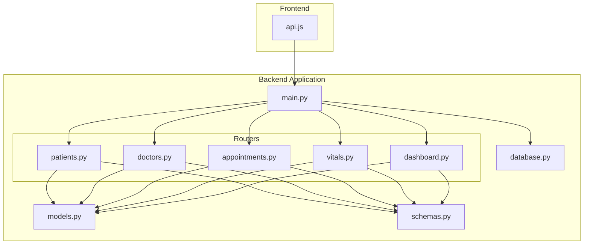
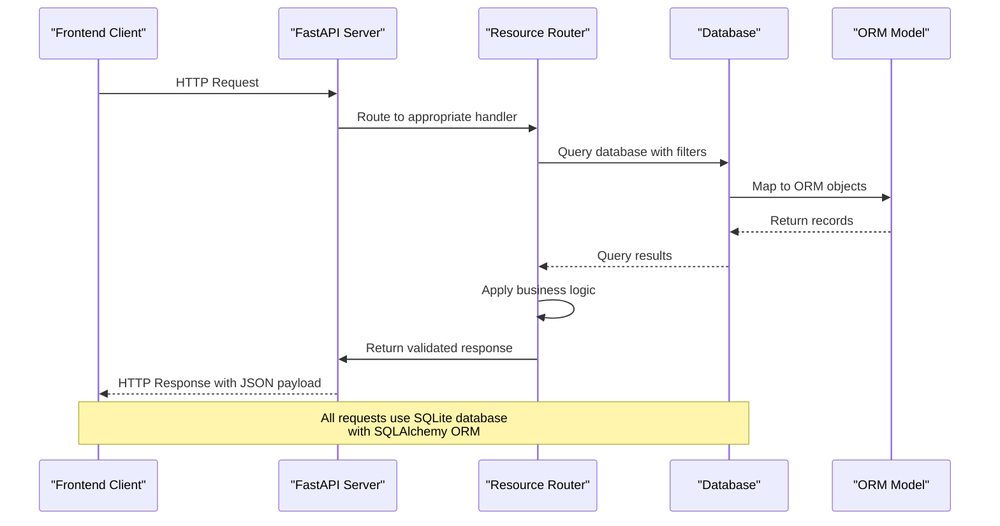
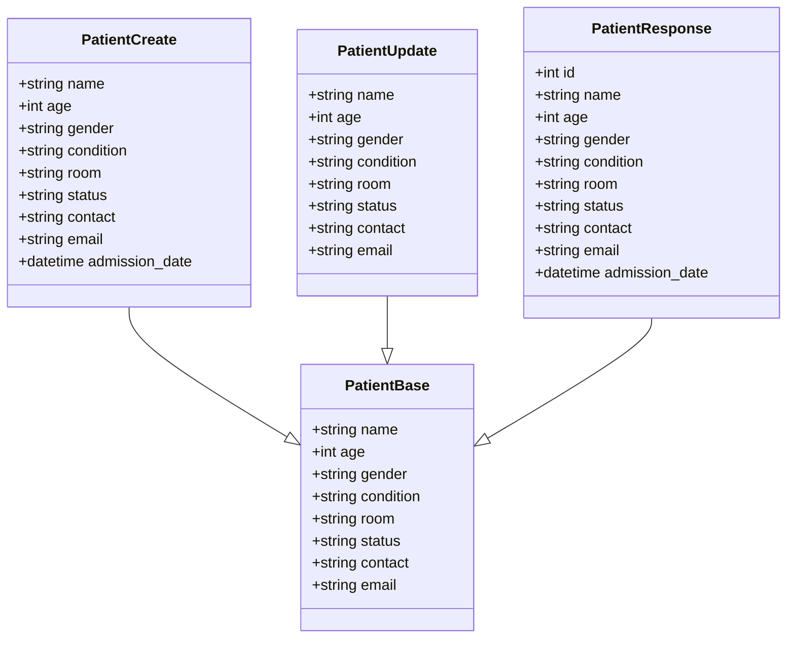
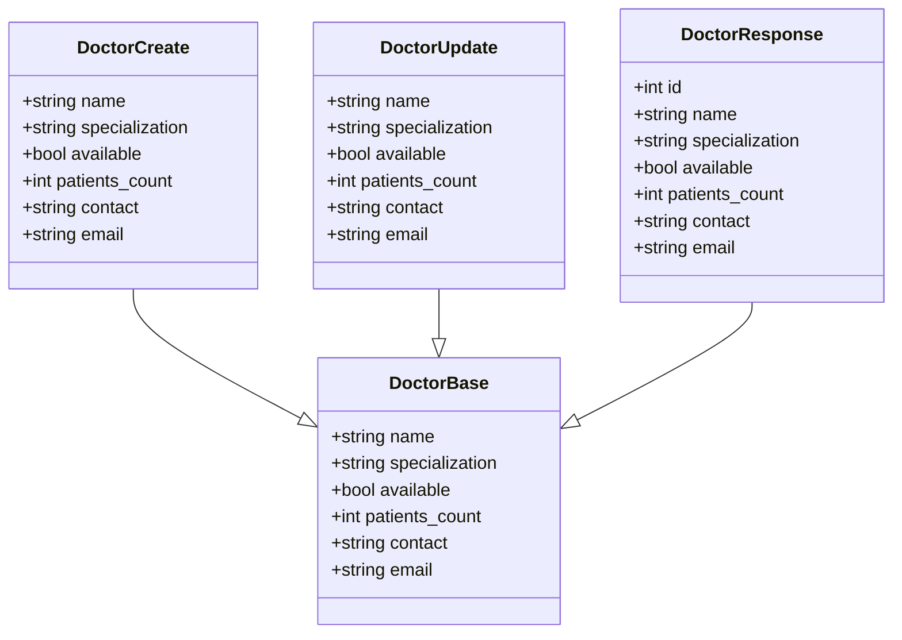
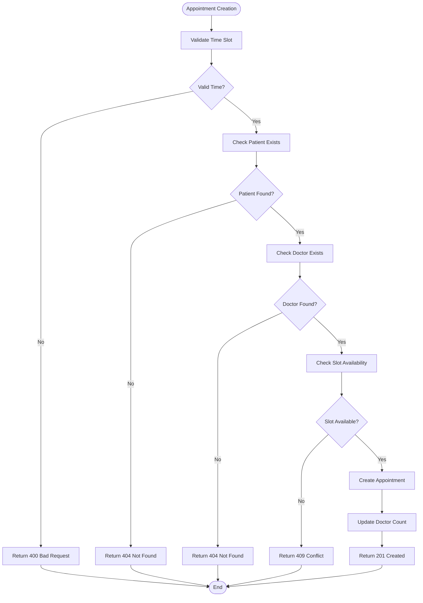
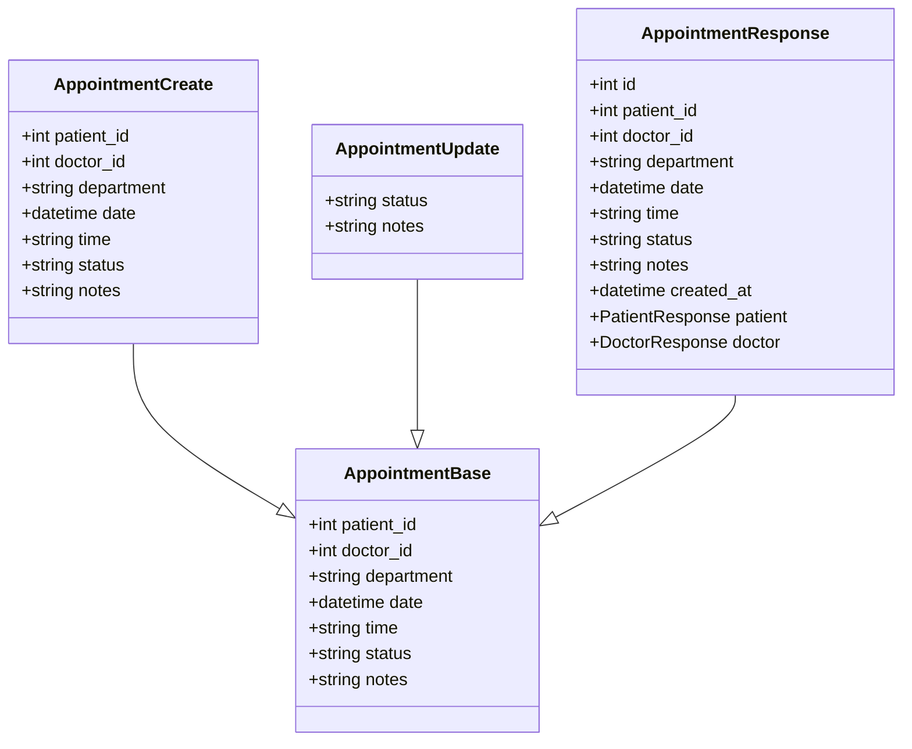
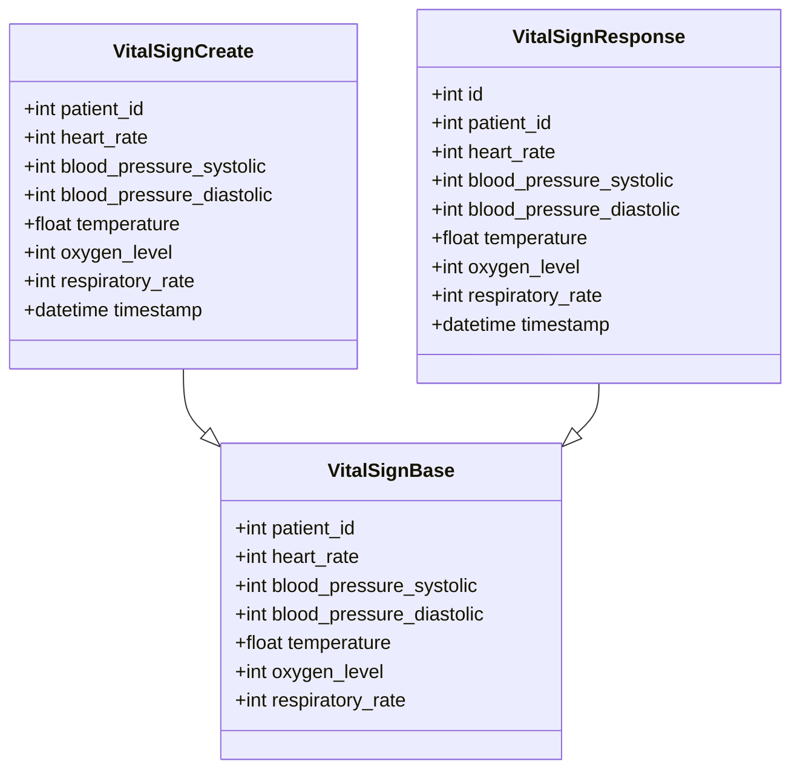
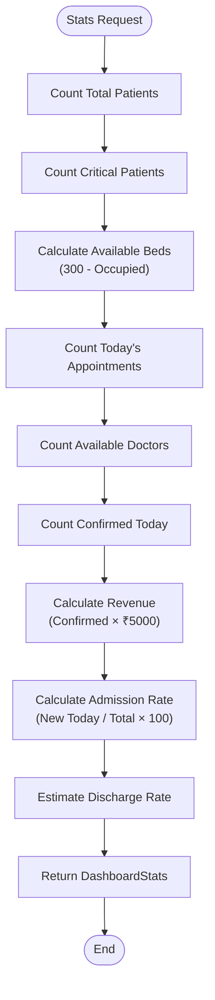
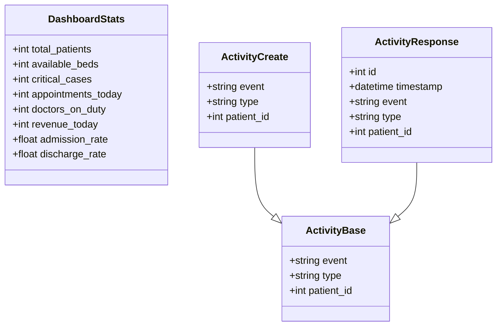
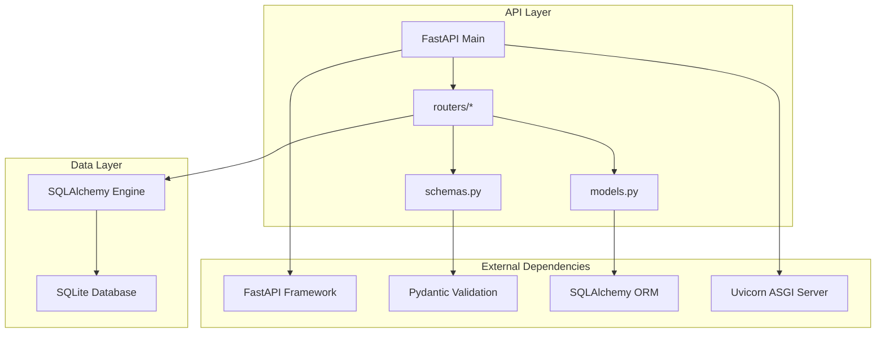

# API Endpoints Reference

<cite>
**Referenced Files in This Document**
- [main.py](file://backend/main.py)
- [patients.py](file://backend/routers/patients.py)
- [doctors.py](file://backend/routers/doctors.py)
- [appointments.py](file://backend/routers/appointments.py)
- [vitals.py](file://backend/routers/vitals.py)
- [dashboard.py](file://backend/routers/dashboard.py)
- [schemas.py](file://backend/schemas.py)
- [models.py](file://backend/models.py)
- [database.py](file://backend/database.py)
- [api.js](file://frontend/src/api.js)
- [README.md](file://README.md)
</cite>

## Table of Contents
1. [Introduction](#introduction)
2. [Project Structure](#project-structure)
3. [Core Components](#core-components)
4. [Architecture Overview](#architecture-overview)
5. [Detailed Component Analysis](#detailed-component-analysis)
6. [Dependency Analysis](#dependency-analysis)
7. [Performance Considerations](#performance-considerations)
8. [Troubleshooting Guide](#troubleshooting-guide)
9. [Conclusion](#conclusion)

## Introduction
This document provides comprehensive API endpoint documentation for the Smart Healthcare Dashboard. It covers all RESTful endpoints, their request/response schemas, validation rules, filtering capabilities, and common usage patterns. The backend is built with FastAPI and SQLAlchemy, while the frontend consumes these endpoints using Axios.

## Project Structure
The API follows a modular FastAPI architecture with separate routers for each resource domain. The main application initializes database tables, configures CORS, and includes all routers.

**Diagram sources**
- [main.py:1-43](file://backend/main.py#L1-L43)
- [patients.py:1-95](file://backend/routers/patients.py#L1-L95)
- [doctors.py:1-70](file://backend/routers/doctors.py#L1-L70)
- [appointments.py:1-173](file://backend/routers/appointments.py#L1-L173)
- [vitals.py:1-72](file://backend/routers/vitals.py#L1-L72)
- [dashboard.py:1-81](file://backend/routers/dashboard.py#L1-L81)

**Section sources**
- [main.py:1-43](file://backend/main.py#L1-L43)
- [database.py:1-20](file://backend/database.py#L1-L20)

## Core Components
The API consists of five main resource domains with standardized CRUD operations:

### Resource Domains
- **Patients**: Patient management with advanced search and filtering
- **Doctors**: Medical staff directory with availability tracking
- **Appointments**: Healthcare appointment scheduling with status management
- **Vitals**: Patient vital signs monitoring and trend analysis
- **Dashboard**: System statistics and recent activity feed

### Shared Patterns
- Pagination support via skip/limit parameters
- Comprehensive validation using Pydantic models
- Standardized error handling with HTTP status codes
- Relationship-aware responses with nested objects

**Section sources**
- [schemas.py:1-134](file://backend/schemas.py#L1-L134)
- [models.py:1-75](file://backend/models.py#L1-L75)

## Architecture Overview
The API follows RESTful principles with clear resource boundaries and consistent response patterns.

**Diagram sources**
- [main.py:24-29](file://backend/main.py#L24-L29)
- [database.py:14-19](file://backend/database.py#L14-L19)

## Detailed Component Analysis

### Patients API
The patients endpoint provides comprehensive patient management with advanced search and filtering capabilities.

#### Endpoint Specifications
- **GET /api/patients**
  - **Query Parameters**:
    - `skip`: int (default: 0) - Number of records to skip
    - `limit`: int (default: 100) - Maximum number of records to return
    - `search`: string (optional) - Fuzzy search by name or condition
    - `status`: string (optional) - Filter by patient status
    - `condition`: string (optional) - Filter by medical condition
  - **Response**: Array of PatientResponse objects
  - **Pagination**: Supported via skip/limit parameters

- **GET /api/patients/{id}**
  - **Path Parameter**: `id` - Patient identifier
  - **Response**: Single PatientResponse object
  - **Status Codes**: 200 OK, 404 Not Found

- **POST /api/patients**
  - **Request Body**: PatientCreate schema
  - **Response**: PatientResponse object
  - **Status Codes**: 201 Created, 409 Conflict, 422 Unprocessable Entity
  - **Validation**: Duplicate detection by name and room

- **PUT /api/patients/{id}**
  - **Path Parameter**: `id` - Patient identifier
  - **Request Body**: PatientUpdate schema (partial updates)
  - **Response**: PatientResponse object
  - **Status Codes**: 200 OK, 404 Not Found

- **DELETE /api/patients/{id}**
  - **Path Parameter**: `id` - Patient identifier
  - **Response**: No content
  - **Status Codes**: 204 No Content, 404 Not Found

#### Request/Response Schemas

**Diagram sources**
- [schemas.py:6-34](file://backend/schemas.py#L6-L34)

#### Filtering and Validation Rules
- **Search Logic**: Case-insensitive fuzzy search on name and condition fields
- **Status Values**: Enumerated values (Stable, Critical, Observation, Recovering, Discharged)
- **Duplicate Prevention**: Unique constraint on (name, room) combination
- **Age Validation**: Positive integer values
- **Room Assignment**: Unique room numbers required

**Section sources**
- [patients.py:11-95](file://backend/routers/patients.py#L11-L95)
- [schemas.py:16-34](file://backend/schemas.py#L16-L34)

### Doctors API
The doctors endpoint manages medical staff with availability tracking and specialization filtering.

#### Endpoint Specifications
- **GET /api/doctors**
  - **Query Parameters**:
    - `skip`: int (default: 0) - Number of records to skip
    - `limit`: int (default: 100) - Maximum number of records to return
    - `available`: boolean (optional) - Filter by availability status
    - `specialization`: string (optional) - Filter by medical specialization
  - **Response**: Array of DoctorResponse objects

- **GET /api/doctors/{id}**
  - **Path Parameter**: `id` - Doctor identifier
  - **Response**: Single DoctorResponse object

- **POST /api/doctors**
  - **Request Body**: DoctorCreate schema
  - **Response**: DoctorResponse object
  - **Status Codes**: 201 Created

- **PUT /api/doctors/{id}**
  - **Path Parameter**: `id` - Doctor identifier
  - **Request Body**: DoctorUpdate schema
  - **Response**: DoctorResponse object

- **DELETE /api/doctors/{id}**
  - **Path Parameter**: `id` - Doctor identifier
  - **Response**: No content

#### Request/Response Schemas

**Diagram sources**
- [schemas.py:37-60](file://backend/schemas.py#L37-L60)

#### Business Rules
- **Availability Tracking**: Automatic availability status management
- **Patient Load**: Maintains count of assigned patients
- **Specialization Categories**: Medical specialties with predefined categories

**Section sources**
- [doctors.py:10-70](file://backend/routers/doctors.py#L10-L70)
- [schemas.py:45-60](file://backend/schemas.py#L45-L60)

### Appointments API
The appointments endpoint handles healthcare appointment scheduling with sophisticated status management and validation.

#### Endpoint Specifications
- **GET /api/appointments**
  - **Query Parameters**:
    - `skip`: int (default: 0) - Number of records to skip
    - `limit`: int (default: 100) - Maximum number of records to return
    - `status`: string (optional) - Filter by appointment status
    - `doctor_id`: int (optional) - Filter by doctor identifier
    - `patient_id`: int (optional) - Filter by patient identifier
  - **Response**: Array of AppointmentResponse objects
  - **Automatic Status Updates**: Pending appointments auto-updated based on time rules

- **GET /api/appointments/{id}**
  - **Path Parameter**: `id` - Appointment identifier
  - **Response**: Single AppointmentResponse object

- **POST /api/appointments**
  - **Request Body**: AppointmentCreate schema
  - **Response**: AppointmentResponse object
  - **Status Codes**: 201 Created, 400 Bad Request, 404 Not Found, 409 Conflict
  - **Validation**: Time slot validation, patient/doctor existence checks

- **PUT /api/appointments/{id}**
  - **Path Parameter**: `id` - Appointment identifier
  - **Request Body**: AppointmentUpdate schema
  - **Response**: AppointmentResponse object

- **DELETE /api/appointments/{id}**
  - **Path Parameter**: `id` - Appointment identifier
  - **Response**: No content

- **GET /api/appointments/revenue/today**
  - **Description**: Calculate daily revenue (₹5000 per confirmed appointment)
  - **Response**: Revenue calculation object with date, count, and currency

#### Time Slot Validation

**Diagram sources**
- [appointments.py:84-125](file://backend/routers/appointments.py#L84-L125)

#### Request/Response Schemas

**Diagram sources**
- [schemas.py:63-86](file://backend/schemas.py#L63-L86)

#### Status Management
- **Pending**: New appointments (auto-updated after 24/48 hours)
- **Confirmed**: Appointments that remain pending after 24 hours
- **Cancelled**: Appointments older than 48 hours
- **Completed**: Appointments that have been served

**Section sources**
- [appointments.py:53-173](file://backend/routers/appointments.py#L53-L173)
- [schemas.py:72-86](file://backend/schemas.py#L72-L86)

### Vitals API
The vitals endpoint monitors patient vital signs with trend analysis capabilities.

#### Endpoint Specifications
- **GET /api/vitals/{patient_id}**
  - **Path Parameter**: `patient_id` - Patient identifier
  - **Query Parameters**:
    - `skip`: int (default: 0) - Number of records to skip
    - `limit`: int (default: 100) - Maximum number of records to return
  - **Response**: Array of VitalSignResponse objects

- **GET /api/vitals/{patient_id}/trends**
  - **Path Parameter**: `patient_id` - Patient identifier
  - **Query Parameters**:
    - `hours`: int (default: 24) - Time window for trend analysis
  - **Response**: Array of VitalSignResponse objects ordered by timestamp

- **POST /api/vitals**
  - **Request Body**: VitalSignCreate schema
  - **Response**: VitalSignResponse object
  - **Status Codes**: 201 Created, 404 Not Found

- **DELETE /api/vitals/{id}**
  - **Path Parameter**: `id` - Vital sign record identifier
  - **Response**: No content

#### Request/Response Schemas

**Diagram sources**
- [schemas.py:89-106](file://backend/schemas.py#L89-L106)

#### Trend Analysis
- **Default Window**: Last 24 hours
- **Granularity**: Records ordered by timestamp ascending
- **Use Cases**: 24-hour trend visualization, anomaly detection

**Section sources**
- [vitals.py:11-72](file://backend/routers/vitals.py#L11-L72)
- [schemas.py:98-106](file://backend/schemas.py#L98-L106)

### Dashboard API
The dashboard endpoint provides system-wide statistics and recent activity feed.

#### Endpoint Specifications
- **GET /api/dashboard/stats**
  - **Response**: DashboardStats object containing:
    - `total_patients`: Total patient count
    - `available_beds`: Bed availability (300 total beds)
    - `critical_cases`: Critical condition patients
    - `appointments_today`: Today's appointments
    - `doctors_on_duty`: Available doctors
    - `revenue_today`: Today's revenue (₹5000 per confirmed)
    - `admission_rate`: Percentage of new admissions
    - `discharge_rate`: Estimated discharge rate

- **GET /api/recent-activity**
  - **Response**: Array of ActivityResponse objects
  - **Limit**: 20 most recent activities
  - **Order**: Timestamp descending

- **GET /api/health**
  - **Response**: Health check object with status and metadata

#### Dashboard Statistics Calculation

**Diagram sources**
- [dashboard.py:12-62](file://backend/routers/dashboard.py#L12-L62)

#### Request/Response Schemas

**Diagram sources**
- [schemas.py:125-134](file://backend/schemas.py#L125-L134)
- [schemas.py:109-122](file://backend/schemas.py#L109-L122)

**Section sources**
- [dashboard.py:12-81](file://backend/routers/dashboard.py#L12-L81)
- [schemas.py:125-134](file://backend/schemas.py#L125-L134)

## Dependency Analysis
The API demonstrates clean separation of concerns with clear dependency relationships.

**Diagram sources**
- [main.py:1-43](file://backend/main.py#L1-L43)
- [schemas.py:1-4](file://backend/schemas.py#L1-L4)
- [models.py:1-5](file://backend/models.py#L1-L5)

### Component Coupling
- **High Cohesion**: Each router focuses on a single resource domain
- **Low Coupling**: Routers depend only on shared schemas and database layer
- **Clear Interfaces**: Consistent request/response patterns across all endpoints

**Section sources**
- [main.py:24-29](file://backend/main.py#L24-L29)
- [schemas.py:1-134](file://backend/schemas.py#L1-L134)

## Performance Considerations
The API implements several performance optimization strategies:

### Pagination Strategy
- **Default Limits**: 100 records per page to prevent large response payloads
- **Skip/Limit Pattern**: Efficient cursor-based pagination
- **Database Indexes**: Primary keys and foreign keys properly indexed

### Query Optimization
- **Selective Field Loading**: Response models minimize data transfer
- **Relationship Queries**: Eager loading prevents N+1 query problems
- **Filter Early**: Database-level filtering reduces result sets

### Caching Opportunities
- **Dashboard Stats**: Consider caching for frequently accessed statistics
- **Recent Activity**: Recent items could benefit from short-term caching
- **Static Data**: Doctor and patient lists could use caching strategies

## Troubleshooting Guide

### Common Error Scenarios

#### Patient Management Issues
- **Duplicate Patient Error**: Occurs when creating patient with existing (name, room) combination
- **Patient Not Found**: Returns 404 for invalid patient identifiers
- **Search Limitations**: Search is case-insensitive but requires at least 2 characters

#### Appointment Scheduling Problems
- **Time Slot Conflicts**: Booking conflicts return 409 Conflict
- **Invalid Time Slots**: Only 15-minute intervals 9AM-5PM are valid
- **Missing Dependencies**: Creating appointments requires existing patient/doctor

#### Vitals Monitoring Errors
- **Patient Validation**: All vitals operations require existing patient
- **Timestamp Ordering**: Trends are automatically ordered by timestamp

#### Database Connection Issues
- **SQLite File Access**: Ensure healthcare.db file has write permissions
- **Connection Pooling**: Database connections are managed automatically

### Debugging Strategies
- **Enable Logging**: Use FastAPI debug mode for detailed error information
- **Validate Schemas**: Check request payloads against Pydantic models
- **Test Endpoints**: Use curl commands or Postman for manual testing
- **Monitor Database**: Check SQLite file integrity and size limits

**Section sources**
- [patients.py:48-66](file://backend/routers/patients.py#L48-L66)
- [appointments.py:84-125](file://backend/routers/appointments.py#L84-L125)
- [vitals.py:50-61](file://backend/routers/vitals.py#L50-L61)

## Conclusion
The Smart Healthcare Dashboard API provides a comprehensive, well-structured RESTful interface for healthcare management operations. The implementation demonstrates strong architectural principles with clear separation of concerns, comprehensive validation, and consistent error handling. The modular design allows for easy maintenance and future enhancements while maintaining backward compatibility.

Key strengths include:
- **Complete CRUD Operations**: Full lifecycle management for all resources
- **Advanced Filtering**: Sophisticated search and filtering capabilities
- **Business Logic Integration**: Real-world healthcare workflows embedded in API design
- **Type Safety**: Strong typing with Pydantic validation
- **Performance Considerations**: Pagination and query optimization built-in

The API serves as a solid foundation for healthcare applications requiring robust patient management, appointment scheduling, and monitoring capabilities.