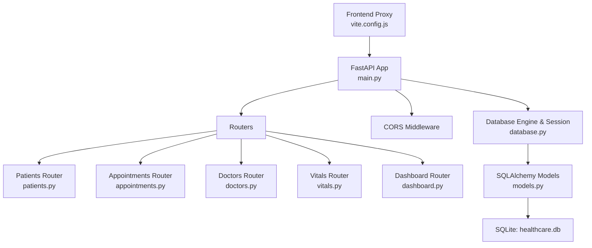
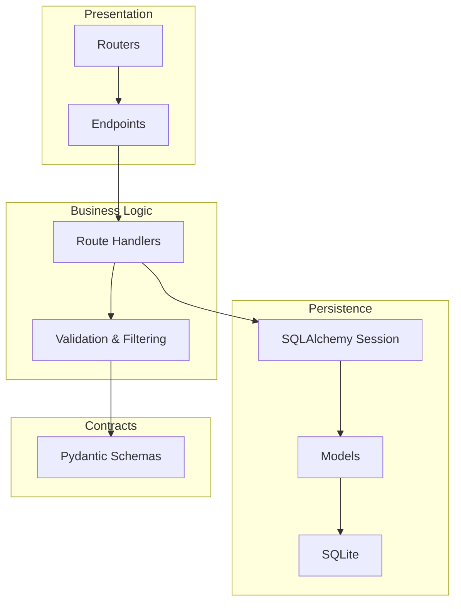
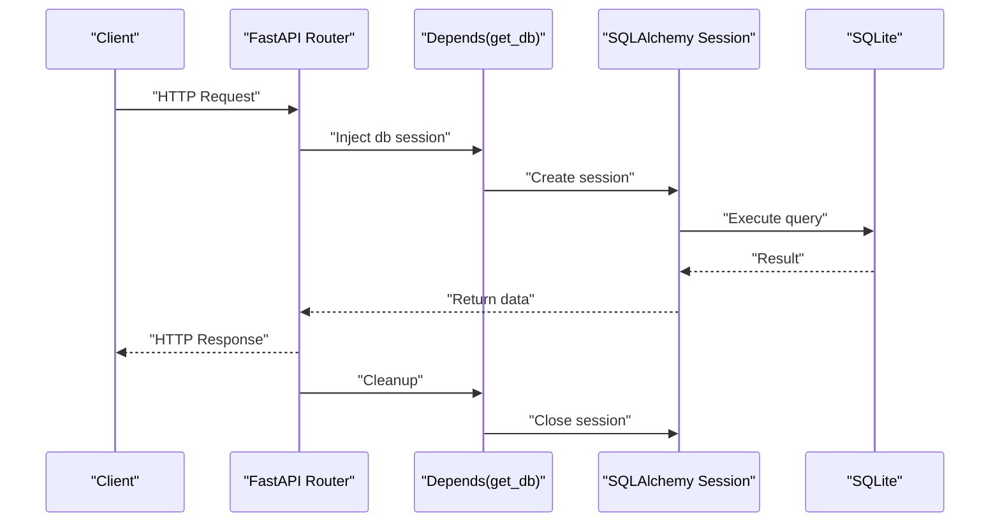
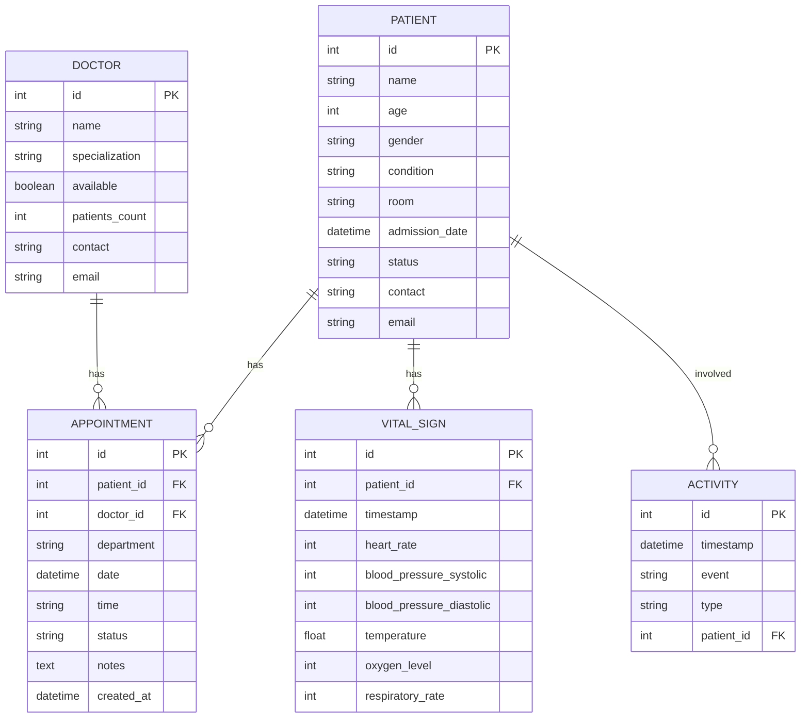
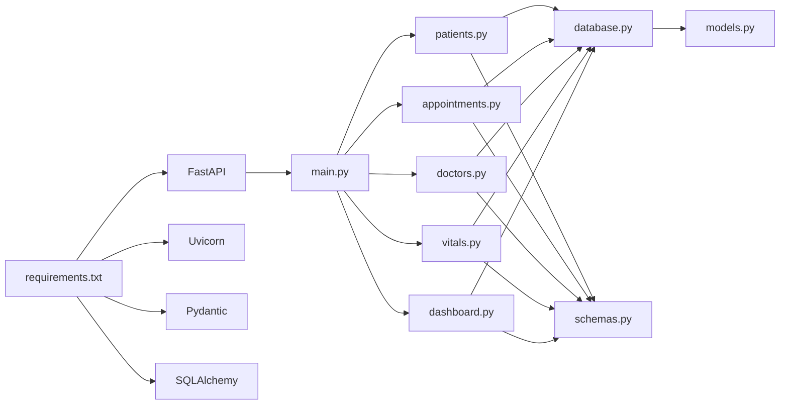

# Backend API Documentation

<cite>
**Referenced Files in This Document**
- [main.py](file://backend/main.py)
- [database.py](file://backend/database.py)
- [models.py](file://backend/models.py)
- [schemas.py](file://backend/schemas.py)
- [patients.py](file://backend/routers/patients.py)
- [appointments.py](file://backend/routers/appointments.py)
- [doctors.py](file://backend/routers/doctors.py)
- [vitals.py](file://backend/routers/vitals.py)
- [dashboard.py](file://backend/routers/dashboard.py)
- [api.js](file://frontend/src/api.js)
- [vite.config.js](file://frontend/vite.config.js)
- [requirements.txt](file://backend/requirements.txt)
- [README.md](file://README.md)
- [Procfile](file://Procfile)
- [DEPLOYMENT.md](file://DEPLOYMENT.md)
- [DEPLOYMENT_CHECKLIST.md](file://DEPLOYMENT_CHECKLIST.md)
</cite>

## Update Summary
**Changes Made**
- Updated CORS middleware configuration section to document wildcard origins support
- Added production deployment considerations for wildcard origins
- Enhanced troubleshooting guide with CORS configuration guidance
- Updated deployment documentation to reflect wildcard origins for production

## Table of Contents
1. [Introduction](#introduction)
2. [Project Structure](#project-structure)
3. [Core Components](#core-components)
4. [Architecture Overview](#architecture-overview)
5. [Detailed Component Analysis](#detailed-component-analysis)
6. [Dependency Analysis](#dependency-analysis)
7. [Performance Considerations](#performance-considerations)
8. [Troubleshooting Guide](#troubleshooting-guide)
9. [Conclusion](#conclusion)
10. [Appendices](#appendices)

## Introduction
This document provides comprehensive API documentation for the Smart Healthcare Dashboard backend. It covers all RESTful endpoints, request/response schemas, routing and dependency injection patterns, database session management, error handling, and integration guidance for frontend components. The backend is built with FastAPI, SQLAlchemy ORM, and Pydantic validation, and serves a SQLite database.

## Project Structure
The backend is organized around a FastAPI application that mounts modular routers for patients, appointments, doctors, vitals, and dashboard endpoints. Data persistence is handled via SQLAlchemy with declarative models and Pydantic schemas for validation and serialization.

**Diagram sources**
- [main.py:1-56](file://backend/main.py#L1-L56)
- [patients.py:1-95](file://backend/routers/patients.py#L1-L95)
- [appointments.py:1-173](file://backend/routers/appointments.py#L1-L173)
- [doctors.py:1-70](file://backend/routers/doctors.py#L1-L70)
- [vitals.py:1-72](file://backend/routers/vitals.py#L1-L72)
- [dashboard.py:1-81](file://backend/routers/dashboard.py#L1-L81)
- [database.py:1-20](file://backend/database.py#L1-L20)
- [models.py:1-75](file://backend/models.py#L1-L75)
- [vite.config.js:1-17](file://frontend/vite.config.js#L1-L17)

**Section sources**
- [main.py:1-56](file://backend/main.py#L1-L56)
- [database.py:1-20](file://backend/database.py#L1-L20)
- [models.py:1-75](file://backend/models.py#L1-L75)
- [schemas.py:1-134](file://backend/schemas.py#L1-L134)
- [README.md:153-164](file://README.md#L153-L164)

## Core Components
- FastAPI Application: Initializes the app, sets up CORS, creates database tables, and includes routers.
- Routers: Modular route groups for patients, appointments, doctors, vitals, and dashboard.
- Database Layer: SQLAlchemy engine, session factory, and declarative base with dependency injection.
- Pydantic Schemas: Validation and serialization models for request/response payloads.
- Frontend Integration: Axios client configured with base URL and proxy for local development.

Key implementation references:
- Application and CORS setup: [main.py:17-35](file://backend/main.py#L17-L35)
- Database engine and session: [database.py:5-19](file://backend/database.py#L5-L19)
- Models definition: [models.py:6-75](file://backend/models.py#L6-L75)
- Pydantic schemas: [schemas.py:6-134](file://backend/schemas.py#L6-L134)
- Frontend API client: [api.js:3-55](file://frontend/src/api.js#L3-L55)

**Section sources**
- [main.py:17-35](file://backend/main.py#L17-L35)
- [database.py:5-19](file://backend/database.py#L5-L19)
- [models.py:6-75](file://backend/models.py#L6-L75)
- [schemas.py:6-134](file://backend/schemas.py#L6-L134)
- [api.js:3-55](file://frontend/src/api.js#L3-L55)

## Architecture Overview
The backend follows a layered architecture:
- Presentation Layer: FastAPI routes and routers.
- Business Logic: Route handlers perform validation, filtering, and orchestration.
- Persistence Layer: SQLAlchemy ORM with dependency-injected sessions.
- Data Contracts: Pydantic models for validation and serialization.

**Diagram sources**
- [main.py:37-42](file://backend/main.py#L37-L42)
- [patients.py:11-39](file://backend/routers/patients.py#L11-L39)
- [appointments.py:53-75](file://backend/routers/appointments.py#L53-L75)
- [doctors.py:10-26](file://backend/routers/doctors.py#L10-L26)
- [vitals.py:11-27](file://backend/routers/vitals.py#L11-L27)
- [dashboard.py:12-62](file://backend/routers/dashboard.py#L12-L62)
- [database.py:14-19](file://backend/database.py#L14-L19)
- [models.py:6-75](file://backend/models.py#L6-L75)
- [schemas.py:6-134](file://backend/schemas.py#L6-L134)

## Detailed Component Analysis

### Authentication, CORS, and Rate Limiting
- Authentication: Not implemented in the current codebase. No authentication middleware or endpoints are present.
- CORS: Enabled for frontend origins http://localhost:3000 and http://localhost:5173 with credentials, methods, and headers allowed. **Updated**: Production deployments now support wildcard origins ('*') for seamless deployment across different production environments.
- Rate Limiting: Not implemented in the current codebase.

**Updated** The CORS middleware configuration now includes wildcard origins ('*') specifically designed for production deployments, allowing the API to work seamlessly across various production environments without requiring specific origin configurations.

References:
- CORS configuration: [main.py:24-35](file://backend/main.py#L24-L35)
- Frontend proxy configuration: [vite.config.js:9-14](file://frontend/vite.config.js#L9-L14)

**Section sources**
- [main.py:24-35](file://backend/main.py#L24-L35)
- [vite.config.js:9-14](file://frontend/vite.config.js#L9-L14)

### Database Session Management and Dependency Injection
- Session Factory: Creates scoped sessions bound to the engine.
- Dependency: get_db yields a session and ensures closure after request completion.
- Usage Pattern: Each route handler accepts db: Session = Depends(get_db) to obtain a session.

**Diagram sources**
- [database.py:14-19](file://backend/database.py#L14-L19)
- [patients.py:18](file://backend/routers/patients.py#L18)
- [appointments.py:60](file://backend/routers/appointments.py#L60)
- [doctors.py:16](file://backend/routers/doctors.py#L16)
- [vitals.py:16](file://backend/routers/vitals.py#L16)
- [dashboard.py:13](file://backend/routers/dashboard.py#L13)

**Section sources**
- [database.py:14-19](file://backend/database.py#L14-L19)
- [patients.py:18](file://backend/routers/patients.py#L18)
- [appointments.py:60](file://backend/routers/appointments.py#L60)
- [doctors.py:16](file://backend/routers/doctors.py#L16)
- [vitals.py:16](file://backend/routers/vitals.py#L16)
- [dashboard.py:13](file://backend/routers/dashboard.py#L13)

### Data Models and Relationships
The backend defines five core models with relationships:
- Patient: admissions, vitals, appointments
- Doctor: appointments
- Appointment: belongs to Patient and Doctor
- VitalSign: belongs to Patient
- Activity: audit/log-like events

**Diagram sources**
- [models.py:6-75](file://backend/models.py#L6-L75)

**Section sources**
- [models.py:6-75](file://backend/models.py#L6-L75)

### Pydantic Validation Schemas
Pydantic models define request/response contracts:
- Patient: PatientBase, PatientCreate, PatientUpdate, PatientResponse
- Doctor: DoctorBase, DoctorCreate, DoctorUpdate, DoctorResponse
- Appointment: AppointmentBase, AppointmentCreate, AppointmentUpdate, AppointmentResponse (includes nested Patient and Doctor)
- VitalSign: VitalSignBase, VitalSignCreate, VitalSignResponse
- Activity: ActivityBase, ActivityCreate, ActivityResponse
- DashboardStats: aggregated metrics for dashboard

References:
- Schemas: [schemas.py:6-134](file://backend/schemas.py#L6-L134)

**Section sources**
- [schemas.py:6-134](file://backend/schemas.py#L6-L134)

### Endpoints Reference

#### GET /api/patients
- Purpose: Retrieve paginated and optionally filtered list of patients.
- Query Parameters:
  - skip: integer, default 0
  - limit: integer, default 100
  - search: optional string (fuzzy match on name or condition)
  - status: optional string
  - condition: optional string
- Response: Array of PatientResponse
- Example Request:
  - GET /api/patients?skip=0&limit=50&search=john&status=Stable
- Example Response:
  - 200 OK with array of patient records
- Error Handling:
  - 404 Not Found if a specific patient lookup endpoint is called with invalid id (see GET /api/patients/{patient_id})

References:
- Handler: [patients.py:11-39](file://backend/routers/patients.py#L11-L39)
- Frontend usage: [api.js:14](file://frontend/src/api.js#L14)

**Section sources**
- [patients.py:11-39](file://backend/routers/patients.py#L11-L39)
- [api.js:14](file://frontend/src/api.js#L14)

#### GET /api/patients/{patient_id}
- Purpose: Retrieve a single patient by ID.
- Path Parameter:
  - patient_id: integer
- Response: PatientResponse
- Error Handling:
  - 404 Not Found if patient does not exist

References:
- Handler: [patients.py:41-46](file://backend/routers/patients.py#L41-L46)

**Section sources**
- [patients.py:41-46](file://backend/routers/patients.py#L41-L46)

#### GET /api/appointments
- Purpose: Retrieve paginated and optionally filtered list of appointments.
- Query Parameters:
  - skip: integer, default 0
  - limit: integer, default 100
  - status: optional string
  - doctor_id: optional integer
  - patient_id: optional integer
- Response: Array of AppointmentResponse
- Behavior:
  - Automatically updates pending appointments based on time thresholds before querying.
- Error Handling:
  - 404 Not Found if appointment not found
  - 409 Conflict if booking overlaps with existing appointment
  - 400 Bad Request for invalid time slot

References:
- Handler: [appointments.py:53-75](file://backend/routers/appointments.py#L53-L75)
- Pending update logic: [appointments.py:25-51](file://backend/routers/appointments.py#L25-L51)
- Frontend usage: [api.js:23](file://frontend/src/api.js#L23)

**Section sources**
- [appointments.py:53-75](file://backend/routers/appointments.py#L53-L75)
- [appointments.py:25-51](file://backend/routers/appointments.py#L25-L51)
- [api.js:23](file://frontend/src/api.js#L23)

#### GET /api/vitals/{patient_id}
- Purpose: Retrieve vitals for a given patient.
- Path Parameter:
  - patient_id: integer
- Query Parameters:
  - skip: integer, default 0
  - limit: integer, default 100
- Response: Array of VitalSignResponse
- Error Handling:
  - 404 Not Found if patient does not exist

References:
- Handler: [vitals.py:11-27](file://backend/routers/vitals.py#L11-L27)

**Section sources**
- [vitals.py:11-27](file://backend/routers/vitals.py#L11-L27)

#### GET /api/vitals/{patient_id}/trends
- Purpose: Retrieve vitals for a given patient within a time window.
- Path Parameter:
  - patient_id: integer
- Query Parameters:
  - hours: integer, default 24
- Response: Array of VitalSignResponse ordered by timestamp
- Error Handling:
  - 404 Not Found if patient does not exist

References:
- Handler: [vitals.py:29-48](file://backend/routers/vitals.py#L29-L48)

**Section sources**
- [vitals.py:29-48](file://backend/routers/vitals.py#L29-L48)

#### GET /api/doctors
- Purpose: Retrieve paginated and optionally filtered list of doctors.
- Query Parameters:
  - skip: integer, default 0
  - limit: integer, default 100
  - available: optional boolean
  - specialization: optional string
- Response: Array of DoctorResponse
- Example Request:
  - GET /api/doctors?available=true&specialization=Cardiology
- Example Response:
  - 200 OK with array of doctor records

References:
- Handler: [doctors.py:10-26](file://backend/routers/doctors.py#L10-L26)
- Frontend usage: [api.js:33](file://frontend/src/api.js#L33)

**Section sources**
- [doctors.py:10-26](file://backend/routers/doctors.py#L10-L26)
- [api.js:33](file://frontend/src/api.js#L33)

#### GET /api/dashboard/stats
- Purpose: Retrieve aggregated dashboard statistics.
- Response: DashboardStats
- Fields:
  - total_patients: integer
  - available_beds: integer
  - critical_cases: integer
  - appointments_today: integer
  - doctors_on_duty: integer
  - revenue_today: integer (INR)
  - admission_rate: float (percentage)
  - discharge_rate: float (placeholder)
- Example Response:
  - 200 OK with statistics object

References:
- Handler: [dashboard.py:12-62](file://backend/routers/dashboard.py#L12-L62)
- Frontend usage: [api.js:50](file://frontend/src/api.js#L50)

**Section sources**
- [dashboard.py:12-62](file://backend/routers/dashboard.py#L12-L62)
- [api.js:50](file://frontend/src/api.js#L50)

#### GET /api/recent-activity
- Purpose: Retrieve recent activity events.
- Response: Array of ActivityResponse
- Example Response:
  - 200 OK with array of activity records

References:
- Handler: [dashboard.py:64-71](file://backend/routers/dashboard.py#L64-L71)
- Frontend usage: [api.js:51](file://frontend/src/api.js#L51)

**Section sources**
- [dashboard.py:64-71](file://backend/routers/dashboard.py#L64-L71)
- [api.js:51](file://frontend/src/api.js#L51)

#### Additional Endpoints
- GET /api/health: Health check endpoint returning service status and timestamp.
- GET /api/appointments/revenue/today: Today's revenue calculation based on confirmed appointments.

References:
- Health check: [dashboard.py:73-80](file://backend/routers/dashboard.py#L73-L80)
- Revenue endpoint: [appointments.py:155-172](file://backend/routers/appointments.py#L155-L172)

**Section sources**
- [dashboard.py:73-80](file://backend/routers/dashboard.py#L73-L80)
- [appointments.py:155-172](file://backend/routers/appointments.py#L155-L172)

### Request/Response Examples

#### Example: GET /api/patients
- Request:
  - GET /api/patients?skip=0&limit=2&search=jane
- Response (200 OK):
  - Array of PatientResponse entries

#### Example: GET /api/appointments
- Request:
  - GET /api/appointments?status=Confirmed&doctor_id=1
- Response (200 OK):
  - Array of AppointmentResponse entries (with nested Patient and Doctor)

#### Example: GET /api/vitals/{patient_id}
- Request:
  - GET /api/vitals/123?skip=0&limit=10
- Response (200 OK):
  - Array of VitalSignResponse entries

#### Example: GET /api/doctors
- Request:
  - GET /api/doctors?available=true&specialization=Orthopedics&skip=0&limit=50
- Response (200 OK):
  - Array of DoctorResponse entries

#### Example: GET /api/dashboard/stats
- Response (200 OK):
  - DashboardStats object with aggregated metrics

#### Example: GET /api/recent-activity
- Response (200 OK):
  - Array of ActivityResponse entries

**Section sources**
- [patients.py:11-39](file://backend/routers/patients.py#L11-L39)
- [appointments.py:53-75](file://backend/routers/appointments.py#L53-L75)
- [vitals.py:11-27](file://backend/routers/vitals.py#L11-L27)
- [doctors.py:10-26](file://backend/routers/doctors.py#L10-L26)
- [dashboard.py:12-62](file://backend/routers/dashboard.py#L12-L62)
- [dashboard.py:64-71](file://backend/routers/dashboard.py#L64-L71)

### Error Handling Strategies
- HTTPException is raised with appropriate status codes:
  - 404 Not Found for missing resources (patients, appointments, doctors, vitals)
  - 409 Conflict for business rule violations (e.g., duplicate patient creation, conflicting appointment)
  - 400 Bad Request for invalid inputs (e.g., invalid time slot)
- Responses follow REST conventions; successful deletions return 204 No Content.

References:
- Patients: [patients.py:44-46](file://backend/routers/patients.py#L44-L46), [patients.py:56-60](file://backend/routers/patients.py#L56-L60), [patients.py:89-90](file://backend/routers/patients.py#L89-L90)
- Appointments: [appointments.py:80-82](file://backend/routers/appointments.py#L80-L82), [appointments.py:88-91](file://backend/routers/appointments.py#L88-L91), [appointments.py:111-115](file://backend/routers/appointments.py#L111-L115)
- Doctors: [doctors.py:31-33](file://backend/routers/doctors.py#L31-L33), [doctors.py:64-66](file://backend/routers/doctors.py#L64-L66)
- Vitals: [vitals.py:20-22](file://backend/routers/vitals.py#L20-L22), [vitals.py:66-68](file://backend/routers/vitals.py#L66-L68)

**Section sources**
- [patients.py:44-46](file://backend/routers/patients.py#L44-L46)
- [patients.py:56-60](file://backend/routers/patients.py#L56-L60)
- [patients.py:89-90](file://backend/routers/patients.py#L89-L90)
- [appointments.py:80-82](file://backend/routers/appointments.py#L80-L82)
- [appointments.py:88-91](file://backend/routers/appointments.py#L88-L91)
- [appointments.py:111-115](file://backend/routers/appointments.py#L111-L115)
- [doctors.py:31-33](file://backend/routers/doctors.py#L31-L33)
- [doctors.py:64-66](file://backend/routers/doctors.py#L64-L66)
- [vitals.py:20-22](file://backend/routers/vitals.py#L20-L22)
- [vitals.py:66-68](file://backend/routers/vitals.py#L66-L68)

### Integration Examples for Frontend Components
- Axios client configured with base URL pointing to backend server.
- Frontend proxy forwards /api requests to backend during development.
- Typical usage patterns:
  - Fetch patients with filters and pagination
  - Fetch appointments with status and provider filters
  - Fetch doctor directory with availability and specialization filters
  - Fetch vitals for a selected patient and trends over time
  - Load dashboard statistics and recent activity feed

References:
- Axios client: [api.js:3-10](file://frontend/src/api.js#L3-L10)
- Patients API: [api.js:13-19](file://frontend/src/api.js#L13-L19)
- Appointments API: [api.js:22-29](file://frontend/src/api.js#L22-L29)
- Doctors API: [api.js:32-38](file://frontend/src/api.js#L32-L38)
- Vitals API: [api.js:41-46](file://frontend/src/api.js#L41-L46)
- Dashboard API: [api.js:49-53](file://frontend/src/api.js#L49-L53)
- Proxy configuration: [vite.config.js:9-14](file://frontend/vite.config.js#L9-L14)

**Section sources**
- [api.js:3-10](file://frontend/src/api.js#L3-L10)
- [api.js:13-19](file://frontend/src/api.js#L13-L19)
- [api.js:22-29](file://frontend/src/api.js#L22-L29)
- [api.js:32-38](file://frontend/src/api.js#L32-L38)
- [api.js:41-46](file://frontend/src/api.js#L41-L46)
- [api.js:49-53](file://frontend/src/api.js#L49-L53)
- [vite.config.js:9-14](file://frontend/vite.config.js#L9-L14)

## Dependency Analysis
- External Dependencies: FastAPI, Uvicorn, Pydantic, SQLAlchemy, Alembic, python-dateutil, faker.
- Internal Dependencies:
  - Routers depend on database.get_db for session injection.
  - Route handlers depend on models and schemas for queries and serialization.
  - Frontend depends on backend endpoints via Axios and proxy.

**Diagram sources**
- [requirements.txt:1-9](file://backend/requirements.txt#L1-L9)
- [main.py:37-42](file://backend/main.py#L37-L42)
- [patients.py:1-8](file://backend/routers/patients.py#L1-L8)
- [appointments.py:1-8](file://backend/routers/appointments.py#L1-L8)
- [doctors.py:1-7](file://backend/routers/doctors.py#L1-L7)
- [vitals.py:1-7](file://backend/routers/vitals.py#L1-L7)
- [dashboard.py:1-7](file://backend/routers/dashboard.py#L1-L7)
- [database.py:1-20](file://backend/database.py#L1-L20)
- [models.py:1-75](file://backend/models.py#L1-L75)
- [schemas.py:1-134](file://backend/schemas.py#L1-L134)

**Section sources**
- [requirements.txt:1-9](file://backend/requirements.txt#L1-L9)
- [main.py:37-42](file://backend/main.py#L37-L42)
- [database.py:1-20](file://backend/database.py#L1-L20)
- [models.py:1-75](file://backend/models.py#L1-L75)
- [schemas.py:1-134](file://backend/schemas.py#L1-L134)

## Performance Considerations
- Pagination: All list endpoints support skip and limit to control payload size.
- Filtering: Query filters reduce dataset size server-side.
- Indexing: Model columns used in filters and joins are indexed (e.g., Patient.id, Doctor.id, Appointment.id).
- Time-based queries: Appointment status auto-updates minimize stale data in responses.
- Recommendations:
  - Use appropriate limit values on the client.
  - Apply filters early to reduce database load.
  - Consider adding database indexes for frequently filtered columns if growth warrants.

## Troubleshooting Guide
- CORS Issues:
  - Ensure frontend origin is included in allowed origins.
  - Confirm credentials and headers are allowed.
  - **Updated**: For production deployments, wildcard origins ('*') are supported to enable seamless deployment across different production environments.
  - References: [main.py:24-35](file://backend/main.py#L24-L35), [vite.config.js:9-14](file://frontend/vite.config.js#L9-L14)
- Database Connectivity:
  - Verify SQLite file path and permissions.
  - Confirm engine creation and session factory setup.
  - References: [database.py:5-19](file://backend/database.py#L5-L19)
- Missing Resources:
  - 404 errors indicate entity not found; verify IDs and existence.
  - References: [patients.py:44-46](file://backend/routers/patients.py#L44-L46), [appointments.py:80-82](file://backend/routers/appointments.py#L80-L82), [doctors.py:31-33](file://backend/routers/doctors.py#L31-L33), [vitals.py:20-22](file://backend/routers/vitals.py#L20-L22)
- Business Rule Violations:
  - 409 conflicts occur for duplicates or overlapping bookings.
  - References: [patients.py:56-60](file://backend/routers/patients.py#L56-L60), [appointments.py:111-115](file://backend/routers/appointments.py#L111-L115)
- Invalid Inputs:
  - 400 errors for invalid time slots or malformed requests.
  - References: [appointments.py:88-91](file://backend/routers/appointments.py#L88-L91)

**Section sources**
- [main.py:24-35](file://backend/main.py#L24-L35)
- [vite.config.js:9-14](file://frontend/vite.config.js#L9-L14)
- [database.py:5-19](file://backend/database.py#L5-L19)
- [patients.py:44-46](file://backend/routers/patients.py#L44-L46)
- [patients.py:56-60](file://backend/routers/patients.py#L56-L60)
- [appointments.py:80-82](file://backend/routers/appointments.py#L80-L82)
- [appointments.py:88-91](file://backend/routers/appointments.py#L88-L91)
- [appointments.py:111-115](file://backend/routers/appointments.py#L111-L115)
- [doctors.py:31-33](file://backend/routers/doctors.py#L31-L33)
- [vitals.py:20-22](file://backend/routers/vitals.py#L20-L22)

## Conclusion
The Smart Healthcare Dashboard backend provides a robust, modular API with strong validation, clear data contracts, and straightforward integration patterns. It supports essential healthcare operations including patient, doctor, appointment, and vitals management, along with dashboard analytics and recent activity feeds. The current implementation lacks authentication and rate limiting, which can be introduced in future iterations.

**Updated**: The expanded CORS middleware configuration with wildcard origins ('*') enables seamless deployment across different production environments, particularly beneficial for cloud platforms like Render and Vercel where the frontend URL may vary or be dynamically assigned.

## Appendices

### API Definition Summary
- Base URL: http://localhost:5000
- Frontend proxy: /api → http://localhost:5000
- Endpoints:
  - GET /api/patients
  - GET /api/patients/{id}
  - GET /api/appointments
  - GET /api/vitals/{patient_id}
  - GET /api/vitals/{patient_id}/trends
  - GET /api/doctors
  - GET /api/dashboard/stats
  - GET /api/recent-activity
  - GET /api/health
  - GET /api/appointments/revenue/today

**Updated**: Production deployment considerations:
- Wildcard origins ('*') are enabled for seamless deployment across various production environments
- For cloud platforms like Render and Vercel, the wildcard configuration allows dynamic frontend URLs
- When deploying to specific production domains, consider restricting origins to improve security

References:
- Endpoints overview: [README.md:153-164](file://README.md#L153-L164)
- Frontend proxy: [vite.config.js:9-14](file://frontend/vite.config.js#L9-L14)
- Deployment configuration: [Procfile:1](file://Procfile#L1)
- Deployment guide: [DEPLOYMENT.md:90-105](file://DEPLOYMENT.md#L90-L105)

**Section sources**
- [README.md:153-164](file://README.md#L153-L164)
- [vite.config.js:9-14](file://frontend/vite.config.js#L9-L14)
- [Procfile:1](file://Procfile#L1)
- [DEPLOYMENT.md:90-105](file://DEPLOYMENT.md#L90-L105)