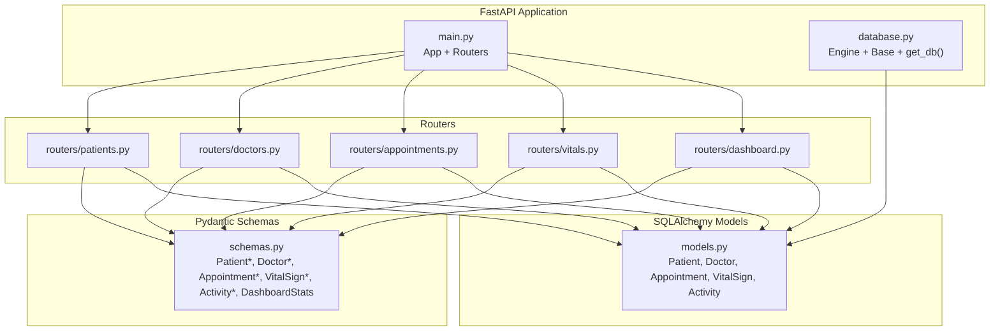
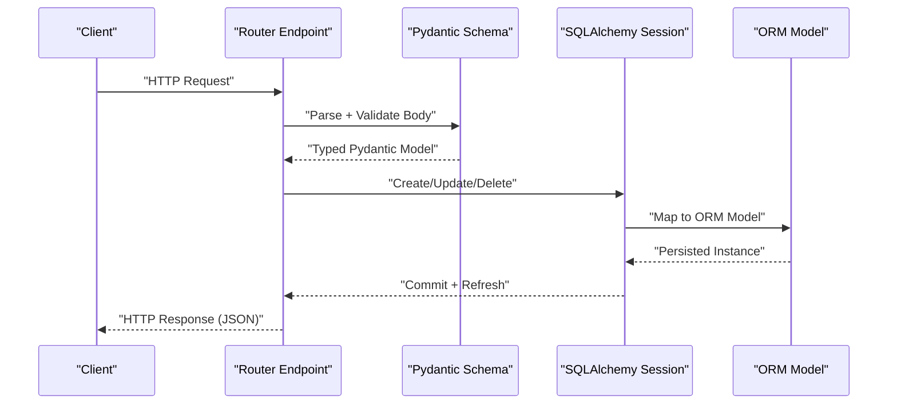
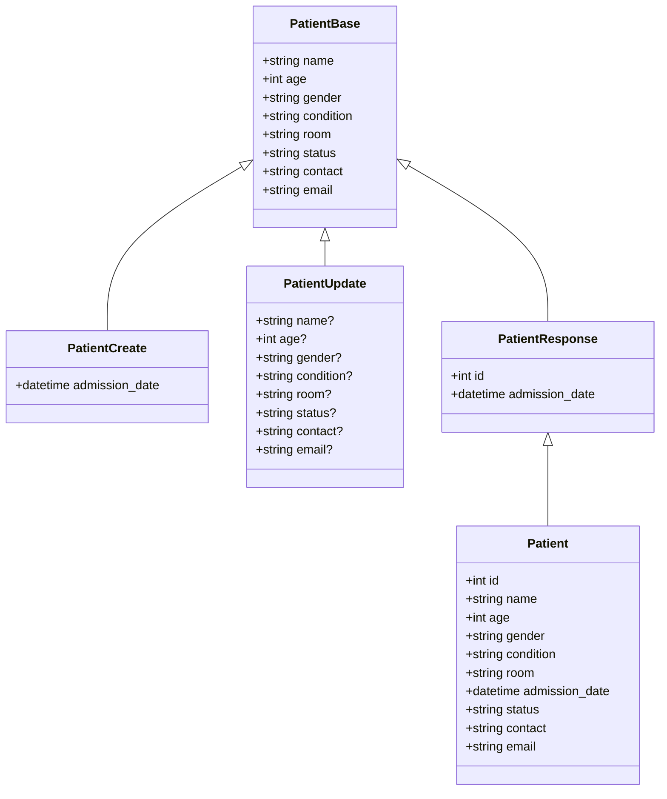
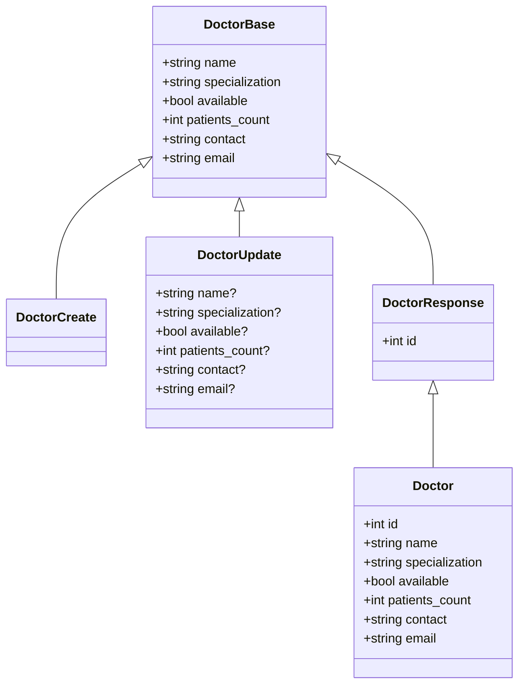
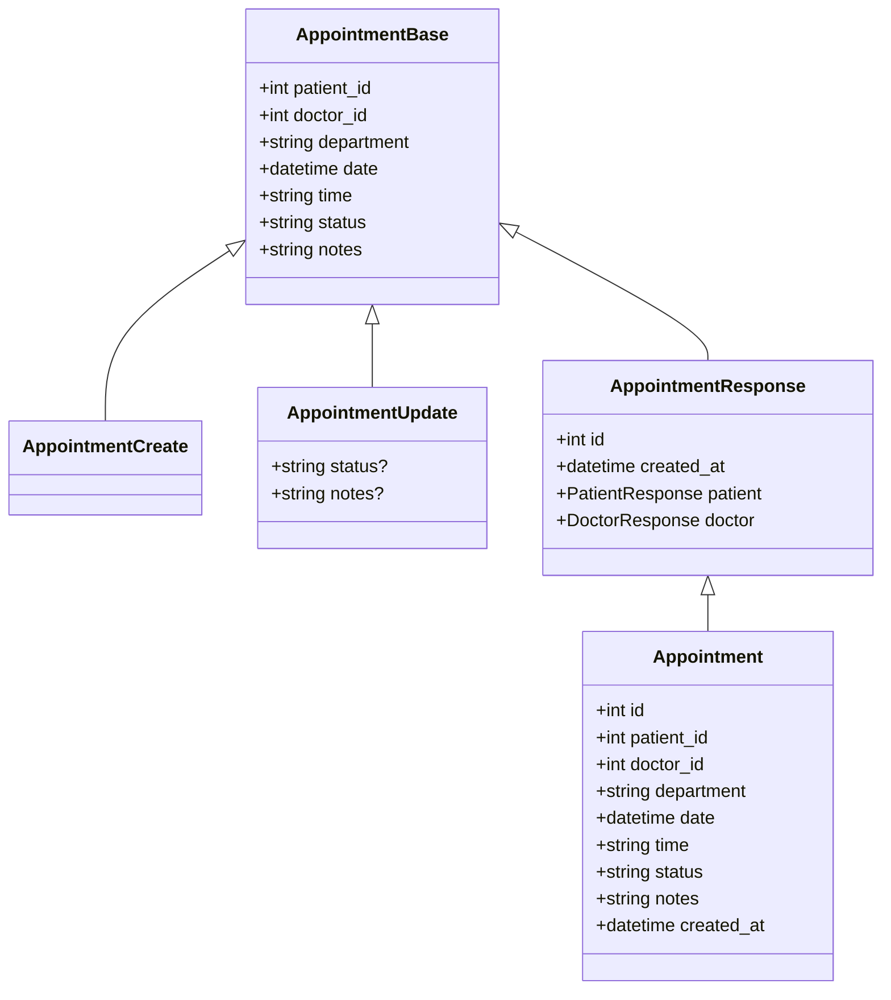
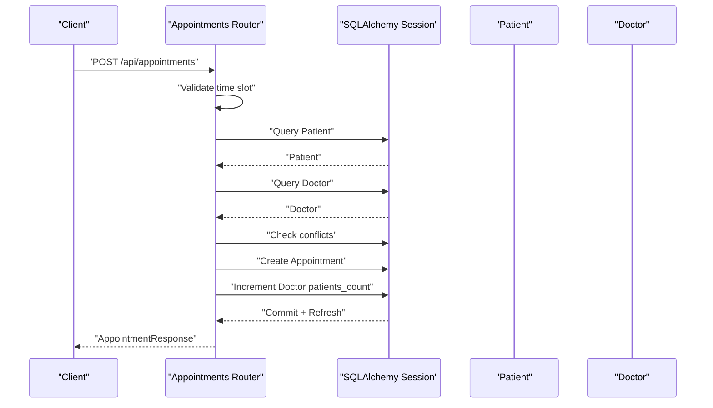
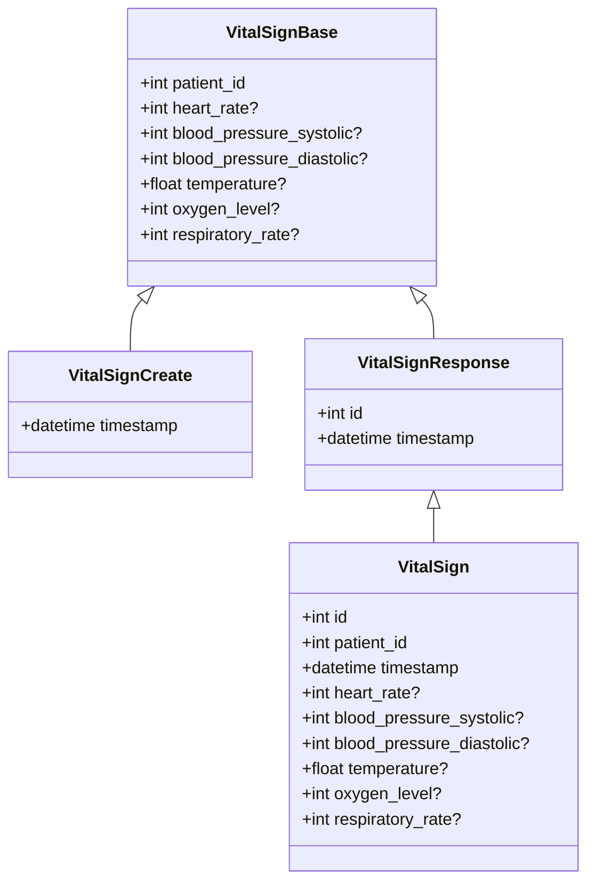
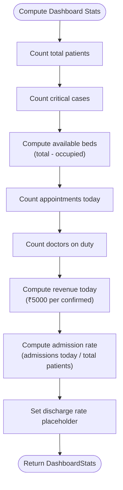
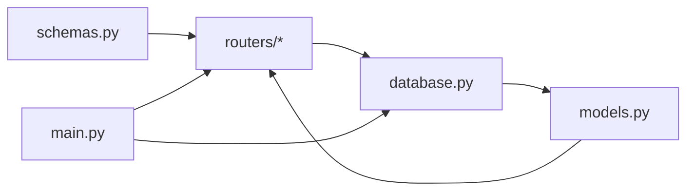

# Data Models & Validation

<cite>
**Referenced Files in This Document**
- [schemas.py](file://backend/schemas.py)
- [models.py](file://backend/models.py)
- [database.py](file://backend/database.py)
- [patients.py](file://backend/routers/patients.py)
- [doctors.py](file://backend/routers/doctors.py)
- [appointments.py](file://backend/routers/appointments.py)
- [vitals.py](file://backend/routers/vitals.py)
- [dashboard.py](file://backend/routers/dashboard.py)
- [main.py](file://backend/main.py)
</cite>

## Table of Contents
1. [Introduction](#introduction)
2. [Project Structure](#project-structure)
3. [Core Components](#core-components)
4. [Architecture Overview](#architecture-overview)
5. [Detailed Component Analysis](#detailed-component-analysis)
6. [Dependency Analysis](#dependency-analysis)
7. [Performance Considerations](#performance-considerations)
8. [Troubleshooting Guide](#troubleshooting-guide)
9. [Conclusion](#conclusion)

## Introduction
This document explains the Pydantic data validation models and SQLAlchemy ORM models used by the Smart Healthcare Dashboard API. It covers request/response schemas for patients, doctors, appointments, and vital signs, along with the dashboard statistics model. It also documents the database models, their relationships, constraints, and how data flows from API requests through validation into the database and back out as responses. Practical examples of data transformation and guidance on validation errors, data integrity checks, and schema evolution are included.

## Project Structure
The API is organized around routers that expose endpoints grouped by domain (patients, doctors, appointments, vitals, dashboard). Pydantic schemas define request/response contracts, and SQLAlchemy models define persistence and relationships. The database engine and base class are configured centrally, and tables are created on startup.

**Diagram sources**
- [main.py:1-43](file://backend/main.py#L1-L43)
- [database.py:1-20](file://backend/database.py#L1-L20)
- [schemas.py:1-134](file://backend/schemas.py#L1-L134)
- [models.py:1-75](file://backend/models.py#L1-L75)
- [patients.py:1-95](file://backend/routers/patients.py#L1-L95)
- [doctors.py:1-70](file://backend/routers/doctors.py#L1-L70)
- [appointments.py:1-173](file://backend/routers/appointments.py#L1-L173)
- [vitals.py:1-72](file://backend/routers/vitals.py#L1-L72)
- [dashboard.py:1-81](file://backend/routers/dashboard.py#L1-L81)

**Section sources**
- [main.py:1-43](file://backend/main.py#L1-L43)
- [database.py:1-20](file://backend/database.py#L1-L20)

## Core Components
This section documents the Pydantic schemas and SQLAlchemy models for the core entities and dashboard statistics.

- Patient schemas
  - PatientBase: shared fields for creation/update/response
  - PatientCreate: adds optional admission date
  - PatientUpdate: optional fields for partial updates
  - PatientResponse: includes id and admission date; supports ORM serialization via configuration
- Doctor schemas
  - DoctorBase: shared fields for creation/update/response
  - DoctorCreate: no extra fields
  - DoctorUpdate: optional fields for partial updates
  - DoctorResponse: includes id; supports ORM serialization
- Appointment schemas
  - AppointmentBase: includes foreign keys, department, date/time, status, notes
  - AppointmentCreate: no extra fields
  - AppointmentUpdate: optional status and notes
  - AppointmentResponse: includes id, created_at, nested PatientResponse and DoctorResponse; supports ORM serialization
- VitalSign schemas
  - VitalSignBase: includes patient_id and vital measurements
  - VitalSignCreate: adds optional timestamp
  - VitalSignResponse: includes id and timestamp; supports ORM serialization
- Activity schemas
  - ActivityBase: event, type, optional patient_id
  - ActivityCreate: no extra fields
  - ActivityResponse: includes id and timestamp; supports ORM serialization
- Dashboard statistics
  - DashboardStats: computed metrics for the dashboard

Validation rules and type constraints are enforced by Pydantic at request boundaries. SQLAlchemy constraints enforce referential integrity and non-nullability at the database level.

**Section sources**
- [schemas.py:6-35](file://backend/schemas.py#L6-L35)
- [schemas.py:37-61](file://backend/schemas.py#L37-L61)
- [schemas.py:63-87](file://backend/schemas.py#L63-L87)
- [schemas.py:89-107](file://backend/schemas.py#L89-L107)
- [schemas.py:109-123](file://backend/schemas.py#L109-L123)
- [schemas.py:125-134](file://backend/schemas.py#L125-L134)

## Architecture Overview
The API follows a layered architecture:
- Routers handle HTTP requests and responses, invoking business logic and database operations.
- Pydantic schemas validate and serialize data between client requests and database models.
- SQLAlchemy models define persistence, relationships, and constraints.
- The database module configures the engine and session lifecycle.

**Diagram sources**
- [patients.py:48-66](file://backend/routers/patients.py#L48-L66)
- [doctors.py:35-41](file://backend/routers/doctors.py#L35-L41)
- [appointments.py:84-125](file://backend/routers/appointments.py#L84-L125)
- [vitals.py:50-61](file://backend/routers/vitals.py#L50-L61)
- [schemas.py:16-34](file://backend/schemas.py#L16-L34)

## Detailed Component Analysis

### Patient Models and Endpoints
- Pydantic schemas
  - PatientBase defines core attributes and defaults.
  - PatientCreate extends with optional admission date.
  - PatientUpdate allows partial updates.
  - PatientResponse adds id and admission date; ORM serialization enabled.
- SQLAlchemy model
  - Patient has non-nullable fields for identity and condition, default status, and optional contact/email.
  - Relationships: appointments and vitals.
- Endpoint behaviors
  - GET /api/patients supports filtering by search term, status, and condition; pagination via skip/limit.
  - GET /api/patients/{id} returns a single patient.
  - POST /api/patients validates uniqueness by name and room; creates a new patient.
  - PUT /api/patients/{id} performs partial updates.
  - DELETE /api/patients/{id} removes a patient.

**Diagram sources**
- [schemas.py:6-35](file://backend/schemas.py#L6-L35)
- [models.py:6-22](file://backend/models.py#L6-L22)

**Section sources**
- [schemas.py:6-35](file://backend/schemas.py#L6-L35)
- [models.py:6-22](file://backend/models.py#L6-L22)
- [patients.py:11-95](file://backend/routers/patients.py#L11-L95)

### Doctor Models and Endpoints
- Pydantic schemas
  - DoctorBase defines core attributes and defaults.
  - DoctorCreate and DoctorUpdate mirror base fields with optional updates.
  - DoctorResponse adds id; ORM serialization enabled.
- SQLAlchemy model
  - Doctor has non-nullable identity and specialization, availability flag, and counts; optional contact/email.
  - Relationship: appointments.
- Endpoint behaviors
  - GET /api/doctors supports filtering by availability and specialization; pagination via skip/limit.
  - GET /api/doctors/{id} returns a single doctor.
  - POST /api/doctors creates a new doctor.
  - PUT /api/doctors/{id} performs partial updates.
  - DELETE /api/doctors/{id} removes a doctor.

**Diagram sources**
- [schemas.py:37-61](file://backend/schemas.py#L37-L61)
- [models.py:23-35](file://backend/models.py#L23-L35)

**Section sources**
- [schemas.py:37-61](file://backend/schemas.py#L37-L61)
- [models.py:23-35](file://backend/models.py#L23-L35)
- [doctors.py:10-70](file://backend/routers/doctors.py#L10-L70)

### Appointment Models, Endpoints, and Business Rules
- Pydantic schemas
  - AppointmentBase includes foreign keys, department, date/time, status, notes.
  - AppointmentCreate mirrors base fields.
  - AppointmentUpdate allows optional status and notes.
  - AppointmentResponse includes id, created_at, and nested PatientResponse and DoctorResponse; ORM serialization enabled.
- SQLAlchemy model
  - Appointment has foreign keys to Patient and Doctor; non-nullable fields for department/date/time/status; timestamps; relationships to both entities.
- Endpoint behaviors
  - GET /api/appointments supports filtering by status, doctor_id, and patient_id; auto-updates pending appointments based on time rules.
  - GET /api/appointments/{id} returns a single appointment.
  - POST /api/appointments validates time slot against predefined slots, existence of patient/doctor, and absence of conflicts; increments doctor’s patient count.
  - PUT /api/appointments/{id} performs partial updates.
  - DELETE /api/appointments/{id} removes an appointment.
  - GET /api/appointments/revenue/today computes revenue from confirmed appointments today.

**Diagram sources**
- [schemas.py:63-87](file://backend/schemas.py#L63-L87)
- [models.py:36-51](file://backend/models.py#L36-L51)

**Diagram sources**
- [appointments.py:84-125](file://backend/routers/appointments.py#L84-L125)
- [models.py:36-51](file://backend/models.py#L36-L51)

**Section sources**
- [schemas.py:63-87](file://backend/schemas.py#L63-L87)
- [models.py:36-51](file://backend/models.py#L36-L51)
- [appointments.py:53-173](file://backend/routers/appointments.py#L53-L173)

### Vital Signs Models and Endpoints
- Pydantic schemas
  - VitalSignBase includes patient_id and vital measurements.
  - VitalSignCreate adds optional timestamp.
  - VitalSignResponse includes id and timestamp; ORM serialization enabled.
- SQLAlchemy model
  - VitalSign has foreign key to Patient; non-nullable timestamp by default; optional measurement fields; relationship to Patient.
- Endpoint behaviors
  - GET /api/vitals/{patient_id} lists vitals for a patient with pagination.
  - GET /api/vitals/{patient_id}/trends fetches vitals from the last N hours.
  - POST /api/vitals creates a vital sign record after verifying patient existence.
  - DELETE /api/vitals/{vital_id} removes a vital sign record.

**Diagram sources**
- [schemas.py:89-107](file://backend/schemas.py#L89-L107)
- [models.py:52-66](file://backend/models.py#L52-L66)

**Section sources**
- [schemas.py:89-107](file://backend/schemas.py#L89-L107)
- [models.py:52-66](file://backend/models.py#L52-L66)
- [vitals.py:11-72](file://backend/routers/vitals.py#L11-L72)

### Dashboard Statistics Model
- DashboardStats aggregates metrics:
  - total_patients
  - available_beds (computed from total beds minus occupied)
  - critical_cases
  - appointments_today
  - doctors_on_duty
  - revenue_today (computed from confirmed appointments)
  - admission_rate (computed from new admissions today)
  - discharge_rate (placeholder)
- Endpoint GET /api/dashboard/stats returns a populated DashboardStats object.

**Diagram sources**
- [dashboard.py:12-62](file://backend/routers/dashboard.py#L12-L62)
- [schemas.py:125-134](file://backend/schemas.py#L125-L134)

**Section sources**
- [schemas.py:125-134](file://backend/schemas.py#L125-L134)
- [dashboard.py:12-62](file://backend/routers/dashboard.py#L12-L62)

## Dependency Analysis
- Routers depend on schemas for request validation and response serialization, and on models for database operations.
- Schemas rely on Pydantic BaseModel and typing constructs; some response schemas enable ORM serialization.
- Models rely on SQLAlchemy Column types, relationships, and foreign keys.
- Database configuration provides engine, session factory, and base class for model metadata.

**Diagram sources**
- [schemas.py:1-134](file://backend/schemas.py#L1-L134)
- [models.py:1-75](file://backend/models.py#L1-L75)
- [database.py:1-20](file://backend/database.py#L1-L20)
- [patients.py:1-95](file://backend/routers/patients.py#L1-L95)
- [doctors.py:1-70](file://backend/routers/doctors.py#L1-L70)
- [appointments.py:1-173](file://backend/routers/appointments.py#L1-L173)
- [vitals.py:1-72](file://backend/routers/vitals.py#L1-L72)
- [dashboard.py:1-81](file://backend/routers/dashboard.py#L1-L81)
- [main.py:1-43](file://backend/main.py#L1-L43)

**Section sources**
- [main.py:1-43](file://backend/main.py#L1-L43)
- [database.py:1-20](file://backend/database.py#L1-L20)

## Performance Considerations
- Indexing: String fields marked as index=True in models (e.g., Patient.name, Doctor.name) improve query performance for lookups.
- Pagination: Routers support skip/limit to avoid loading large datasets.
- Filtering: Routers apply filters server-side to reduce payload sizes.
- Relationships: Eager-loading is not used; relationships are loaded on demand. Consider using joinedload for frequently accessed nested objects if latency becomes a concern.
- Timestamps: Default timestamps are set at insertion time; ensure appropriate indexing for time-series queries (e.g., vitals trends).

[No sources needed since this section provides general guidance]

## Troubleshooting Guide
Common validation and integrity errors observed in endpoints:
- Patient creation conflict
  - Duplicate patient by name and room triggers a conflict error.
  - Resolution: Ensure unique combinations of name and room or adjust uniqueness criteria.
- Not found errors
  - Accessing non-existent patient/doctor/appointment/vital raises a not-found error.
  - Resolution: Verify resource IDs and existence before performing operations.
- Appointment booking errors
  - Invalid time slot: outside predefined slots.
  - Missing patient/doctor: referenced entity does not exist.
  - Slot already booked: conflict with existing appointment.
  - Resolution: Validate inputs and availability prior to booking.
- Revenue calculation
  - Today’s revenue depends on confirmed appointments; ensure status is updated accordingly.

**Section sources**
- [patients.py:48-66](file://backend/routers/patients.py#L48-L66)
- [appointments.py:84-125](file://backend/routers/appointments.py#L84-L125)
- [vitals.py:50-61](file://backend/routers/vitals.py#L50-L61)

## Conclusion
The API employs a clear separation between Pydantic schemas for validation and serialization and SQLAlchemy models for persistence and relationships. Endpoints enforce business rules (e.g., time slots, uniqueness, referential integrity) and compute dashboard metrics. The design supports straightforward data transformation from request bodies to ORM instances and back to JSON responses, with robust error handling and extensibility for future enhancements.