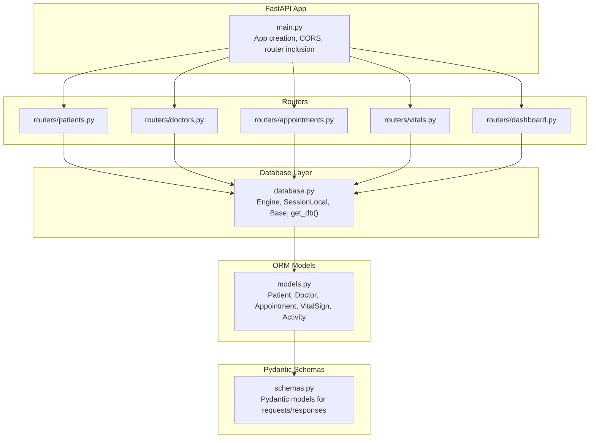
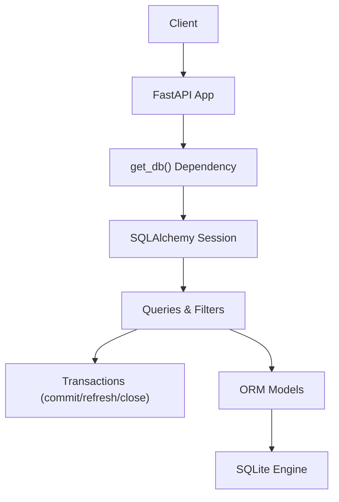
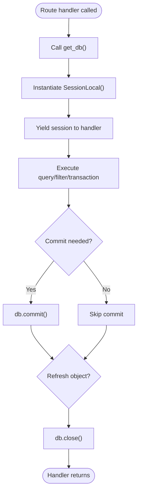
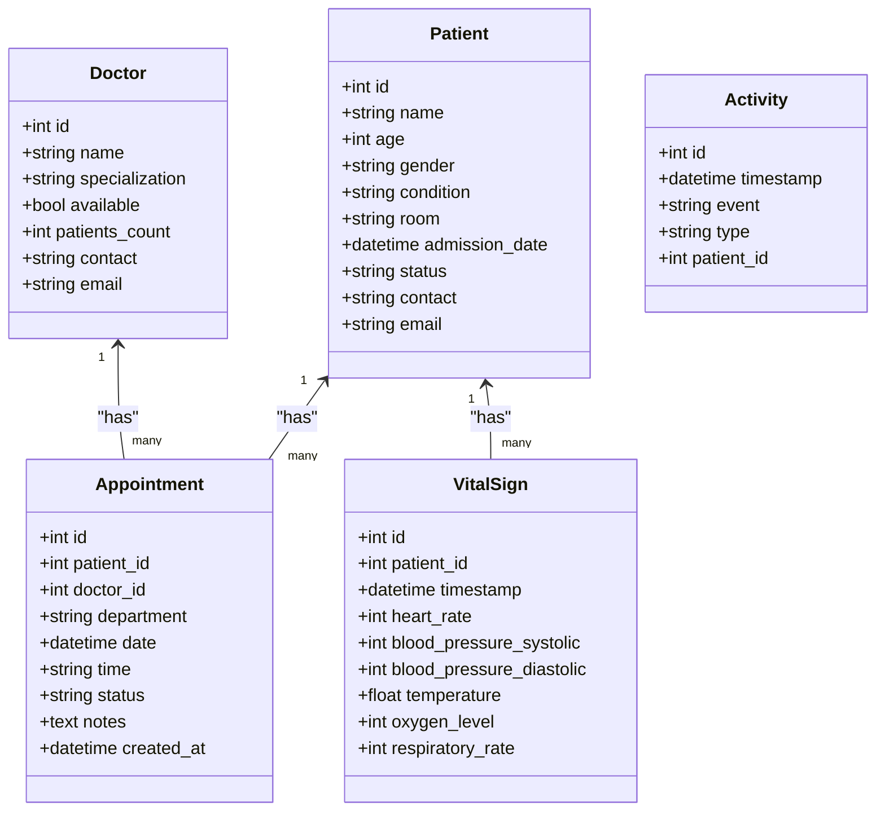
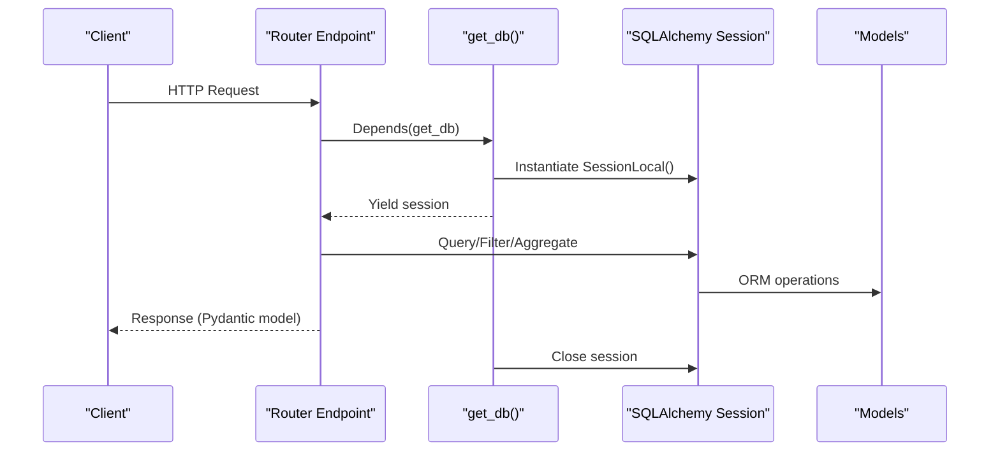
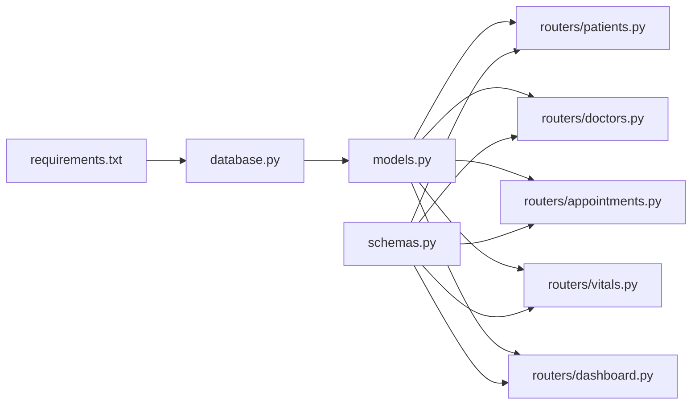
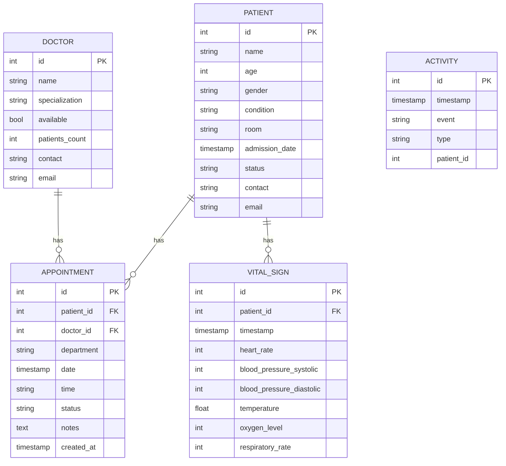

# Database Integration

<cite>
**Referenced Files in This Document**
- [database.py](file://backend/database.py)
- [models.py](file://backend/models.py)
- [schemas.py](file://backend/schemas.py)
- [main.py](file://backend/main.py)
- [patients.py](file://backend/routers/patients.py)
- [doctors.py](file://backend/routers/doctors.py)
- [appointments.py](file://backend/routers/appointments.py)
- [vitals.py](file://backend/routers/vitals.py)
- [dashboard.py](file://backend/routers/dashboard.py)
- [seed_data.py](file://backend/seed_data.py)
- [requirements.txt](file://backend/requirements.txt)
</cite>

## Table of Contents
1. [Introduction](#introduction)
2. [Project Structure](#project-structure)
3. [Core Components](#core-components)
4. [Architecture Overview](#architecture-overview)
5. [Detailed Component Analysis](#detailed-component-analysis)
6. [Dependency Analysis](#dependency-analysis)
7. [Performance Considerations](#performance-considerations)
8. [Troubleshooting Guide](#troubleshooting-guide)
9. [Conclusion](#conclusion)
10. [Appendices](#appendices)

## Introduction
This document explains the database integration layer for the Smart Healthcare Dashboard. It covers SQLAlchemy configuration, session management, ORM patterns, and how FastAPI routes depend on the database via dependency injection. It documents entity definitions, relationships, query patterns, filtering, transactions, and analytics endpoints. It also outlines migration readiness, connection pooling considerations, and performance optimization techniques.

## Project Structure
The database integration spans several modules:
- Engine and session factory are defined centrally.
- Declarative base powers ORM models.
- Pydantic schemas define request/response shapes.
- FastAPI app creates tables at startup and registers routers.
- Routers orchestrate CRUD and analytics using SQLAlchemy sessions injected via dependency.

**Diagram sources**
- [main.py:1-43](file://backend/main.py#L1-L43)
- [database.py:1-20](file://backend/database.py#L1-L20)
- [models.py:1-75](file://backend/models.py#L1-L75)
- [schemas.py:1-134](file://backend/schemas.py#L1-L134)
- [patients.py:1-95](file://backend/routers/patients.py#L1-L95)
- [doctors.py:1-70](file://backend/routers/doctors.py#L1-L70)
- [appointments.py:1-173](file://backend/routers/appointments.py#L1-L173)
- [vitals.py:1-72](file://backend/routers/vitals.py#L1-L72)
- [dashboard.py:1-81](file://backend/routers/dashboard.py#L1-L81)

**Section sources**
- [main.py:1-43](file://backend/main.py#L1-L43)
- [database.py:1-20](file://backend/database.py#L1-L20)
- [models.py:1-75](file://backend/models.py#L1-L75)
- [schemas.py:1-134](file://backend/schemas.py#L1-L134)

## Core Components
- Database engine and session factory:
  - SQLite URL configured for local development.
  - SessionLocal bound to the engine.
  - Declarative Base for ORM models.
  - get_db() dependency yields a scoped session and closes it after use.
- ORM models:
  - Patient, Doctor, Appointment, VitalSign, and Activity entities.
  - Foreign keys and relationships define referential integrity and eager loading.
- Pydantic schemas:
  - Typed request/response models aligned with ORM entities.
- FastAPI app:
  - Creates all tables at startup.
  - Registers routers for patients, doctors, appointments, vitals, and dashboard.

Key implementation references:
- Engine and session factory: [database.py:5-19](file://backend/database.py#L5-L19)
- Declarative base: [database.py:12](file://backend/database.py#L12)
- Dependency provider: [database.py:14-19](file://backend/database.py#L14-L19)
- Model definitions: [models.py:6-75](file://backend/models.py#L6-L75)
- Schema definitions: [schemas.py:6-134](file://backend/schemas.py#L6-L134)
- Table creation at startup: [main.py:6-7](file://backend/main.py#L6-L7)

**Section sources**
- [database.py:1-20](file://backend/database.py#L1-L20)
- [models.py:1-75](file://backend/models.py#L1-L75)
- [schemas.py:1-134](file://backend/schemas.py#L1-L134)
- [main.py:6-7](file://backend/main.py#L6-L7)

## Architecture Overview
The database integration follows a layered pattern:
- Application layer (FastAPI) depends on the database layer via dependency injection.
- Database layer exposes a session factory and a shared Base.
- ORM models encapsulate table schemas and relationships.
- Routers perform queries, apply filters, manage transactions, and return Pydantic models.

**Diagram sources**
- [database.py:14-19](file://backend/database.py#L14-L19)
- [patients.py:11-39](file://backend/routers/patients.py#L11-L39)
- [appointments.py:53-75](file://backend/routers/appointments.py#L53-L75)
- [doctors.py:10-26](file://backend/routers/doctors.py#L10-L26)
- [vitals.py:11-27](file://backend/routers/vitals.py#L11-L27)
- [dashboard.py:12-62](file://backend/routers/dashboard.py#L12-L62)

## Detailed Component Analysis

### SQLAlchemy Configuration and Session Management
- Engine:
  - SQLite database URL configured for local development.
  - connect_args set to disable thread checks for async-friendly usage.
- Session factory:
  - Autocommit disabled, autoflush disabled to control transaction boundaries explicitly.
  - Bound to the engine.
- Declarative base:
  - Central Base used by all models.
- Dependency provider:
  - get_db() creates a session, yields it to the route handler, and ensures cleanup.

**Diagram sources**
- [database.py:14-19](file://backend/database.py#L14-L19)
- [patients.py:48-66](file://backend/routers/patients.py#L48-L66)
- [appointments.py:84-125](file://backend/routers/appointments.py#L84-L125)
- [doctors.py:35-41](file://backend/routers/doctors.py#L35-L41)
- [vitals.py:50-61](file://backend/routers/vitals.py#L50-L61)

**Section sources**
- [database.py:5-19](file://backend/database.py#L5-L19)

### Declarative Base and Model Definitions
- Patient:
  - Fields include personal info, admission date, status, and contact details.
  - Relationships: appointments and vitals back-populated via back_populates.
- Doctor:
  - Fields include availability, specialization, and patient count.
  - Relationship: appointments back-populated.
- Appointment:
  - Composite foreign keys to Patient and Doctor.
  - Includes department, date/time, status, notes, and timestamps.
  - Relationships: patient and doctor back-populated.
- VitalSign:
  - Numeric vital signs with timestamp and foreign key to Patient.
  - Relationship: patient back-populated.
- Activity:
  - Audit/event logging with optional patient linkage.

**Diagram sources**
- [models.py:6-75](file://backend/models.py#L6-L75)

**Section sources**
- [models.py:1-75](file://backend/models.py#L1-L75)

### Relationships and Referential Integrity
- Appointment.patient and Appointment.doctor:
  - Foreign keys to Patient and Doctor respectively.
  - back_populates enable bidirectional navigation.
- Patient.vitals and Patient.appointments:
  - One-to-many relationships enforced by foreign keys.
- VitalSign.patient:
  - One-to-many relationship to Patient.

These relationships are leveraged in routers for joins and cascading operations.

**Section sources**
- [models.py:36-50](file://backend/models.py#L36-L50)
- [models.py:52-65](file://backend/models.py#L52-L65)

### Query Patterns, Filtering, and Transactions
- Filtering:
  - Patients: fuzzy search across name and condition; filter by status and condition.
  - Doctors: filter by availability and specialization.
  - Appointments: filter by status, doctor_id, patient_id; auto-updates pending appointments.
  - Vitals: filter by patient_id and time window for trends.
- Aggregations:
  - Dashboard statistics compute counts and rates using SQLAlchemy functions.
- Transactions:
  - Explicit commit after inserts/updates/deletes.
  - Refresh after insert/update to load generated fields.
  - Close session in dependency finally block.

Examples by file:
- Patient filtering and pagination: [patients.py:11-39](file://backend/routers/patients.py#L11-L39)
- Doctor filtering: [doctors.py:10-26](file://backend/routers/doctors.py#L10-L26)
- Appointment filtering and auto-status updates: [appointments.py:53-75](file://backend/routers/appointments.py#L53-L75)
- Vitals retrieval and trends: [vitals.py:11-48](file://backend/routers/vitals.py#L11-L48)
- Dashboard aggregations: [dashboard.py:12-62](file://backend/routers/dashboard.py#L12-L62)

**Section sources**
- [patients.py:11-39](file://backend/routers/patients.py#L11-L39)
- [doctors.py:10-26](file://backend/routers/doctors.py#L10-L26)
- [appointments.py:53-75](file://backend/routers/appointments.py#L53-L75)
- [vitals.py:11-48](file://backend/routers/vitals.py#L11-L48)
- [dashboard.py:12-62](file://backend/routers/dashboard.py#L12-L62)

### Dependency Injection for FastAPI Routes
- Each router endpoint accepts a Session parameter annotated with Depends(get_db).
- This ensures a fresh session per request, with automatic closure.

**Diagram sources**
- [patients.py:18](file://backend/routers/patients.py#L18)
- [doctors.py:16](file://backend/routers/doctors.py#L16)
- [appointments.py:60](file://backend/routers/appointments.py#L60)
- [vitals.py:16](file://backend/routers/vitals.py#L16)
- [dashboard.py:13](file://backend/routers/dashboard.py#L13)
- [database.py:14-19](file://backend/database.py#L14-L19)

**Section sources**
- [patients.py:1-95](file://backend/routers/patients.py#L1-L95)
- [doctors.py:1-70](file://backend/routers/doctors.py#L1-L70)
- [appointments.py:1-173](file://backend/routers/appointments.py#L1-L173)
- [vitals.py:1-72](file://backend/routers/vitals.py#L1-L72)
- [dashboard.py:1-81](file://backend/routers/dashboard.py#L1-L81)
- [database.py:14-19](file://backend/database.py#L14-L19)

### Complex Queries, Joins, and Aggregations
- Dashboard statistics:
  - Count totals and derive rates using SQLAlchemy func and filters.
  - Example aggregation endpoints: [dashboard.py:12-62](file://backend/routers/dashboard.py#L12-L62)
- Revenue calculation:
  - Count confirmed appointments for the current day and multiply by fixed amount.
  - Example aggregation endpoint: [appointments.py:155-172](file://backend/routers/appointments.py#L155-L172)
- Auto-status updates:
  - Conditional updates based on time thresholds.
  - Example procedural update: [appointments.py:25-51](file://backend/routers/appointments.py#L25-L51)

**Section sources**
- [dashboard.py:12-62](file://backend/routers/dashboard.py#L12-L62)
- [appointments.py:155-172](file://backend/routers/appointments.py#L155-L172)
- [appointments.py:25-51](file://backend/routers/appointments.py#L25-L51)

### Database Migration Strategies
- Alembic is included in requirements, indicating migration tooling support.
- Current setup uses imperative metadata.create_all at startup for simplicity.
- Recommended migration workflow:
  - Initialize Alembic in the project root.
  - Generate initial revision from current Base metadata.
  - Use alembic upgrade/head for production deployments.
  - Keep migrations under version control alongside code.

**Section sources**
- [requirements.txt:6](file://backend/requirements.txt#L6)
- [main.py:6-7](file://backend/main.py#L6-L7)

### Seed Data and Initialization
- seed_data.py:
  - Creates tables, seeds realistic test data for patients, doctors, appointments, vitals, and activities.
  - Skips seeding if data already exists.
  - Demonstrates transactional inserts and rollbacks on errors.

**Section sources**
- [seed_data.py:6-135](file://backend/seed_data.py#L6-L135)

## Dependency Analysis
- Internal dependencies:
  - Routers depend on database.get_db for sessions.
  - Models depend on Base from database.
  - Schemas depend on models for nested serialization in responses.
- External dependencies:
  - SQLAlchemy 2.x for ORM and core.
  - Alembic for migrations.
  - Pydantic for data validation and serialization.

**Diagram sources**
- [requirements.txt:1-9](file://backend/requirements.txt#L1-L9)
- [database.py:1-20](file://backend/database.py#L1-L20)
- [models.py:1-75](file://backend/models.py#L1-L75)
- [schemas.py:1-134](file://backend/schemas.py#L1-L134)
- [patients.py:1-95](file://backend/routers/patients.py#L1-L95)
- [doctors.py:1-70](file://backend/routers/doctors.py#L1-L70)
- [appointments.py:1-173](file://backend/routers/appointments.py#L1-L173)
- [vitals.py:1-72](file://backend/routers/vitals.py#L1-L72)
- [dashboard.py:1-81](file://backend/routers/dashboard.py#L1-L81)

**Section sources**
- [requirements.txt:1-9](file://backend/requirements.txt#L1-L9)
- [database.py:1-20](file://backend/database.py#L1-L20)
- [models.py:1-75](file://backend/models.py#L1-L75)
- [schemas.py:1-134](file://backend/schemas.py#L1-L134)

## Performance Considerations
- Connection pooling:
  - Current SQLite configuration does not enable pooling; suitable for development.
  - For production, switch to an async-capable engine and configure pool_size and max_overflow.
- Indexing:
  - Primary keys are indexed by default; consider adding indexes on frequently filtered columns (e.g., Patient.status, Appointment.doctor_id/date/time).
- Query efficiency:
  - Use offset/limit for pagination; avoid loading unnecessary relationships unless needed.
  - Prefer bulk operations for seeding and batch updates.
- Transactions:
  - Keep transactions short; commit immediately after writes to reduce lock contention.
- Aggregations:
  - Use server-side aggregation (func.count, func.date) to minimize data transfer.

[No sources needed since this section provides general guidance]

## Troubleshooting Guide
- Session lifecycle:
  - Ensure get_db() is used as a Depends parameter so the session is closed in all cases.
  - Verify db.close() runs after exceptions using try/finally semantics.
- Transaction anomalies:
  - Confirm db.commit() is called after adds/updates/deletes.
  - Use db.refresh() after inserts/updates to reload generated fields.
- Integrity errors:
  - Check foreign keys and uniqueness constraints before inserts.
  - Example: duplicate patient detection by name and room in patients router.
- Timezone and date comparisons:
  - Use UTC consistently; leverage func.date for date-only comparisons in aggregations.

**Section sources**
- [database.py:14-19](file://backend/database.py#L14-L19)
- [patients.py:48-66](file://backend/routers/patients.py#L48-L66)
- [appointments.py:155-172](file://backend/routers/appointments.py#L155-L172)
- [dashboard.py:12-62](file://backend/routers/dashboard.py#L12-L62)

## Conclusion
The database integration layer uses a clean separation of concerns: a central database module defines engine, session factory, and dependency; models encapsulate schema and relationships; routers orchestrate queries, filters, and transactions; and schemas unify request/response validation. While the current setup uses imperative table creation for simplicity, the presence of Alembic indicates readiness for formal migrations. With minor enhancements—such as connection pooling, indexing, and async engines—the system can scale effectively for production.

[No sources needed since this section summarizes without analyzing specific files]

## Appendices

### Appendix A: Entity Relationship Diagram

**Diagram sources**
- [models.py:6-75](file://backend/models.py#L6-L75)