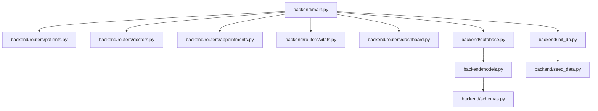
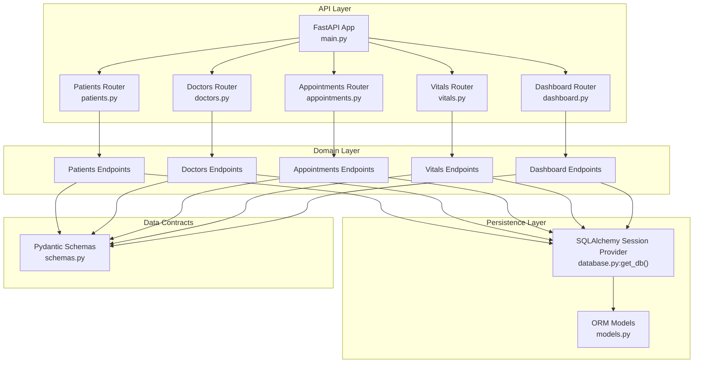
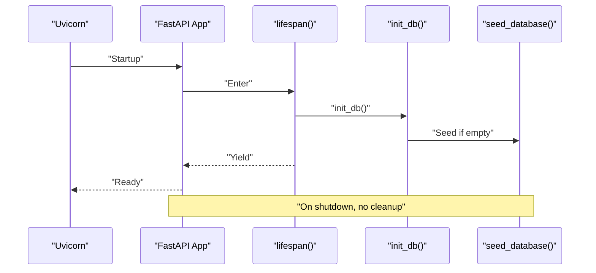
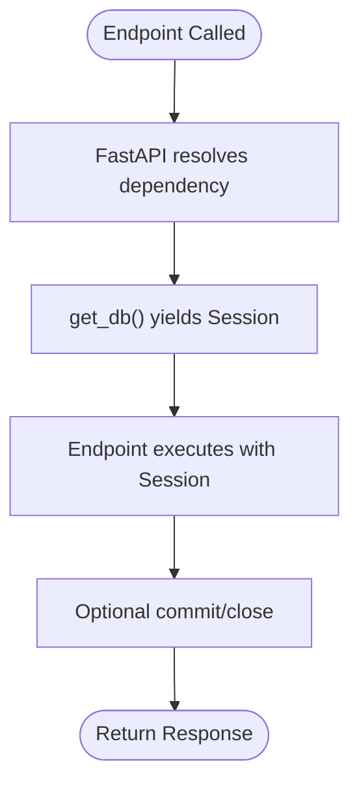
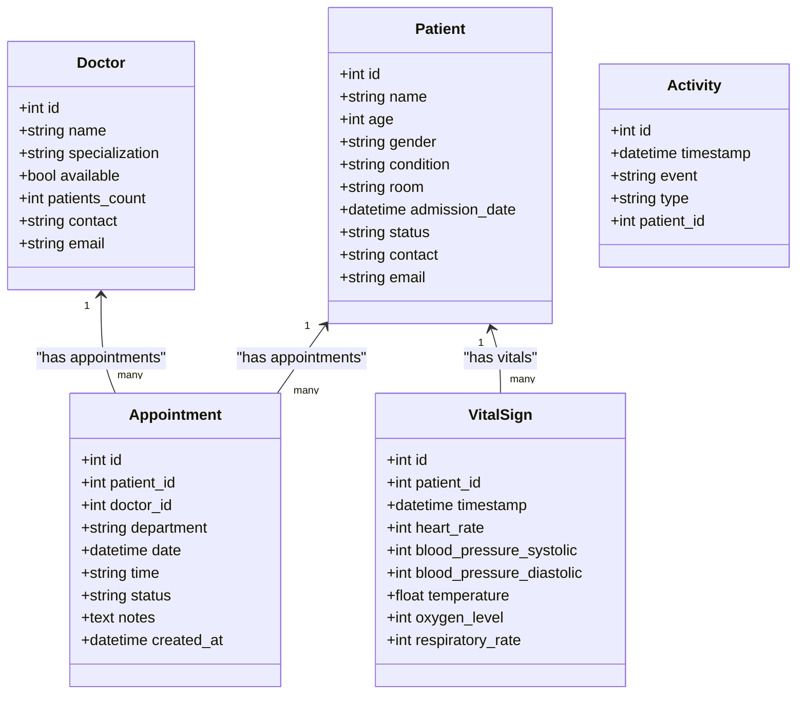
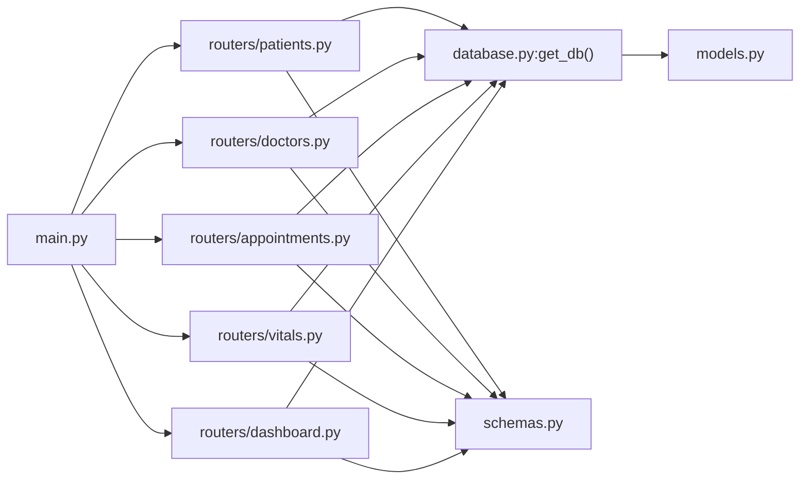

# Routing & Dependency Injection

<cite>
**Referenced Files in This Document**
- [main.py](file://backend/main.py)
- [database.py](file://backend/database.py)
- [models.py](file://backend/models.py)
- [schemas.py](file://backend/schemas.py)
- [init_db.py](file://backend/init_db.py)
- [seed_data.py](file://backend/seed_data.py)
- [patients.py](file://backend/routers/patients.py)
- [doctors.py](file://backend/routers/doctors.py)
- [appointments.py](file://backend/routers/appointments.py)
- [vitals.py](file://backend/routers/vitals.py)
- [dashboard.py](file://backend/routers/dashboard.py)
- [requirements.txt](file://backend/requirements.txt)
</cite>

## Table of Contents
1. [Introduction](#introduction)
2. [Project Structure](#project-structure)
3. [Core Components](#core-components)
4. [Architecture Overview](#architecture-overview)
5. [Detailed Component Analysis](#detailed-component-analysis)
6. [Dependency Analysis](#dependency-analysis)
7. [Performance Considerations](#performance-considerations)
8. [Troubleshooting Guide](#troubleshooting-guide)
9. [Conclusion](#conclusion)

## Introduction
This document explains the FastAPI routing system and dependency injection patterns used in the Smart Healthcare Dashboard. It covers the main application setup, router registration, CORS configuration, modular router architecture, dependency injection via a database session provider, route decorators and tag organization, endpoint grouping, middleware configuration, exception handling, and the relationship between routers and their corresponding database models. It also describes how dependencies are resolved and injected into endpoint functions.

## Project Structure
The backend is organized around a FastAPI application with a modular router architecture. Each domain (patients, doctors, appointments, vitals, dashboard) is encapsulated in its own router module. Database models and Pydantic schemas define the data structures and validation. A lifespan manager initializes the database and seeds data on startup.

**Diagram sources**
- [main.py:1-52](file://backend/main.py#L1-L52)
- [patients.py:1-95](file://backend/routers/patients.py#L1-L95)
- [doctors.py:1-70](file://backend/routers/doctors.py#L1-L70)
- [appointments.py:1-173](file://backend/routers/appointments.py#L1-L173)
- [vitals.py:1-72](file://backend/routers/vitals.py#L1-L72)
- [dashboard.py:1-81](file://backend/routers/dashboard.py#L1-L81)
- [database.py:1-20](file://backend/database.py#L1-L20)
- [models.py:1-75](file://backend/models.py#L1-L75)
- [schemas.py:1-134](file://backend/schemas.py#L1-L134)
- [init_db.py:1-25](file://backend/init_db.py#L1-L25)
- [seed_data.py:1-138](file://backend/seed_data.py#L1-L138)

**Section sources**
- [main.py:1-52](file://backend/main.py#L1-L52)
- [requirements.txt:1-9](file://backend/requirements.txt#L1-L9)

## Core Components
- Application factory and lifecycle: The application is created with metadata and a lifespan manager that initializes the database and seeds data on startup.
- Middleware: CORS is configured to allow requests from the frontend origins.
- Router registration: Each domain router is included into the main application.
- Dependency injection: A generator dependency provides a SQLAlchemy session to endpoints.

Key implementation references:
- Application creation and lifespan: [main.py:17-22](file://backend/main.py#L17-L22)
- CORS middleware: [main.py:24-31](file://backend/main.py#L24-L31)
- Router inclusion: [main.py:33-38](file://backend/main.py#L33-L38)
- Database session dependency: [database.py:14-19](file://backend/database.py#L14-L19)

**Section sources**
- [main.py:17-38](file://backend/main.py#L17-L38)
- [database.py:14-19](file://backend/database.py#L14-L19)

## Architecture Overview
The system follows a layered architecture:
- API Layer: FastAPI application and routers define routes and tags.
- Domain Layer: Each router encapsulates CRUD and custom endpoints for a domain.
- Persistence Layer: SQLAlchemy ORM models and a session provider manage database operations.
- Data Contracts: Pydantic schemas validate and serialize request/response bodies.

**Diagram sources**
- [main.py:17-38](file://backend/main.py#L17-L38)
- [patients.py:1-95](file://backend/routers/patients.py#L1-L95)
- [doctors.py:1-70](file://backend/routers/doctors.py#L1-L70)
- [appointments.py:1-173](file://backend/routers/appointments.py#L1-L173)
- [vitals.py:1-72](file://backend/routers/vitals.py#L1-L72)
- [dashboard.py:1-81](file://backend/routers/dashboard.py#L1-L81)
- [database.py:14-19](file://backend/database.py#L14-L19)
- [models.py:1-75](file://backend/models.py#L1-L75)
- [schemas.py:1-134](file://backend/schemas.py#L1-L134)

## Detailed Component Analysis

### Application Setup and Lifecycle
- The application defines metadata (title, version, description) and registers a lifespan manager.
- On startup, the lifespan initializes the database and seeds data if needed.
- On shutdown, no cleanup is performed.

**Diagram sources**
- [main.py:9-15](file://backend/main.py#L9-L15)
- [init_db.py:4-24](file://backend/init_db.py#L4-L24)
- [seed_data.py:6-134](file://backend/seed_data.py#L6-L134)

**Section sources**
- [main.py:9-15](file://backend/main.py#L9-L15)
- [init_db.py:4-24](file://backend/init_db.py#L4-L24)

### CORS Configuration
- CORS middleware allows credentials and all methods/headers.
- Origins include typical frontend development ports.

**Section sources**
- [main.py:24-31](file://backend/main.py#L24-L31)

### Router Registration and Tag Organization
- Routers are registered under the main application with distinct prefixes and tags.
- Tags group endpoints in the OpenAPI docs for improved navigation.

Endpoints and tags:
- Patients: prefix "/api/patients", tag "patients"
- Doctors: prefix "/api/doctors", tag "doctors"
- Appointments: prefix "/api/appointments", tag "appointments"
- Vitals: prefix "/api/vitals", tag "vitals"
- Dashboard: prefix "/api", tag "dashboard"

**Section sources**
- [main.py:33-38](file://backend/main.py#L33-L38)
- [patients.py:9](file://backend/routers/patients.py#L9)
- [doctors.py:8](file://backend/routers/doctors.py#L8)
- [appointments.py:10](file://backend/routers/appointments.py#L10)
- [vitals.py:9](file://backend/routers/vitals.py#L9)
- [dashboard.py:10](file://backend/routers/dashboard.py#L10)

### Dependency Injection Pattern: Database Session Provider
- The dependency provider creates a local SQLAlchemy session and yields it to endpoints.
- The session is closed in a finally block to ensure cleanup.
- Endpoints declare a dependency on the provider to receive a Session instance.

**Diagram sources**
- [database.py:14-19](file://backend/database.py#L14-L19)

**Section sources**
- [database.py:14-19](file://backend/database.py#L14-L19)

### Route Decorators, Filtering, and Query Parameters
- Routes use decorators to define HTTP methods, path parameters, and query parameters.
- Filtering is implemented directly in routers using SQLAlchemy queries.
- Example patterns:
  - Pagination via skip/limit.
  - Search with fuzzy matching.
  - Conditional filtering by status, specialty, etc.

Examples by router:
- Patients: search, status, condition filters with pagination.
- Doctors: availability and specialization filters with pagination.
- Appointments: status, doctor_id, patient_id filters; auto-updates pending appointments.
- Vitals: patient-specific retrieval and trend analysis over time windows.
- Dashboard: aggregated statistics and recent activity.

**Section sources**
- [patients.py:11-39](file://backend/routers/patients.py#L11-L39)
- [doctors.py:10-26](file://backend/routers/doctors.py#L10-L26)
- [appointments.py:53-75](file://backend/routers/appointments.py#L53-L75)
- [vitals.py:11-48](file://backend/routers/vitals.py#L11-L48)
- [dashboard.py:12-71](file://backend/routers/dashboard.py#L12-L71)

### Relationship Between Routers and Database Models
- Each router interacts with its corresponding SQLAlchemy model(s).
- Relationships defined in models enable joined queries and foreign key constraints.
- Endpoints validate existence of related entities (e.g., patient/doctor presence) before operations.

**Diagram sources**
- [models.py:6-75](file://backend/models.py#L6-L75)

**Section sources**
- [models.py:6-75](file://backend/models.py#L6-L75)
- [patients.py:41-46](file://backend/routers/patients.py#L41-L46)
- [doctors.py:28-33](file://backend/routers/doctors.py#L28-L33)
- [appointments.py:77-82](file://backend/routers/appointments.py#L77-L82)
- [vitals.py:11-27](file://backend/routers/vitals.py#L11-L27)

### Exception Handling and Global Error Management
- Routers raise HTTP exceptions with appropriate status codes when resources are not found or conflicts occur.
- Centralized exception handling is not implemented; FastAPI’s default exception handlers apply.

Common patterns:
- 404 Not Found for missing entities.
- 409 Conflict for duplicates or booking conflicts.
- 400 Bad Request for invalid inputs.

**Section sources**
- [patients.py:44-46](file://backend/routers/patients.py#L44-L46)
- [patients.py:56-60](file://backend/routers/patients.py#L56-L60)
- [doctors.py:30-33](file://backend/routers/doctors.py#L30-L33)
- [appointments.py:86-91](file://backend/routers/appointments.py#L86-L91)
- [appointments.py:93-101](file://backend/routers/appointments.py#L93-L101)
- [appointments.py:111-115](file://backend/routers/appointments.py#L111-L115)
- [vitals.py:18-21](file://backend/routers/vitals.py#L18-L21)
- [vitals.py:63-71](file://backend/routers/vitals.py#L63-L71)

### Endpoint Grouping and Tag Organization
- Each router uses a tag to group endpoints in the OpenAPI documentation.
- Prefixes define logical grouping under "/api/<resource>".

**Section sources**
- [patients.py:9](file://backend/routers/patients.py#L9)
- [doctors.py:8](file://backend/routers/doctors.py#L8)
- [appointments.py:10](file://backend/routers/appointments.py#L10)
- [vitals.py:9](file://backend/routers/vitals.py#L9)
- [dashboard.py:10](file://backend/routers/dashboard.py#L10)

## Dependency Analysis
- Application depends on routers and database initialization.
- Routers depend on the database session provider and models/schemas.
- Models define relationships that routers leverage for joins and validations.
- Schemas validate request/response payloads used by routers.

**Diagram sources**
- [main.py:33-38](file://backend/main.py#L33-L38)
- [patients.py:1-8](file://backend/routers/patients.py#L1-L8)
- [doctors.py:1-7](file://backend/routers/doctors.py#L1-L7)
- [appointments.py:1-8](file://backend/routers/appointments.py#L1-L8)
- [vitals.py:1-7](file://backend/routers/vitals.py#L1-L7)
- [dashboard.py:1-7](file://backend/routers/dashboard.py#L1-L7)
- [database.py:14-19](file://backend/database.py#L14-L19)
- [models.py:1-75](file://backend/models.py#L1-L75)
- [schemas.py:1-134](file://backend/schemas.py#L1-L134)

**Section sources**
- [main.py:33-38](file://backend/main.py#L33-L38)
- [database.py:14-19](file://backend/database.py#L14-L19)
- [models.py:1-75](file://backend/models.py#L1-L75)
- [schemas.py:1-134](file://backend/schemas.py#L1-L134)

## Performance Considerations
- Pagination via skip/limit prevents large result sets.
- Query filtering reduces database load.
- Auto-updating pending appointments runs on reads to maintain data consistency.
- Consider adding database indexes for frequently filtered columns (e.g., status, specialty).
- Use asynchronous operations for heavy computations if needed.

[No sources needed since this section provides general guidance]

## Troubleshooting Guide
- Database initialization errors: Check the initialization logs and seed conditions.
- Missing or empty data: Confirm that seeding ran and patients/tables exist.
- CORS errors: Verify allowed origins and credentials configuration.
- 404 Not Found: Ensure resource IDs exist and relationships are valid.
- 409 Conflict: Resolve duplicate entries or scheduling conflicts.

**Section sources**
- [init_db.py:4-24](file://backend/init_db.py#L4-L24)
- [seed_data.py:6-134](file://backend/seed_data.py#L6-L134)
- [main.py:24-31](file://backend/main.py#L24-L31)
- [patients.py:44-46](file://backend/routers/patients.py#L44-L46)
- [appointments.py:93-101](file://backend/routers/appointments.py#L93-L101)
- [appointments.py:111-115](file://backend/routers/appointments.py#L111-L115)

## Conclusion
The Smart Healthcare Dashboard employs a clean, modular FastAPI architecture with explicit dependency injection for database sessions. Routers are organized by domain, grouped by tags, and prefixed for logical endpoint organization. The lifespan manager ensures database initialization and seeding on startup. Exception handling is explicit at the router level, and relationships between models support robust endpoint logic. This design promotes maintainability, testability, and scalability.