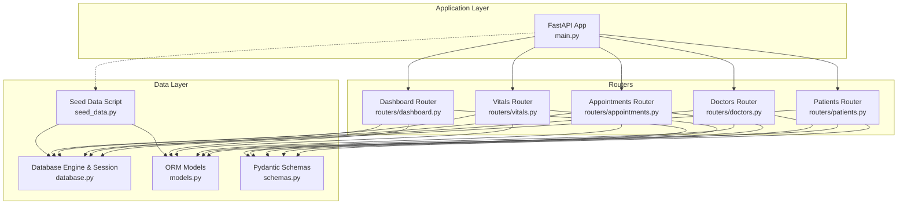
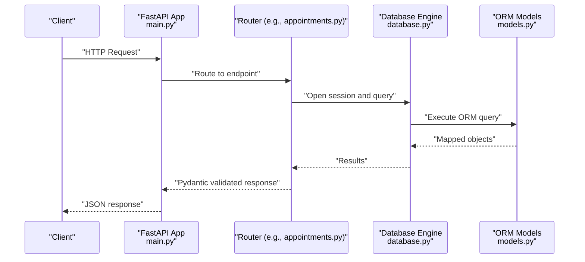
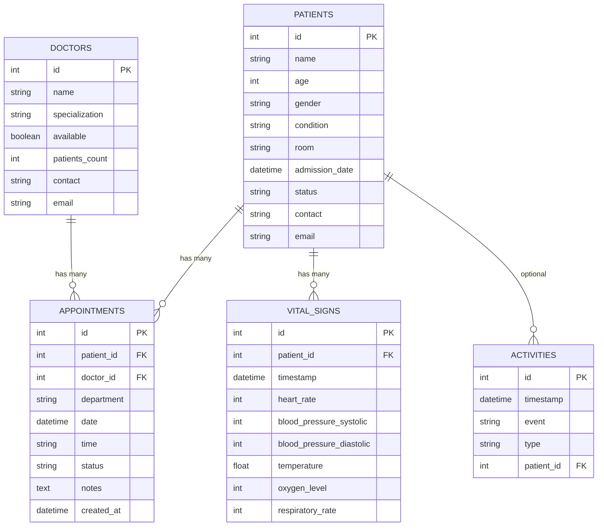
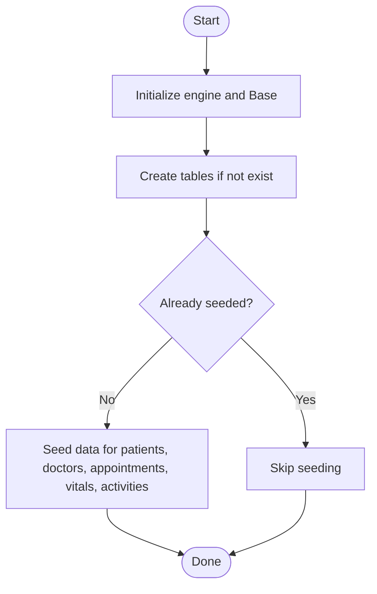
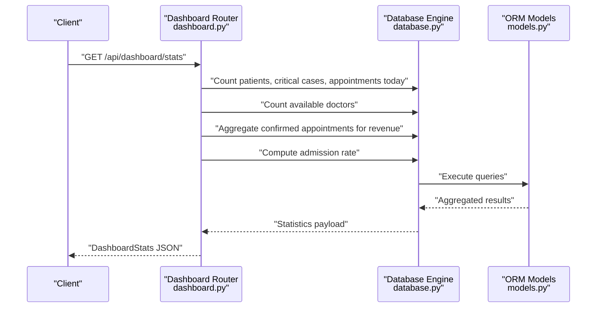
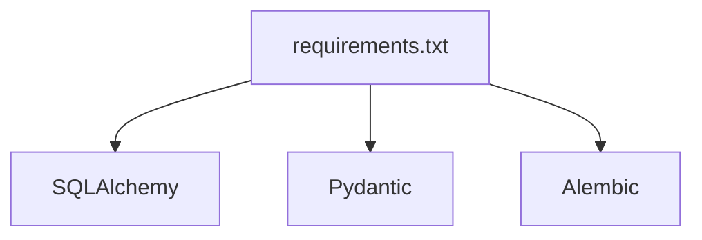

# Database Schema & Data Models

<cite>
**Referenced Files in This Document**
- [models.py](file://backend/models.py)
- [schemas.py](file://backend/schemas.py)
- [database.py](file://backend/database.py)
- [seed_data.py](file://backend/seed_data.py)
- [main.py](file://backend/main.py)
- [patients.py](file://backend/routers/patients.py)
- [doctors.py](file://backend/routers/doctors.py)
- [appointments.py](file://backend/routers/appointments.py)
- [vitals.py](file://backend/routers/vitals.py)
- [dashboard.py](file://backend/routers/dashboard.py)
- [requirements.txt](file://backend/requirements.txt)
- [README.md](file://README.md)
</cite>

## Table of Contents
1. [Introduction](#introduction)
2. [Project Structure](#project-structure)
3. [Core Components](#core-components)
4. [Architecture Overview](#architecture-overview)
5. [Detailed Component Analysis](#detailed-component-analysis)
6. [Dependency Analysis](#dependency-analysis)
7. [Performance Considerations](#performance-considerations)
8. [Troubleshooting Guide](#troubleshooting-guide)
9. [Conclusion](#conclusion)
10. [Appendices](#appendices)

## Introduction
This document provides comprehensive data model documentation for the Smart Healthcare Dashboard database schema. It details the entity relationships among Patient, Doctor, Appointment, and VitalSign, along with their fields, data types, constraints, and indexing strategies. It also explains the SQLAlchemy ORM model definitions, Pydantic schema validations for serialization/deserialization, database initialization and seeding procedures, and the relationship patterns and cascading behaviors. Finally, it outlines data integrity constraints, validation rules, business logic enforcement, and examples of complex queries, joins, and aggregations used in dashboard analytics.

## Project Structure
The backend follows a layered architecture:
- Database layer: SQLAlchemy declarative base and engine configuration
- Models layer: ORM entities and relationships
- Schemas layer: Pydantic models for request/response validation
- Routers layer: FastAPI endpoints implementing CRUD and analytics
- Application entrypoint: FastAPI app creation and table initialization

**Diagram sources**
- [main.py:1-43](file://backend/main.py#L1-L43)
- [database.py:1-20](file://backend/database.py#L1-L20)
- [models.py:1-75](file://backend/models.py#L1-L75)
- [schemas.py:1-134](file://backend/schemas.py#L1-L134)
- [seed_data.py:1-138](file://backend/seed_data.py#L1-L138)
- [patients.py:1-95](file://backend/routers/patients.py#L1-L95)
- [doctors.py:1-70](file://backend/routers/doctors.py#L1-L70)
- [appointments.py:1-173](file://backend/routers/appointments.py#L1-L173)
- [vitals.py:1-72](file://backend/routers/vitals.py#L1-L72)
- [dashboard.py:1-81](file://backend/routers/dashboard.py#L1-L81)

**Section sources**
- [main.py:1-43](file://backend/main.py#L1-L43)
- [database.py:1-20](file://backend/database.py#L1-L20)
- [models.py:1-75](file://backend/models.py#L1-L75)
- [schemas.py:1-134](file://backend/schemas.py#L1-L134)
- [seed_data.py:1-138](file://backend/seed_data.py#L1-L138)
- [patients.py:1-95](file://backend/routers/patients.py#L1-L95)
- [doctors.py:1-70](file://backend/routers/doctors.py#L1-L70)
- [appointments.py:1-173](file://backend/routers/appointments.py#L1-L173)
- [vitals.py:1-72](file://backend/routers/vitals.py#L1-L72)
- [dashboard.py:1-81](file://backend/routers/dashboard.py#L1-L81)

## Core Components
This section documents the core entities and their attributes, constraints, and relationships.

- Patient
  - Fields: id (Integer, PK, indexed), name (String, indexed), age (Integer), gender (String), condition (String), room (String), admission_date (DateTime), status (String, default "Stable"), contact (String), email (String)
  - Relationships: one-to-many with Appointment and VitalSign via patient back_populates
  - Indexing: primary key index on id; name and status are indexed for efficient filtering/search

- Doctor
  - Fields: id (Integer, PK, indexed), name (String, indexed), specialization (String), available (Boolean, default True), patients_count (Integer, default 0), contact (String), email (String)
  - Relationships: one-to-many with Appointment via doctor back_populates
  - Indexing: primary key index on id; name is indexed for efficient filtering

- Appointment
  - Fields: id (Integer, PK, indexed), patient_id (Integer, FK to patients.id), doctor_id (Integer, FK to doctors.id), department (String), date (DateTime), time (String), status (String, default "Pending"), notes (Text), created_at (DateTime)
  - Relationships: many-to-one with Patient and Doctor; bidirectional via back_populates
  - Constraints: composite uniqueness enforced by business logic (time slot availability per doctor per day/status filter)
  - Indexing: primary key index on id; patient_id and doctor_id indexed implicitly by foreign key; status and created_at support analytics queries

- VitalSign
  - Fields: id (Integer, PK, indexed), patient_id (Integer, FK to patients.id), timestamp (DateTime), heart_rate (Integer), blood_pressure_systolic (Integer), blood_pressure_diastolic (Integer), temperature (Float), oxygen_level (Integer), respiratory_rate (Integer)
  - Relationships: many-to-one with Patient via back_populates
  - Indexing: primary key index on id; patient_id indexed implicitly by foreign key; timestamp supports time-series analytics

- Activity
  - Fields: id (Integer, PK, indexed), timestamp (DateTime), event (String), type (String), patient_id (Integer, FK to patients.id, nullable)
  - Relationships: many-to-one with Patient via back_populates
  - Indexing: primary key index on id; patient_id indexed implicitly by foreign key; timestamp supports chronological ordering

Constraints and defaults:
- Non-null constraints on required fields (e.g., name, age, gender, condition, room, department, date, time)
- Defaults for status, admission_date, created_at, and availability fields
- Composite business rules enforced in routers (e.g., appointment time slot validation, duplicate patient detection)

**Section sources**
- [models.py:6-66](file://backend/models.py#L6-L66)
- [models.py:67-75](file://backend/models.py#L67-L75)
- [patients.py:48-66](file://backend/routers/patients.py#L48-L66)
- [appointments.py:84-125](file://backend/routers/appointments.py#L84-L125)

## Architecture Overview
The system uses FastAPI with SQLAlchemy ORM and Pydantic validation. The application initializes database tables at startup, exposes REST endpoints for CRUD operations and analytics, and seeds initial data for demonstration.

**Diagram sources**
- [main.py:1-43](file://backend/main.py#L1-L43)
- [database.py:14-19](file://backend/database.py#L14-L19)
- [appointments.py:53-75](file://backend/routers/appointments.py#L53-L75)
- [models.py:36-50](file://backend/models.py#L36-L50)

**Section sources**
- [main.py:6-7](file://backend/main.py#L6-L7)
- [database.py:1-20](file://backend/database.py#L1-L20)
- [models.py:1-3](file://backend/models.py#L1-L3)

## Detailed Component Analysis

### Entity Relationship Model
The entities form a star schema centered around Patient, with Doctor and Appointment forming a many-to-one relationship to Patient, and VitalSign forming a one-to-many relationship to Patient. Activity optionally references Patient.

**Diagram sources**
- [models.py:6-66](file://backend/models.py#L6-L66)
- [models.py:67-75](file://backend/models.py#L67-L75)

**Section sources**
- [models.py:6-66](file://backend/models.py#L6-L66)
- [models.py:67-75](file://backend/models.py#L67-L75)

### SQLAlchemy ORM Models and Relationships
- Primary keys: id fields on all entities
- Foreign keys: patient_id in Appointment and VitalSign; doctor_id in Appointment; patient_id in Activity
- Relationships:
  - Patient: appointments (one-to-many), vitals (one-to-many)
  - Doctor: appointments (one-to-many)
  - Appointment: patient (many-to-one), doctor (many-to-one)
  - VitalSign: patient (many-to-one)
  - Activity: patient (many-to-one)
- Back-populates ensure bidirectional navigation from related objects

**Section sources**
- [models.py:6-66](file://backend/models.py#L6-L66)

### Pydantic Schemas for Validation
- Patient schemas: PatientBase, PatientCreate, PatientUpdate, PatientResponse
- Doctor schemas: DoctorBase, DoctorCreate, DoctorUpdate, DoctorResponse
- Appointment schemas: AppointmentBase, AppointmentCreate, AppointmentUpdate, AppointmentResponse (includes nested Patient and Doctor)
- VitalSign schemas: VitalSignBase, VitalSignCreate, VitalSignResponse
- Activity schema: ActivityBase, ActivityCreate, ActivityResponse
- Config flag enables loading from ORM attributes for seamless serialization

Validation highlights:
- Defaults for optional fields in create/update schemas
- Nested response models include related entities (e.g., AppointmentResponse includes Patient and Doctor)
- Optional fields allow partial updates

**Section sources**
- [schemas.py:6-34](file://backend/schemas.py#L6-L34)
- [schemas.py:37-60](file://backend/schemas.py#L37-L60)
- [schemas.py:63-86](file://backend/schemas.py#L63-L86)
- [schemas.py:89-106](file://backend/schemas.py#L89-L106)
- [schemas.py:109-122](file://backend/schemas.py#L109-L122)
- [schemas.py:125-134](file://backend/schemas.py#L125-L134)

### Database Initialization and Seeding
- Initialization:
  - Engine configured for SQLite with a local file database
  - Tables created at application startup
  - Session factory and dependency injection for route handlers
- Seeding:
  - Creates tables if not present
  - Prevents duplicate seeding by checking existing records
  - Generates realistic test data for:
    - Patients (with randomized admission dates)
    - Doctors (with availability and counts)
    - Appointments (randomized across time slots and statuses)
    - Vital signs (hourly measurements for 24 hours per patient)
    - Activities (categorized events with timestamps)

**Diagram sources**
- [main.py:6-7](file://backend/main.py#L6-L7)
- [database.py:1-20](file://backend/database.py#L1-L20)
- [seed_data.py:6-134](file://backend/seed_data.py#L6-L134)

**Section sources**
- [main.py:6-7](file://backend/main.py#L6-L7)
- [database.py:5-12](file://backend/database.py#L5-L12)
- [seed_data.py:6-134](file://backend/seed_data.py#L6-L134)

### Business Logic and Validation Rules
- Patient creation prevents duplicates by name and room
- Appointment creation validates:
  - Time slot against predefined intervals
  - Existence of patient and doctor
  - Uniqueness of slot per doctor per day (excluding cancelled)
  - Automatic doctor patient count increment
- Appointment status automation:
  - Pending appointments auto-updated after thresholds (e.g., older than 48 hours become Cancelled; older than 24 hours become Confirmed)
- Vitals:
  - Patient existence verified before retrieval/insertion
  - Trend retrieval supports configurable time windows
- Dashboard analytics:
  - Counts and aggregates computed using SQLAlchemy functions
  - Revenue calculation based on confirmed appointments

**Section sources**
- [patients.py:48-66](file://backend/routers/patients.py#L48-L66)
- [appointments.py:25-51](file://backend/routers/appointments.py#L25-L51)
- [appointments.py:84-125](file://backend/routers/appointments.py#L84-L125)
- [vitals.py:11-48](file://backend/routers/vitals.py#L11-L48)
- [dashboard.py:12-62](file://backend/routers/dashboard.py#L12-L62)

### Complex Queries, Joins, and Aggregations
- Dashboard statistics:
  - Count of total patients and critical cases
  - Available beds estimation based on occupancy
  - Appointments scheduled for the current day
  - Number of available doctors
  - Revenue derived from confirmed appointments on the current day
  - Admission rate computed as percentage of new admissions today
- Appointment revenue endpoint:
  - Aggregation of confirmed appointments on the current day with fixed pricing
- Trend analysis:
  - Hourly vitals for a given patient over a configurable window
- Filtering and search:
  - Patient search by name or condition with fuzzy matching
  - Filtering by status, condition, availability, specialization, and pagination

**Diagram sources**
- [dashboard.py:12-62](file://backend/routers/dashboard.py#L12-L62)
- [models.py:6-66](file://backend/models.py#L6-L66)

**Section sources**
- [dashboard.py:12-62](file://backend/routers/dashboard.py#L12-L62)
- [appointments.py:155-172](file://backend/routers/appointments.py#L155-L172)
- [patients.py:11-39](file://backend/routers/patients.py#L11-L39)
- [vitals.py:29-48](file://backend/routers/vitals.py#L29-L48)

## Dependency Analysis
External dependencies relevant to the data layer:
- SQLAlchemy: ORM and database connectivity
- Pydantic: Data validation and serialization
- Alembic: Migration tooling (present in requirements)

**Diagram sources**
- [requirements.txt:1-9](file://backend/requirements.txt#L1-L9)

**Section sources**
- [requirements.txt:1-9](file://backend/requirements.txt#L1-L9)

## Performance Considerations
- Indexing strategy:
  - Primary key indexes on all entities
  - Name fields on Patient and Doctor indexed for search/filter
  - Implicit indexes on foreign keys (patient_id, doctor_id, patient_id in Activity)
- Query patterns:
  - Use filtered queries with pagination (skip/limit) for large datasets
  - Prefer exact matches on indexed fields for better performance
  - Aggregate queries leverage SQLAlchemy functions for efficient computation
- Data volume:
  - Vitals table grows linearly with time; consider partitioning or retention policies for long-term storage
- Concurrency:
  - Session-per-request pattern ensures thread-safe access to the database

[No sources needed since this section provides general guidance]

## Troubleshooting Guide
Common issues and resolutions:
- Duplicate patient creation:
  - Symptom: Conflict when creating a patient with the same name and room
  - Resolution: Ensure unique combinations or adjust business rules
- Appointment conflicts:
  - Symptom: Booking fails due to overlapping time slot
  - Resolution: Verify time slot validity and doctor availability
- Missing entities:
  - Symptom: 404 errors when retrieving patients/doctor/appointments
  - Resolution: Confirm entity existence before performing operations
- Seeding conflicts:
  - Symptom: Seeding script skips when data exists
  - Resolution: Clear database or remove seeding guard if reseeding is intended

**Section sources**
- [patients.py:48-66](file://backend/routers/patients.py#L48-L66)
- [appointments.py:84-125](file://backend/routers/appointments.py#L84-L125)
- [vitals.py:11-27](file://backend/routers/vitals.py#L11-L27)
- [seed_data.py:13-16](file://backend/seed_data.py#L13-L16)

## Conclusion
The Smart Healthcare Dashboard employs a clean, normalized relational schema with clear entity relationships and robust validation through Pydantic. SQLAlchemy ORM models encapsulate business rules and enforce referential integrity. The application initializes the database at startup, seeds realistic data for demonstration, and exposes analytics endpoints leveraging aggregated queries. The documented constraints, indexing strategies, and business logic ensure data integrity and efficient operation for the dashboard’s analytics and operational needs.

[No sources needed since this section summarizes without analyzing specific files]

## Appendices

### Appendix A: Field Reference and Constraints
- Patient: id (PK, indexed), name (indexed), age, gender, condition, room, admission_date, status (default "Stable"), contact, email
- Doctor: id (PK, indexed), name (indexed), specialization, available (default True), patients_count (default 0), contact, email
- Appointment: id (PK, indexed), patient_id (FK), doctor_id (FK), department, date, time, status (default "Pending"), notes, created_at
- VitalSign: id (PK, indexed), patient_id (FK), timestamp, heart_rate, blood_pressure_systolic, blood_pressure_diastolic, temperature, oxygen_level, respiratory_rate
- Activity: id (PK, indexed), timestamp, event, type, patient_id (FK, nullable)

**Section sources**
- [models.py:6-66](file://backend/models.py#L6-L66)
- [models.py:67-75](file://backend/models.py#L67-L75)

### Appendix B: Example Endpoints and Operations
- Retrieve dashboard statistics: GET /api/dashboard/stats
- Get recent activity feed: GET /api/recent-activity
- Manage patients: GET/POST/PUT/DELETE /api/patients
- Manage doctors: GET/POST/PUT/DELETE /api/doctors
- Manage appointments: GET/POST/PUT/DELETE /api/appointments
- Manage vitals: GET/POST/DELETE /api/vitals
- Revenue by day: GET /api/appointments/revenue/today

**Section sources**
- [dashboard.py:12-71](file://backend/routers/dashboard.py#L12-L71)
- [patients.py:11-94](file://backend/routers/patients.py#L11-L94)
- [doctors.py:10-69](file://backend/routers/doctors.py#L10-L69)
- [appointments.py:53-172](file://backend/routers/appointments.py#L53-L172)
- [vitals.py:11-71](file://backend/routers/vitals.py#L11-L71)