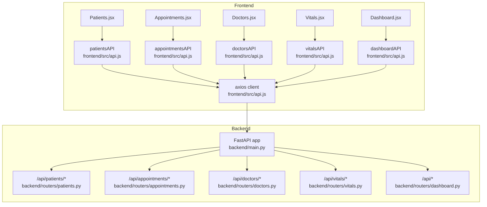
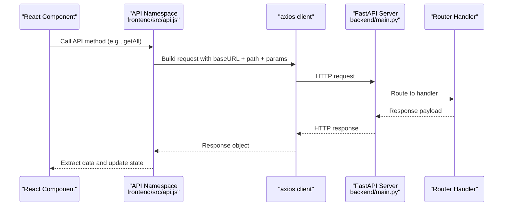
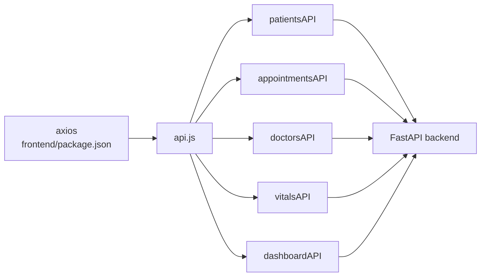

# API Integration Layer

<cite>
**Referenced Files in This Document**
- [api.js](file://frontend/src/api.js)
- [package.json](file://frontend/package.json)
- [main.py](file://backend/main.py)
- [patients.py](file://backend/routers/patients.py)
- [appointments.py](file://backend/routers/appointments.py)
- [doctors.py](file://backend/routers/doctors.py)
- [vitals.py](file://backend/routers/vitals.py)
- [dashboard.py](file://backend/routers/dashboard.py)
- [Patients.jsx](file://frontend/src/components/Patients.jsx)
- [Appointments.jsx](file://frontend/src/components/Appointments.jsx)
- [Dashboard.jsx](file://frontend/src/components/Dashboard.jsx)
- [Vitals.jsx](file://frontend/src/components/Vitals.jsx)
- [Doctors.jsx](file://frontend/src/components/Doctors.jsx)
- [App.jsx](file://frontend/src/App.jsx)
- [main.jsx](file://frontend/src/main.jsx)
</cite>

## Table of Contents
1. [Introduction](#introduction)
2. [Project Structure](#project-structure)
3. [Core Components](#core-components)
4. [Architecture Overview](#architecture-overview)
5. [Detailed Component Analysis](#detailed-component-analysis)
6. [Dependency Analysis](#dependency-analysis)
7. [Performance Considerations](#performance-considerations)
8. [Troubleshooting Guide](#troubleshooting-guide)
9. [Conclusion](#conclusion)

## Introduction
This document explains the frontend API integration layer built with axios. It covers the HTTP client configuration, endpoint mapping for backend services, request/response patterns, error handling strategies, and integration with React components. It also outlines loading states, concurrent data fetching, and recommended retry mechanisms.

## Project Structure
The frontend API layer is encapsulated in a single module that exports typed API namespaces for each backend domain. React components consume these APIs to render data and manage user interactions.

**Diagram sources**
- [api.js:1-56](file://frontend/src/api.js#L1-L56)
- [Patients.jsx:1-119](file://frontend/src/components/Patients.jsx#L1-L119)
- [Appointments.jsx:1-101](file://frontend/src/components/Appointments.jsx#L1-L101)
- [Dashboard.jsx:1-194](file://frontend/src/components/Dashboard.jsx#L1-L194)
- [Vitals.jsx:1-162](file://frontend/src/components/Vitals.jsx#L1-L162)
- [Doctors.jsx:1-77](file://frontend/src/components/Doctors.jsx#L1-L77)
- [main.py:1-52](file://backend/main.py#L1-L52)
- [patients.py:1-95](file://backend/routers/patients.py#L1-L95)
- [appointments.py:1-173](file://backend/routers/appointments.py#L1-L173)
- [doctors.py:1-70](file://backend/routers/doctors.py#L1-L70)
- [vitals.py:1-72](file://backend/routers/vitals.py#L1-L72)
- [dashboard.py:1-81](file://backend/routers/dashboard.py#L1-L81)

**Section sources**
- [api.js:1-56](file://frontend/src/api.js#L1-L56)
- [main.py:1-52](file://backend/main.py#L1-L52)

## Core Components
- Axios client: Configured with base URL pointing to the backend server, JSON content-type header, and no default timeout.
- API namespaces:
  - patientsAPI: CRUD for patients with optional query filters.
  - appointmentsAPI: CRUD for appointments with filters and a revenue endpoint.
  - doctorsAPI: CRUD for doctors with filters.
  - vitalsAPI: Retrieve vitals by patient and trends over time.
  - dashboardAPI: Dashboard statistics, recent activity, and health check.

Key characteristics:
- Base URL: http://localhost:5000
- Headers: Content-Type: application/json
- No interceptors or authentication tokens configured in the client
- No timeouts configured in the axios instance

**Section sources**
- [api.js:1-56](file://frontend/src/api.js#L1-L56)
- [package.json:1-34](file://frontend/package.json#L1-L34)

## Architecture Overview
The frontend consumes a RESTful backend via axios. Each React component invokes the appropriate API namespace method, receives a response object, and extracts the data payload for rendering. Loading states are managed locally in components.

**Diagram sources**
- [api.js:1-56](file://frontend/src/api.js#L1-L56)
- [main.py:1-52](file://backend/main.py#L1-L52)

## Detailed Component Analysis

### HTTP Client Setup
- Base URL: http://localhost:5000
- Headers: Content-Type: application/json
- No request/response interceptors
- No default timeout
- No authentication token injection

Recommendations:
- Add request interceptor to attach Authorization header when available.
- Configure timeout to handle slow networks gracefully.
- Centralize error handling in a response interceptor.

**Section sources**
- [api.js:3-10](file://frontend/src/api.js#L3-L10)
- [package.json:12-18](file://frontend/package.json#L12-L18)

### Endpoint Mapping and Request/Response Patterns

#### Patients
- GET /api/patients/?skip&limit&search&status&condition
- GET /api/patients/{id}
- POST /api/patients/
- PUT /api/patients/{id}
- DELETE /api/patients/{id}

Request parameters:
- Query params: skip, limit, search, status, condition

Response:
- GET lists return arrays; GET by ID returns a single object
- POST returns the created resource with 201 status
- PUT returns the updated resource
- DELETE returns no content (204)

Integration pattern in React:
- Use local loading state and try/catch around API calls
- Pass filters via params object

**Section sources**
- [api.js:12-19](file://frontend/src/api.js#L12-L19)
- [patients.py:11-39](file://backend/routers/patients.py#L11-L39)
- [patients.py:41-46](file://backend/routers/patients.py#L41-L46)
- [patients.py:48-66](file://backend/routers/patients.py#L48-L66)
- [patients.py:68-84](file://backend/routers/patients.py#L68-L84)
- [patients.py:86-94](file://backend/routers/patients.py#L86-L94)
- [Patients.jsx:16-30](file://frontend/src/components/Patients.jsx#L16-L30)

#### Appointments
- GET /api/appointments/?skip&limit&status&doctor_id&patient_id
- GET /api/appointments/{id}
- POST /api/appointments/
- PUT /api/appointments/{id}
- DELETE /api/appointments/{id}
- GET /api/appointments/revenue/today

Request parameters:
- Query params: skip, limit, status, doctor_id, patient_id
- Body: appointment creation/update payload
- Path param: appointment_id

Response:
- POST returns created appointment
- PUT returns updated appointment
- DELETE returns no content (204)
- Revenue endpoint returns a summary object

Integration pattern in React:
- Apply status filter and limit
- Handle potential validation errors (e.g., invalid time slot, conflicts)

**Section sources**
- [api.js:21-29](file://frontend/src/api.js#L21-L29)
- [appointments.py:53-75](file://backend/routers/appointments.py#L53-L75)
- [appointments.py:77-82](file://backend/routers/appointments.py#L77-L82)
- [appointments.py:84-125](file://backend/routers/appointments.py#L84-L125)
- [appointments.py:127-143](file://backend/routers/appointments.py#L127-L143)
- [appointments.py:145-153](file://backend/routers/appointments.py#L145-L153)
- [appointments.py:155-172](file://backend/routers/appointments.py#L155-L172)
- [Appointments.jsx:14-27](file://frontend/src/components/Appointments.jsx#L14-L27)

#### Doctors
- GET /api/doctors/?skip&limit&available&specialization
- GET /api/doctors/{id}
- POST /api/doctors/
- PUT /api/doctors/{id}
- DELETE /api/doctors/{id}

Request parameters:
- Query params: skip, limit, available, specialization

Response:
- GET lists return arrays; GET by ID returns a single object
- POST returns created doctor
- PUT returns updated doctor
- DELETE returns no content (204)

Integration pattern in React:
- Fetch with limit and optional filters
- Render availability and contact info

**Section sources**
- [api.js:31-38](file://frontend/src/api.js#L31-L38)
- [doctors.py:10-26](file://backend/routers/doctors.py#L10-L26)
- [doctors.py:28-33](file://backend/routers/doctors.py#L28-L33)
- [doctors.py:35-41](file://backend/routers/doctors.py#L35-L41)
- [doctors.py:43-59](file://backend/routers/doctors.py#L43-L59)
- [doctors.py:61-69](file://backend/routers/doctors.py#L61-L69)
- [Doctors.jsx:13-23](file://frontend/src/components/Doctors.jsx#L13-L23)

#### Vitals
- GET /api/vitals/{patientId}?skip&limit
- GET /api/vitals/{patientId}/trends?hours=24
- POST /api/vitals/
- DELETE /api/vitals/{id}

Request parameters:
- Path param: patientId or vitalId
- Query params: skip, limit, hours
- Body: vital sign creation payload

Response:
- GET returns array of vitals
- Trends returns array ordered by timestamp
- POST returns created vital sign
- DELETE returns no content (204)

Integration pattern in React:
- Select a patient, then fetch trends for the last N hours
- Render latest vitals and chart trends

**Section sources**
- [api.js:40-46](file://frontend/src/api.js#L40-L46)
- [vitals.py:11-27](file://backend/routers/vitals.py#L11-L27)
- [vitals.py:29-48](file://backend/routers/vitals.py#L29-L48)
- [vitals.py:50-61](file://backend/routers/vitals.py#L50-L61)
- [vitals.py:63-71](file://backend/routers/vitals.py#L63-L71)
- [Vitals.jsx:34-44](file://frontend/src/components/Vitals.jsx#L34-L44)

#### Dashboard
- GET /api/dashboard/stats
- GET /api/recent-activity
- GET /api/health

Response:
- Stats returns a structured stats object
- Activity returns a list of recent events
- Health returns a service status object

Integration pattern in React:
- Concurrently fetch stats, recent patients, and activity
- Display KPI cards and charts

**Section sources**
- [api.js:48-53](file://frontend/src/api.js#L48-L53)
- [dashboard.py:12-62](file://backend/routers/dashboard.py#L12-L62)
- [dashboard.py:64-71](file://backend/routers/dashboard.py#L64-L71)
- [dashboard.py:73-80](file://backend/routers/dashboard.py#L73-L80)
- [Dashboard.jsx:37-62](file://frontend/src/components/Dashboard.jsx#L37-L62)

### API Usage Examples

#### GET
- Retrieve filtered patients:
  - Call: patientsAPI.getAll({ search, status, condition, limit })
  - Response: res.data is an array of patient objects
  - Reference: [Patients.jsx:16-30](file://frontend/src/components/Patients.jsx#L16-L30)

- Retrieve appointments with status filter:
  - Call: appointmentsAPI.getAll({ status, limit })
  - Response: res.data is an array of appointment objects
  - Reference: [Appointments.jsx:14-27](file://frontend/src/components/Appointments.jsx#L14-L27)

- Retrieve doctor directory:
  - Call: doctorsAPI.getAll({ limit })
  - Response: res.data is an array of doctor objects
  - Reference: [Doctors.jsx:13-23](file://frontend/src/components/Doctors.jsx#L13-L23)

- Fetch dashboard stats and recent activity:
  - Call: Promise.all([dashboardAPI.getStats(), patientsAPI.getAll({ limit: 5 }), dashboardAPI.getActivity()])
  - Response: statsRes.data, patientsRes.data, activityRes.data
  - Reference: [Dashboard.jsx:40-48](file://frontend/src/components/Dashboard.jsx#L40-L48)

#### POST
- Create a new patient:
  - Call: patientsAPI.create(payload)
  - Response: res.data is the created patient object
  - Reference: [patients.py:48-66](file://backend/routers/patients.py#L48-L66)

- Create a new appointment:
  - Call: appointmentsAPI.create(payload)
  - Response: res.data is the created appointment object
  - Reference: [appointments.py:84-125](file://backend/routers/appointments.py#L84-L125)

- Record vitals:
  - Call: vitalsAPI.create(payload)
  - Response: res.data is the created vital sign object
  - Reference: [vitals.py:50-61](file://backend/routers/vitals.py#L50-L61)

#### PUT
- Update a patient:
  - Call: patientsAPI.update(id, payload)
  - Response: res.data is the updated patient object
  - Reference: [patients.py:68-84](file://backend/routers/patients.py#L68-L84)

- Update an appointment:
  - Call: appointmentsAPI.update(id, payload)
  - Response: res.data is the updated appointment object
  - Reference: [appointments.py:127-143](file://backend/routers/appointments.py#L127-L143)

- Update a doctor:
  - Call: doctorsAPI.update(id, payload)
  - Response: res.data is the updated doctor object
  - Reference: [doctors.py:43-59](file://backend/routers/doctors.py#L43-L59)

#### DELETE
- Remove a patient:
  - Call: patientsAPI.delete(id)
  - Response: no data returned (204)
  - Reference: [patients.py:86-94](file://backend/routers/patients.py#L86-L94)

- Cancel an appointment:
  - Call: appointmentsAPI.delete(id)
  - Response: no data returned (204)
  - Reference: [appointments.py:145-153](file://backend/routers/appointments.py#L145-L153)

- Remove a vital record:
  - Call: vitalsAPI.delete(id)
  - Response: no data returned (204)
  - Reference: [vitals.py:63-71](file://backend/routers/vitals.py#L63-L71)

### Integration Patterns with React Components
- Loading states: Components set and clear a local loading flag around API calls.
- Error handling: Try/catch blocks log errors to the console; consider surfacing user-friendly messages.
- Concurrent data fetching: Components use Promise.all to fetch related data efficiently.
- Parameter passing: Query parameters are passed as an object to API methods.

Examples:
- Patients: [Patients.jsx:16-30](file://frontend/src/components/Patients.jsx#L16-L30)
- Appointments: [Appointments.jsx:14-27](file://frontend/src/components/Appointments.jsx#L14-L27)
- Dashboard: [Dashboard.jsx:37-62](file://frontend/src/components/Dashboard.jsx#L37-L62)
- Vitals: [Vitals.jsx:34-44](file://frontend/src/components/Vitals.jsx#L34-L44)
- Doctors: [Doctors.jsx:13-23](file://frontend/src/components/Doctors.jsx#L13-L23)

**Section sources**
- [Patients.jsx:1-119](file://frontend/src/components/Patients.jsx#L1-L119)
- [Appointments.jsx:1-101](file://frontend/src/components/Appointments.jsx#L1-L101)
- [Dashboard.jsx:1-194](file://frontend/src/components/Dashboard.jsx#L1-L194)
- [Vitals.jsx:1-162](file://frontend/src/components/Vitals.jsx#L1-L162)
- [Doctors.jsx:1-77](file://frontend/src/components/Doctors.jsx#L1-L77)

## Dependency Analysis
- Frontend depends on axios for HTTP requests.
- Backend exposes REST endpoints grouped under /api with CORS enabled for frontend origins.
- Components depend on API namespaces exported from the central module.

**Diagram sources**
- [package.json:16-16](file://frontend/package.json#L16-L16)
- [api.js:1-56](file://frontend/src/api.js#L1-L56)
- [main.py:24-31](file://backend/main.py#L24-L31)

**Section sources**
- [package.json:12-18](file://frontend/package.json#L12-L18)
- [api.js:1-56](file://frontend/src/api.js#L1-L56)
- [main.py:24-31](file://backend/main.py#L24-L31)

## Performance Considerations
- Network latency: Without a timeout, long-running requests can hang indefinitely. Consider adding a timeout to the axios instance.
- Concurrency: Components already use Promise.all for efficient fetching. Keep this pattern to reduce total load time.
- Pagination: Use skip and limit parameters to avoid large payloads.
- Caching: Implement a simple in-memory cache keyed by URL and query params to avoid redundant requests.
- Retry: Introduce exponential backoff for transient failures (e.g., network errors, 5xx).

[No sources needed since this section provides general guidance]

## Troubleshooting Guide
Common issues and remedies:
- Network errors: axios throws when the server is unreachable or CORS is misconfigured. Ensure the backend allows frontend origins and the server is running.
- HTTP status codes:
  - 404 Not Found: Resource does not exist (e.g., missing patient/appointment/doctor/vital).
  - 409 Conflict: Duplicate resource or scheduling conflict (e.g., existing patient with same name/room, booked time slot).
  - 400 Bad Request: Validation failure (e.g., invalid time slot).
- Validation errors: Catch and display user-friendly messages derived from error.response.data.detail.
- Authentication: The client does not include tokens. If authentication is required, add an interceptor to attach Authorization headers.

References:
- Backend error responses and validation:
  - Patients: [patients.py:48-66](file://backend/routers/patients.py#L48-L66), [patients.py:68-84](file://backend/routers/patients.py#L68-L84), [patients.py:86-94](file://backend/routers/patients.py#L86-L94)
  - Appointments: [appointments.py:84-125](file://backend/routers/appointments.py#L84-L125), [appointments.py:127-143](file://backend/routers/appointments.py#L127-L143), [appointments.py:145-153](file://backend/routers/appointments.py#L145-L153)
  - Doctors: [doctors.py:35-41](file://backend/routers/doctors.py#L35-L41), [doctors.py:43-59](file://backend/routers/doctors.py#L43-L59), [doctors.py:61-69](file://backend/routers/doctors.py#L61-L69)
  - Vitals: [vitals.py:50-61](file://backend/routers/vitals.py#L50-L61), [vitals.py:63-71](file://backend/routers/vitals.py#L63-L71)
- Frontend error handling patterns:
  - Patients: [Patients.jsx:16-30](file://frontend/src/components/Patients.jsx#L16-L30)
  - Appointments: [Appointments.jsx:14-27](file://frontend/src/components/Appointments.jsx#L14-L27)
  - Dashboard: [Dashboard.jsx:37-62](file://frontend/src/components/Dashboard.jsx#L37-L62)
  - Vitals: [Vitals.jsx:34-44](file://frontend/src/components/Vitals.jsx#L34-L44)
  - Doctors: [Doctors.jsx:13-23](file://frontend/src/components/Doctors.jsx#L13-L23)

**Section sources**
- [patients.py:48-94](file://backend/routers/patients.py#L48-L94)
- [appointments.py:84-153](file://backend/routers/appointments.py#L84-L153)
- [doctors.py:35-69](file://backend/routers/doctors.py#L35-L69)
- [vitals.py:50-71](file://backend/routers/vitals.py#L50-L71)
- [Patients.jsx:16-30](file://frontend/src/components/Patients.jsx#L16-L30)
- [Appointments.jsx:14-27](file://frontend/src/components/Appointments.jsx#L14-L27)
- [Dashboard.jsx:37-62](file://frontend/src/components/Dashboard.jsx#L37-L62)
- [Vitals.jsx:34-44](file://frontend/src/components/Vitals.jsx#L34-L44)
- [Doctors.jsx:13-23](file://frontend/src/components/Doctors.jsx#L13-L23)

## Conclusion
The frontend API integration layer provides a clean, modular interface to the backend services. It supports standard CRUD operations and specialized endpoints for appointments and vitals. To improve robustness, consider adding interceptors for authentication and centralized error handling, configuring timeouts, and implementing retry logic for transient failures. Components already demonstrate effective loading state management and concurrent data fetching patterns.