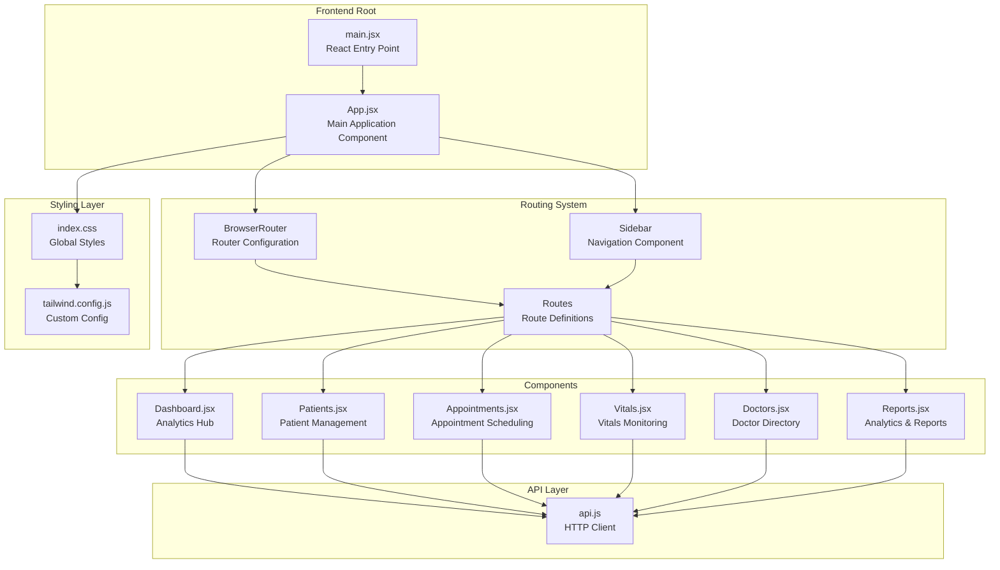
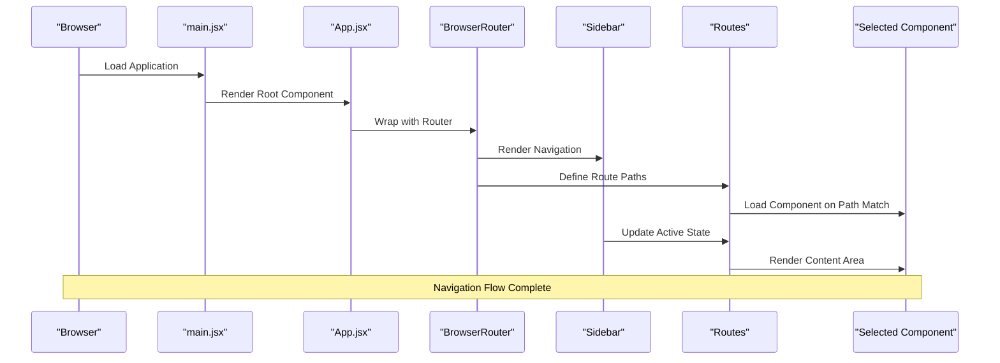
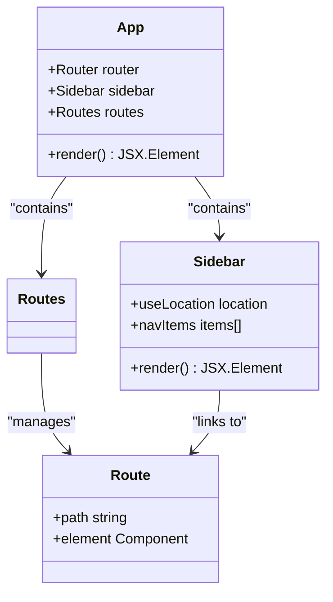
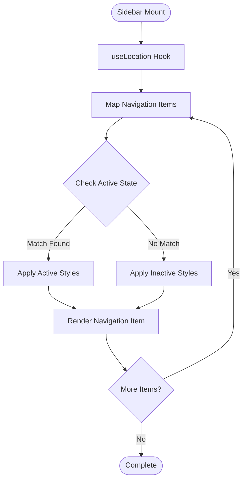
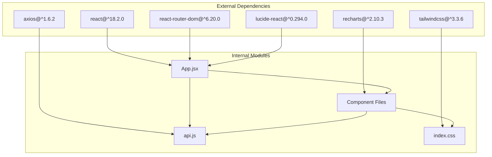

# Application Structure & Routing

<cite>
**Referenced Files in This Document**
- [App.jsx](file://frontend/src/App.jsx)
- [main.jsx](file://frontend/src/main.jsx)
- [Dashboard.jsx](file://frontend/src/components/Dashboard.jsx)
- [Patients.jsx](file://frontend/src/components/Patients.jsx)
- [Appointments.jsx](file://frontend/src/components/Appointments.jsx)
- [Vitals.jsx](file://frontend/src/components/Vitals.jsx)
- [Doctors.jsx](file://frontend/src/components/Doctors.jsx)
- [Reports.jsx](file://frontend/src/components/Reports.jsx)
- [api.js](file://frontend/src/api.js)
- [index.css](file://frontend/src/index.css)
- [tailwind.config.js](file://frontend/tailwind.config.js)
- [package.json](file://frontend/package.json)
- [README.md](file://README.md)
</cite>

## Table of Contents
1. [Introduction](#introduction)
2. [Project Structure](#project-structure)
3. [Core Components](#core-components)
4. [Architecture Overview](#architecture-overview)
5. [Detailed Component Analysis](#detailed-component-analysis)
6. [Dependency Analysis](#dependency-analysis)
7. [Performance Considerations](#performance-considerations)
8. [Troubleshooting Guide](#troubleshooting-guide)
9. [Conclusion](#conclusion)

## Introduction
This document provides comprehensive documentation for the Smart Healthcare Dashboard application's main structure and routing system. The application follows a modern React architecture with React Router DOM for navigation, Lucide React for icons, and TailwindCSS for styling with glass-morphism effects and dark theme implementation. The system consists of six main routes covering dashboard analytics, patient management, appointments, vitals monitoring, doctor directory, and comprehensive reporting.

## Project Structure
The frontend application follows a component-based architecture with clear separation of concerns:

**Diagram sources**
- [main.jsx:1-11](file://frontend/src/main.jsx#L1-L11)
- [App.jsx:53-74](file://frontend/src/App.jsx#L53-L74)
- [index.css:1-119](file://frontend/src/index.css#L1-L119)
- [tailwind.config.js:1-50](file://frontend/tailwind.config.js#L1-L50)

**Section sources**
- [main.jsx:1-11](file://frontend/src/main.jsx#L1-L11)
- [App.jsx:1-74](file://frontend/src/App.jsx#L1-L74)
- [README.md:106-136](file://README.md#L106-L136)

## Core Components
The application's core architecture centers around three fundamental components that work together to provide a seamless user experience:

### Application Entry Point
The React application starts from the main entry point which renders the root App component within a strict mode wrapper. This establishes the foundation for the entire application's rendering lifecycle.

### Central Routing Hub
The main App component serves as the central routing hub, configuring BrowserRouter for navigation management and defining all six main routes. It implements a fixed sidebar layout with responsive content areas.

### Navigation System
The Sidebar component provides dynamic navigation with Lucide React icons integration, active state management using react-router-dom's useLocation hook, and glass-morphism styling for modern UI aesthetics.

**Section sources**
- [main.jsx:6-10](file://frontend/src/main.jsx#L6-L10)
- [App.jsx:53-74](file://frontend/src/App.jsx#L53-L74)
- [App.jsx:10-51](file://frontend/src/App.jsx#L10-L51)

## Architecture Overview
The application follows a layered architecture pattern with clear separation between presentation, routing, data fetching, and styling concerns:

**Diagram sources**
- [main.jsx:6-10](file://frontend/src/main.jsx#L6-L10)
- [App.jsx:53-74](file://frontend/src/App.jsx#L53-L74)
- [App.jsx:10-51](file://frontend/src/App.jsx#L10-L51)

The architecture implements several key design patterns:

- **Component Composition**: Parent components orchestrate child components through props and state management
- **Route-Based Rendering**: Dynamic component loading based on URL path matching
- **Hook-Based State Management**: React hooks for local state and lifecycle management
- **API Abstraction**: Centralized HTTP client for backend communication
- **Styling Architecture**: Utility-first CSS with custom theme extensions

**Section sources**
- [App.jsx:53-74](file://frontend/src/App.jsx#L53-L74)
- [api.js:1-56](file://frontend/src/api.js#L1-L56)

## Detailed Component Analysis

### App.jsx - Central Application Hub
The main application component serves as the foundation for the entire routing system and layout structure.

#### Router Configuration
The application uses BrowserRouter as the primary router configuration, establishing a single source of truth for navigation throughout the application. This provides client-side routing capabilities without requiring server-side configuration.

#### Route Definitions
Six distinct routes are configured, each mapping to specific functional components:
- `/` → Dashboard component for analytics overview
- `/patients` → Patient management interface
- `/appointments` → Appointment scheduling and management
- `/vitals` → Vitals monitoring and tracking
- `/doctors` → Doctor directory and information
- `/reports` → Comprehensive analytics and reporting

#### Layout System Implementation
The layout system employs a fixed sidebar approach with responsive content areas:
- Fixed sidebar positioned absolutely on the left side
- Content area automatically adjusts to sidebar width
- Glass-morphism effect achieved through Tailwind utilities
- Responsive design that adapts to different screen sizes

**Diagram sources**
- [App.jsx:53-74](file://frontend/src/App.jsx#L53-L74)
- [App.jsx:10-51](file://frontend/src/App.jsx#L10-L51)

**Section sources**
- [App.jsx:1-74](file://frontend/src/App.jsx#L1-L74)

### Sidebar Component - Dynamic Navigation
The Sidebar component implements sophisticated navigation with several key features:

#### Active State Management
Uses react-router-dom's useLocation hook to track current route and dynamically apply active state styling. The active state is determined by exact path matching between the current location and navigation items.

#### Lucide React Integration
Integrates seamlessly with Lucide React icons library, allowing for consistent iconography across the application. Each navigation item includes a corresponding icon that changes appearance based on active state.

#### Styling Architecture
Implements glass-morphism effects through TailwindCSS utilities, creating a modern frosted glass appearance with backdrop blur and semi-transparent backgrounds.

**Diagram sources**
- [App.jsx:10-51](file://frontend/src/App.jsx#L10-L51)

**Section sources**
- [App.jsx:10-51](file://frontend/src/App.jsx#L10-L51)

### Component Composition Pattern
Each main component follows a consistent composition pattern:

#### Data Fetching Strategy
Components implement useEffect hooks for initial data loading and dependency-based re-fetching when filters or parameters change. This ensures optimal performance while maintaining data freshness.

#### Loading States
Consistent loading state implementation using conditional rendering to provide user feedback during data fetching operations.

#### Responsive Design
All components utilize TailwindCSS grid systems for responsive layouts that adapt to different screen sizes from mobile to desktop.

**Section sources**
- [Dashboard.jsx:26-62](file://frontend/src/components/Dashboard.jsx#L26-L62)
- [Patients.jsx:5-30](file://frontend/src/components/Patients.jsx#L5-L30)
- [Appointments.jsx:5-27](file://frontend/src/components/Appointments.jsx#L5-L27)

### Routing Configuration Details
The routing system implements six main routes with specific configurations:

#### Route Path Definitions
- Root route (`/`) for dashboard analytics
- Patient management route (`/patients`) with search and filtering
- Appointment scheduling route (`/appointments`) with status filtering
- Vitals monitoring route (`/vitals`) with patient selection
- Doctor directory route (`/doctors`) for healthcare provider information
- Comprehensive reporting route (`/reports`) with analytics and insights

#### Component Integration
Each route integrates with its corresponding component through direct element assignment, enabling lazy loading and efficient memory usage.

**Section sources**
- [App.jsx:59-66](file://frontend/src/App.jsx#L59-L66)

## Dependency Analysis
The application maintains clean dependency relationships through strategic module organization and abstraction layers.

**Diagram sources**
- [package.json:12-19](file://frontend/package.json#L12-L19)
- [App.jsx:1-8](file://frontend/src/App.jsx#L1-L8)
- [api.js:1-56](file://frontend/src/api.js#L1-L56)

### Module Dependencies
The application demonstrates excellent modularity with clear separation between:
- **Presentation Layer**: React components handling UI logic
- **Routing Layer**: Router configuration and navigation management
- **Data Layer**: API client abstraction for backend communication
- **Styling Layer**: TailwindCSS configuration and custom utilities

### Circular Dependency Prevention
The architecture avoids circular dependencies through:
- Single-direction data flow from parent to child components
- Centralized API client preventing direct backend coupling
- Modular component structure with explicit import boundaries

**Section sources**
- [package.json:12-32](file://frontend/package.json#L12-L32)
- [App.jsx:1-8](file://frontend/src/App.jsx#L1-L8)
- [api.js:1-56](file://frontend/src/api.js#L1-L56)

## Performance Considerations
The application implements several performance optimization strategies:

### Lazy Loading Implementation
React Router DOM enables automatic code splitting for route components, ensuring only the currently active component is loaded and rendered.

### Efficient State Management
React hooks provide efficient state updates with minimal re-rendering through proper dependency arrays and state normalization.

### Optimized Rendering
Glass-morphism effects are implemented efficiently through TailwindCSS utilities rather than heavy JavaScript computations.

### API Optimization
Centralized API client with axios provides request caching and error handling capabilities for improved performance.

## Troubleshooting Guide

### Common Issues and Solutions

#### Navigation Not Working
- Verify BrowserRouter is properly wrapped around the application
- Check route paths match exactly with Link components
- Ensure useLocation hook is used correctly in Sidebar component

#### Styling Issues
- Confirm TailwindCSS is properly configured with content paths
- Verify glass-morphism classes are applied correctly
- Check for conflicting CSS class names

#### API Communication Problems
- Validate API base URL matches backend server
- Check CORS configuration on backend
- Verify endpoint paths match backend routes

#### Component Rendering Issues
- Ensure useEffect hooks have proper dependency arrays
- Check for missing loading state handling
- Verify responsive design classes are applied correctly

**Section sources**
- [App.jsx:53-74](file://frontend/src/App.jsx#L53-L74)
- [index.css:21-28](file://frontend/src/index.css#L21-L28)
- [api.js:3-10](file://frontend/src/api.js#L3-L10)

## Conclusion
The Smart Healthcare Dashboard demonstrates a well-architected React application with robust routing, modern UI patterns, and scalable component design. The centralized routing system in App.jsx provides a clean foundation for navigation, while the Sidebar component offers intuitive user interaction through active state management and icon integration. The glass-morphism styling approach creates a contemporary healthcare dashboard interface, and the component composition pattern ensures maintainable and extensible code architecture.

The application successfully balances functionality with performance through strategic use of React hooks, efficient routing patterns, and optimized styling approaches. The modular architecture supports future enhancements including database integration, authentication systems, and advanced analytics capabilities.