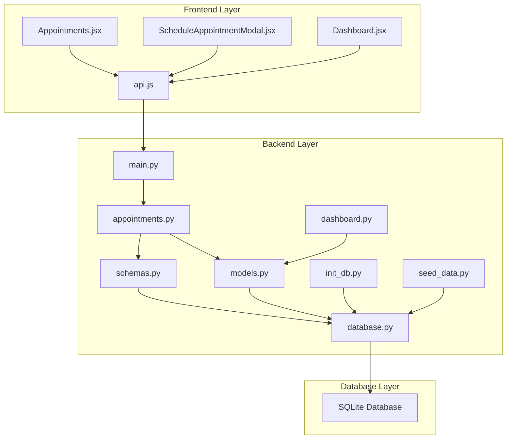
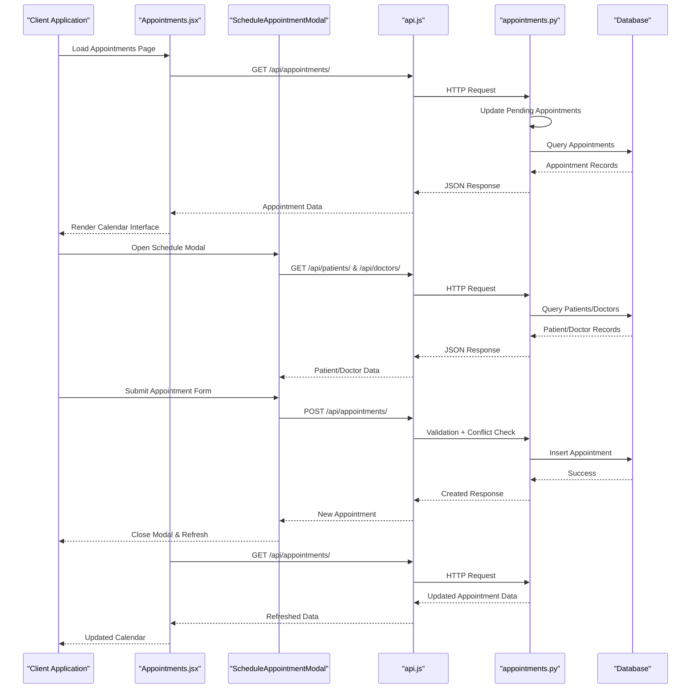
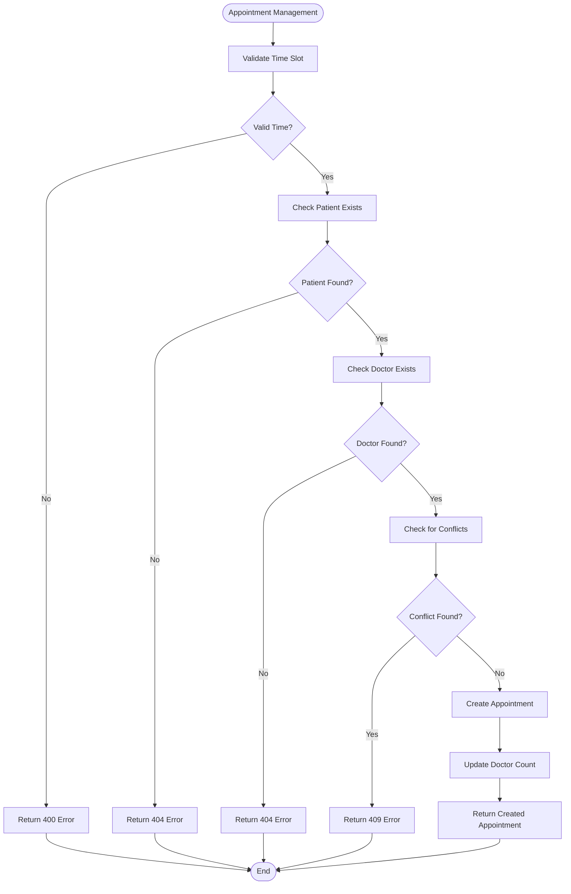
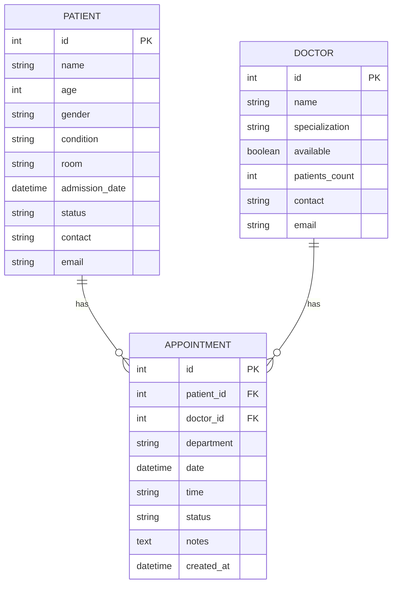
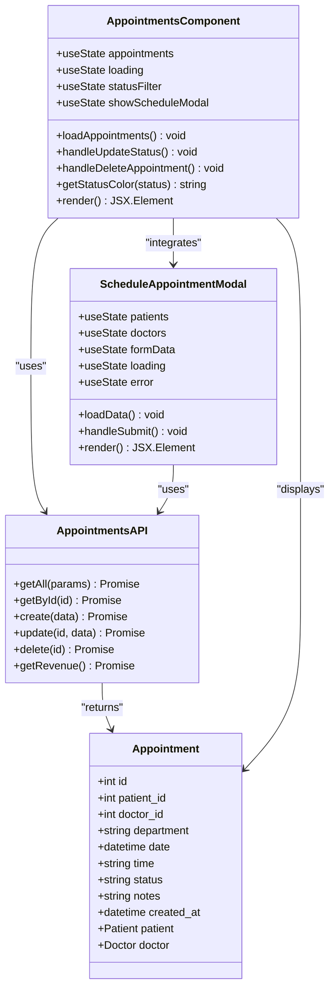
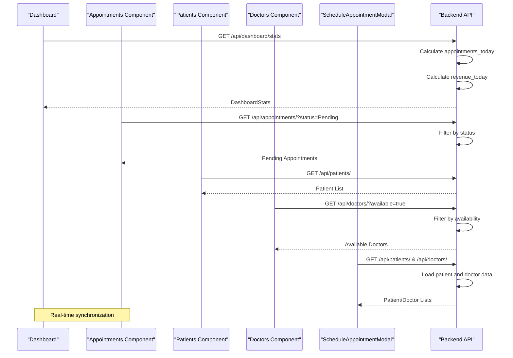
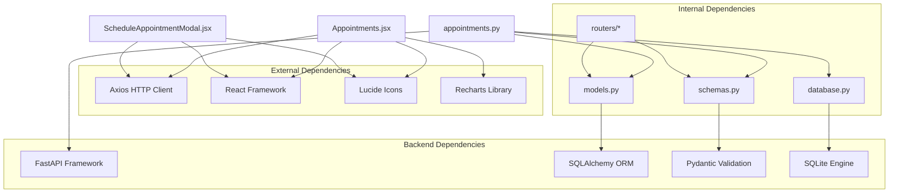
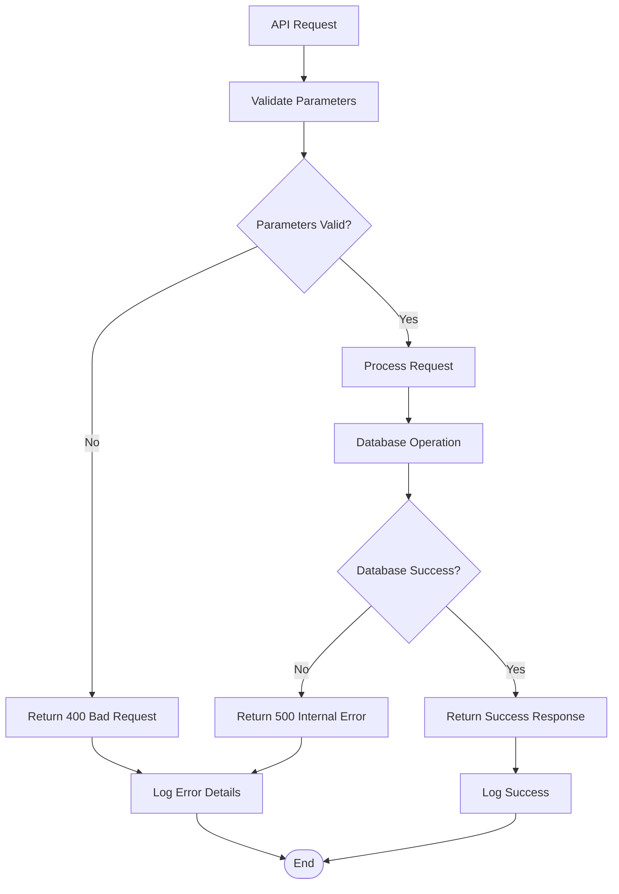

# Appointments Component

<cite>
**Referenced Files in This Document**
- [appointments.py](file://backend/routers/appointments.py)
- [models.py](file://backend/models.py)
- [schemas.py](file://backend/schemas.py)
- [main.py](file://backend/main.py)
- [database.py](file://backend/database.py)
- [api.js](file://frontend/src/api.js)
- [Appointments.jsx](file://frontend/src/components/Appointments.jsx)
- [ScheduleAppointmentModal.jsx](file://frontend/src/components/ScheduleAppointmentModal.jsx)
- [Dashboard.jsx](file://frontend/src/components/Dashboard.jsx)
- [init_db.py](file://backend/init_db.py)
- [seed_data.py](file://backend/seed_data.py)
- [dashboard.py](file://backend/routers/dashboard.py)
</cite>

## Update Summary
**Changes Made**
- Enhanced status management with individual appointment status update capabilities
- Added individual appointment deletion with confirmation prompts
- Integrated new ScheduleAppointmentModal for streamlined appointment creation
- Updated frontend interface to support interactive status management and modal-based scheduling

## Table of Contents
1. [Introduction](#introduction)
2. [Project Structure](#project-structure)
3. [Core Components](#core-components)
4. [Architecture Overview](#architecture-overview)
5. [Detailed Component Analysis](#detailed-component-analysis)
6. [Dependency Analysis](#dependency-analysis)
7. [Performance Considerations](#performance-considerations)
8. [Troubleshooting Guide](#troubleshooting-guide)
9. [Conclusion](#conclusion)
10. [Appendices](#appendices)

## Introduction
The Appointments component is a central module in the Smart Healthcare Dashboard responsible for managing patient-doctor scheduling, calendar-based display, and comprehensive status tracking. It provides a complete lifecycle for appointments including creation, modification, conflict detection, automatic status updates, and revenue calculation. The component integrates seamlessly with the patient and doctor modules to ensure real-time availability and resource allocation.

The system implements a structured approach to healthcare scheduling with predefined time slots, robust validation mechanisms, and automated workflows for status transitions. It supports multiple status states (pending, confirmed, completed, cancelled) with clear visual indicators and provides comprehensive filtering capabilities for efficient appointment management.

**Updated** Enhanced with interactive status management, individual appointment deletion, and modal-based scheduling interface.

## Project Structure
The Appointments component spans both frontend and backend layers, with clear separation of concerns:

**Diagram sources**
- [main.py:1-56](file://backend/main.py#L1-L56)
- [appointments.py:1-173](file://backend/routers/appointments.py#L1-L173)
- [models.py:1-75](file://backend/models.py#L1-L75)
- [schemas.py:1-134](file://backend/schemas.py#L1-L134)
- [database.py:1-20](file://backend/database.py#L1-L20)
- [init_db.py:1-25](file://backend/init_db.py#L1-L25)
- [seed_data.py:1-138](file://backend/seed_data.py#L1-L138)
- [dashboard.py:1-81](file://backend/routers/dashboard.py#L1-L81)

**Section sources**
- [main.py:1-56](file://backend/main.py#L1-L56)
- [appointments.py:1-173](file://backend/routers/appointments.py#L1-L173)
- [models.py:1-75](file://backend/models.py#L1-L75)
- [schemas.py:1-134](file://backend/schemas.py#L1-L134)
- [database.py:1-20](file://backend/database.py#L1-L20)

## Core Components
The Appointments component consists of several interconnected modules that handle different aspects of the scheduling system:

### Backend API Router
The primary backend component handles all appointment-related operations including CRUD operations, validation, conflict detection, and status management. It implements a RESTful API with comprehensive error handling and response formatting.

### Data Models and Schemas
The system uses SQLAlchemy ORM models for persistent storage and Pydantic schemas for request/response validation. These models define the appointment entity structure, relationships with patients and doctors, and validation rules.

### Frontend Interface
The frontend component provides a responsive calendar-based interface for appointment display, filtering, and interactive management operations. It integrates with the backend API through a well-defined client interface and includes enhanced status management capabilities.

### Modal-Based Scheduling
The new ScheduleAppointmentModal provides an integrated interface for creating new appointments with patient and doctor selection, department assignment, and time slot configuration.

### Database Integration
The system uses SQLite with SQLAlchemy ORM for data persistence, with automatic initialization and seeding capabilities for development environments.

**Updated** Added modal-based scheduling interface and enhanced status management capabilities.

**Section sources**
- [appointments.py:12-23](file://backend/routers/appointments.py#L12-L23)
- [models.py:36-50](file://backend/models.py#L36-L50)
- [schemas.py:62-86](file://backend/schemas.py#L62-L86)
- [Appointments.jsx:1-154](file://frontend/src/components/Appointments.jsx#L1-L154)
- [ScheduleAppointmentModal.jsx:1-199](file://frontend/src/components/ScheduleAppointmentModal.jsx#L1-L199)

## Architecture Overview
The Appointments component follows a layered architecture pattern with clear separation between presentation, business logic, and data access layers:

**Diagram sources**
- [Appointments.jsx:14-27](file://frontend/src/components/Appointments.jsx#L14-L27)
- [ScheduleAppointmentModal.jsx:19-36](file://frontend/src/components/ScheduleAppointmentModal.jsx#L19-L36)
- [api.js:21-29](file://frontend/src/api.js#L21-L29)
- [appointments.py:53-75](file://backend/routers/appointments.py#L53-L75)
- [appointments.py:84-125](file://backend/routers/appointments.py#L84-L125)

The architecture ensures real-time updates through automatic status management and provides comprehensive validation at multiple layers to prevent scheduling conflicts and maintain data integrity.

**Section sources**
- [appointments.py:25-52](file://backend/routers/appointments.py#L25-L52)
- [Appointments.jsx:10-27](file://frontend/src/components/Appointments.jsx#L10-L27)

## Detailed Component Analysis

### Backend API Router Implementation
The backend router serves as the primary interface for appointment management operations, implementing comprehensive validation and business logic:

#### Time Slot Management
The system enforces strict time slot validation using predefined intervals from 9 AM to 6 PM with 15-minute increments. This ensures optimal resource utilization and prevents scheduling conflicts.

#### Conflict Detection System
The router implements sophisticated conflict detection that prevents double-booking by checking existing appointments for the same doctor, date, and time slot. The system automatically excludes cancelled appointments from conflict calculations.

#### Status Management Workflow
The component includes an automated status management system that automatically transitions appointments based on temporal criteria:
- Pending appointments older than 48 hours become Cancelled
- Pending appointments older than 24 hours but less than 48 hours become Confirmed

#### Enhanced Status Update Capabilities
**Updated** The router now supports individual appointment status updates through PUT requests, allowing manual intervention in the status management workflow.

#### Individual Appointment Deletion
**Updated** The router provides DELETE endpoint for removing specific appointments with proper validation and error handling.

#### Revenue Calculation
The system provides automated revenue calculation based on confirmed appointments, with a fixed rate of ₹5000 per confirmed appointment for the current day.

**Diagram sources**
- [appointments.py:84-125](file://backend/routers/appointments.py#L84-L125)

**Section sources**
- [appointments.py:12-23](file://backend/routers/appointments.py#L12-L23)
- [appointments.py:25-52](file://backend/routers/appointments.py#L25-L52)
- [appointments.py:84-125](file://backend/routers/appointments.py#L84-L125)
- [appointments.py:127-153](file://backend/routers/appointments.py#L127-L153)
- [appointments.py:155-173](file://backend/routers/appointments.py#L155-L173)

### Data Models and Relationships
The appointment system utilizes a normalized relational model with clear foreign key relationships:

**Diagram sources**
- [models.py:6-50](file://backend/models.py#L6-L50)

The model design ensures referential integrity while maintaining flexibility for future enhancements. The relationships enable efficient querying of appointment data with associated patient and doctor information.

**Section sources**
- [models.py:6-50](file://backend/models.py#L6-L50)

### Frontend Interface Implementation
The frontend component provides a comprehensive interface for appointment management with real-time filtering, interactive status management, and modal-based scheduling:

#### Enhanced Calendar-Based Display
**Updated** The interface presents appointments in a card-based layout with clear visual indicators for different status states. Each appointment card displays essential information including patient name, doctor name, department, date, time, and status. The interface now includes interactive status management controls.

#### Interactive Status Management
**Updated** The component includes inline status management controls that allow users to update appointment status directly from the calendar interface:
- Confirm button appears for Pending appointments
- Direct status updates trigger immediate API calls
- Real-time UI updates reflect status changes

#### Individual Appointment Deletion
**Updated** Each appointment card includes a delete button with confirmation prompts to prevent accidental deletions. The interface provides visual feedback during deletion operations.

#### Status Filtering System
The component includes an intuitive dropdown filter that allows users to view appointments by status (All, Confirmed, Pending, Completed, Cancelled). The filter automatically triggers data refresh when changed.

#### Visual Status Indicators
Different status states are represented with distinct color-coded badges:
- Confirmed: Green indicators
- Pending: Yellow indicators  
- Completed: Blue indicators
- Cancelled: Red indicators

#### Modal-Based Scheduling Integration
**Updated** The component integrates with ScheduleAppointmentModal for streamlined appointment creation. Users can open the modal from the main interface to create new appointments with a comprehensive form.

**Diagram sources**
- [Appointments.jsx:1-154](file://frontend/src/components/Appointments.jsx#L1-L154)
- [ScheduleAppointmentModal.jsx:1-199](file://frontend/src/components/ScheduleAppointmentModal.jsx#L1-199)
- [api.js:21-29](file://frontend/src/api.js#L21-L29)

**Section sources**
- [Appointments.jsx:1-154](file://frontend/src/components/Appointments.jsx#L1-L154)
- [ScheduleAppointmentModal.jsx:1-199](file://frontend/src/components/ScheduleAppointmentModal.jsx#L1-L199)
- [api.js:21-29](file://frontend/src/api.js#L21-L29)

### Integration with Patient and Doctor Components
The Appointments component seamlessly integrates with patient and doctor management systems through shared database relationships and API endpoints:

#### Real-Time Availability Updates
The system maintains doctor availability through the `available` field in the Doctor model, allowing for dynamic filtering and display of available practitioners. The `patients_count` field provides insights into doctor workload distribution.

#### Patient-Doctor Matching
The appointment creation process validates both patient and doctor existence before creating new appointments, ensuring data integrity and preventing orphaned records. The relationship enables comprehensive reporting and analytics.

#### Cross-Component Data Flow

**Diagram sources**
- [dashboard.py:12-62](file://backend/routers/dashboard.py#L12-L62)
- [appointments.py:53-75](file://backend/routers/appointments.py#L53-L75)
- [models.py:23-35](file://backend/models.py#L23-L35)

**Section sources**
- [dashboard.py:12-62](file://backend/routers/dashboard.py#L12-L62)
- [models.py:23-35](file://backend/models.py#L23-L35)

## Dependency Analysis
The Appointments component exhibits well-structured dependencies that support maintainability and scalability:

**Diagram sources**
- [main.py:1-56](file://backend/main.py#L1-L56)
- [Appointments.jsx:1-154](file://frontend/src/components/Appointments.jsx#L1-L154)
- [ScheduleAppointmentModal.jsx:1-199](file://frontend/src/components/ScheduleAppointmentModal.jsx#L1-L199)
- [api.js:1-57](file://frontend/src/api.js#L1-L57)

The dependency structure ensures loose coupling between components while maintaining clear interfaces. The backend uses modern Python frameworks with robust validation and database abstraction layers.

**Section sources**
- [main.py:1-56](file://backend/main.py#L1-L56)
- [api.js:1-57](file://frontend/src/api.js#L1-L57)

## Performance Considerations
The Appointments component implements several performance optimization strategies:

### Database Optimization
- Index creation on frequently queried fields (id, date, status)
- Efficient query patterns using SQLAlchemy ORM
- Batch operations for status updates
- Connection pooling through SQLAlchemy session management

### Frontend Performance
- Lazy loading of appointment data with pagination support
- Efficient state management using React hooks
- Debounced API calls for filtering operations
- Optimized rendering through virtualized lists for large datasets
- **Updated** Modal-based scheduling reduces page reload overhead

### Caching Strategies
- Automatic status updates reduce redundant queries
- Client-side caching for filtered results
- Efficient data structures for status color mapping
- **Updated** Modal state management for improved user experience

### Scalability Considerations
- Horizontal scaling through database clustering
- API rate limiting for high-volume environments
- Asynchronous processing for heavy operations
- Database indexing for improved query performance

## Troubleshooting Guide

### Common Issues and Solutions

#### Appointment Creation Failures
**Problem**: Time slot validation errors during appointment creation
**Solution**: Verify that the selected time falls within the predefined 9 AM to 6 PM window with 15-minute intervals

**Problem**: "This time slot is already booked" errors
**Solution**: Check for existing appointments with the same doctor, date, and time slot. Consider rescheduling or selecting alternative time slots

**Problem**: Patient or doctor not found errors
**Solution**: Verify that the patient_id and doctor_id correspond to existing records in the database

#### Status Management Issues
**Problem**: Automatic status transitions not occurring
**Solution**: Check server logs for the update_pending_appointments function execution. Verify system time and timezone settings

**Problem**: Manual status updates failing
**Solution**: Verify that the appointment_id exists and the new status value is valid. Check network connectivity and API response codes.

**Problem**: Confirmed appointments not reflecting in revenue calculations
**Solution**: Ensure appointments meet the criteria for confirmed status (older than 24 hours for automatic confirmation)

#### Frontend Display Problems
**Problem**: Appointments not loading in the calendar interface
**Solution**: Verify API connectivity to http://localhost:5000. Check browser console for CORS-related errors

**Problem**: Status filters not working correctly
**Solution**: Ensure the statusFilter state is properly managed and triggers useEffect dependencies

**Problem**: Schedule modal not opening or closing
**Solution**: Verify that the modal isOpen prop is properly managed and the onClose callback is functioning correctly.

#### Modal-Based Scheduling Issues
**Problem**: Patient or doctor lists not loading in modal
**Solution**: Check network connectivity and verify that /api/patients/ and /api/doctors/ endpoints are accessible.

**Problem**: Appointment creation fails in modal
**Solution**: Verify that all required fields are filled and the selected time slot is valid. Check for conflict detection errors.

### Error Handling Patterns
The system implements comprehensive error handling across all layers:

**Diagram sources**
- [appointments.py:84-125](file://backend/routers/appointments.py#L84-L125)

**Section sources**
- [appointments.py:84-125](file://backend/routers/appointments.py#L84-L125)
- [Appointments.jsx:14-27](file://frontend/src/components/Appointments.jsx#L14-L27)

## Conclusion
The Appointments component represents a comprehensive solution for healthcare appointment management, combining robust backend validation with an intuitive frontend interface. The system successfully addresses key challenges in medical scheduling through:

- **Enhanced Status Management**: Interactive status updates with confirm/pending/cancelled capabilities
- **Improved User Experience**: Modal-based scheduling interface with comprehensive form validation
- **Safety Features**: Confirmation prompts for appointment deletion to prevent accidental removals
- **Automated Status Management**: Intelligent status transitions based on temporal criteria
- **Conflict Prevention**: Comprehensive validation to prevent double-booking scenarios
- **Real-Time Integration**: Seamless coordination with patient and doctor management systems
- **Scalable Architecture**: Well-structured codebase supporting future enhancements
- **User Experience**: Clean, responsive interface with meaningful status visualization

The component demonstrates best practices in healthcare software development, including proper data modeling, comprehensive error handling, and thoughtful user interface design. The addition of modal-based scheduling and interactive status management significantly improves the user experience while maintaining system reliability and performance.

Future enhancements could include advanced scheduling features, automated notification systems, and expanded reporting capabilities, all built upon the solid foundation established by the current implementation.

## Appendices

### API Endpoint Reference
The Appointments component exposes the following REST API endpoints:

| Method | Endpoint | Description | Response |
|--------|----------|-------------|----------|
| GET | `/api/appointments/` | Retrieve all appointments with filtering | List of AppointmentResponse |
| GET | `/api/appointments/{id}` | Get specific appointment | AppointmentResponse |
| POST | `/api/appointments/` | Create new appointment | AppointmentResponse |
| PUT | `/api/appointments/{id}` | Update appointment status | AppointmentResponse |
| DELETE | `/api/appointments/{id}` | Delete appointment | No Content |
| GET | `/api/appointments/revenue/today` | Today's revenue calculation | RevenueResponse |

**Updated** Added PUT endpoint for individual appointment status updates.

### Status Definitions
- **Pending**: New appointment awaiting confirmation (auto-updated after 24-48 hours)
- **Confirmed**: Appointment approved and scheduled for service
- **Completed**: Appointment successfully completed
- **Cancelled**: Appointment cancelled by patient or provider

### Time Slot Specifications
- **Operating Hours**: 9:00 AM - 6:00 PM
- **Interval**: 15 minutes
- **Available Slots**: 36 time slots per day
- **Validation**: Strict adherence to predefined time windows

### Modal-Based Scheduling Features
**New** The ScheduleAppointmentModal provides:
- Patient and doctor selection dropdowns
- Department auto-completion based on doctor specialization
- Date and time picker with validation
- Real-time conflict detection
- Comprehensive error handling and user feedback
- Responsive design for mobile and desktop use