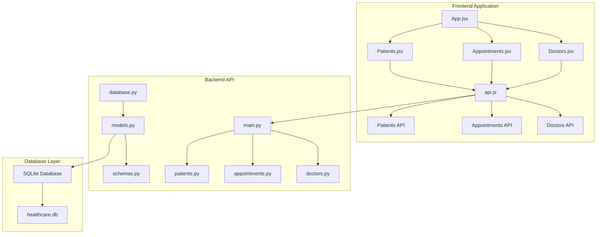
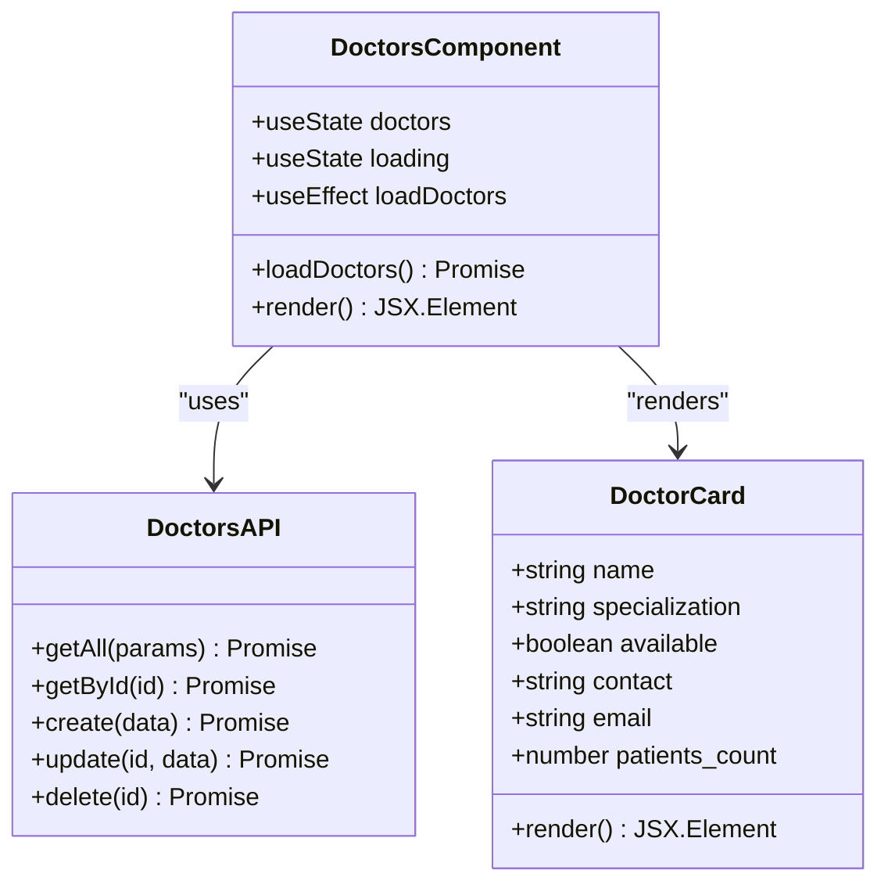
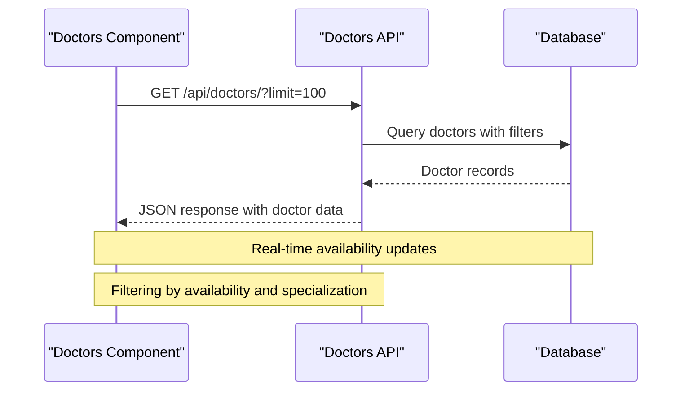
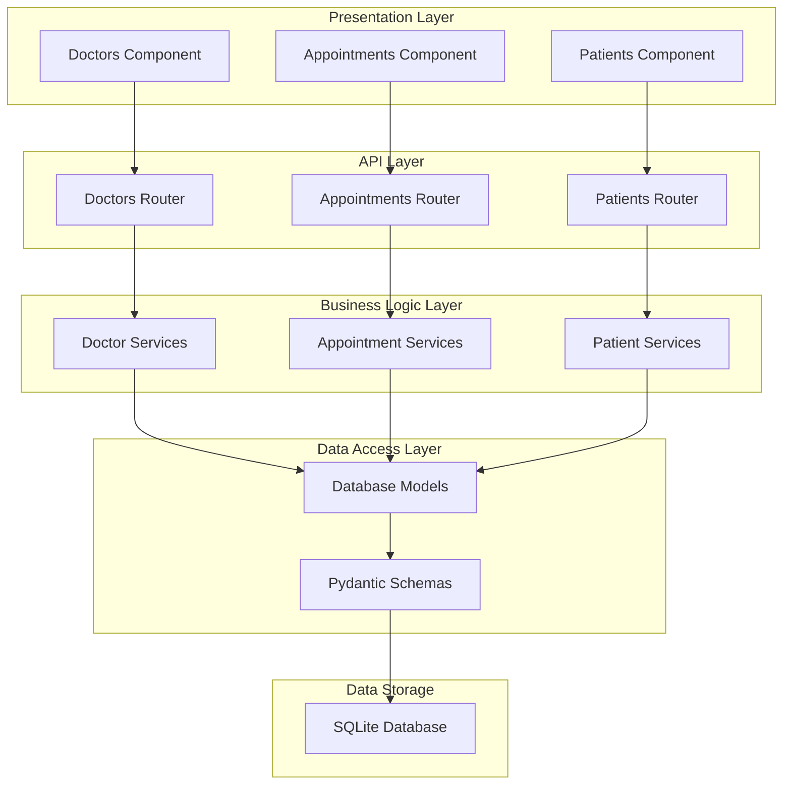
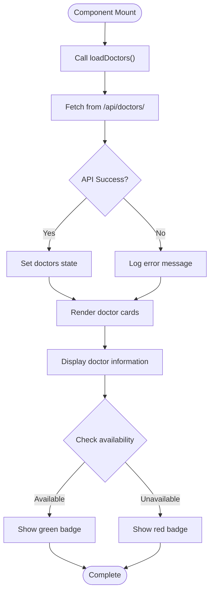
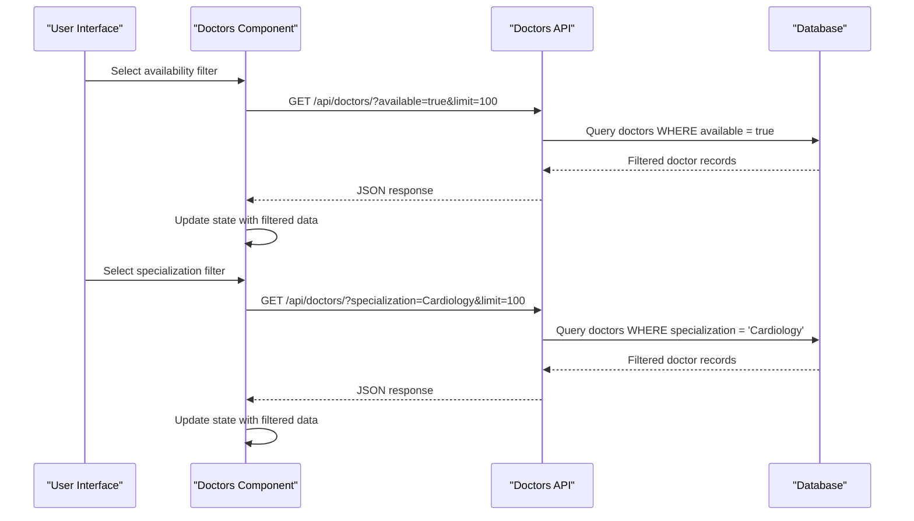
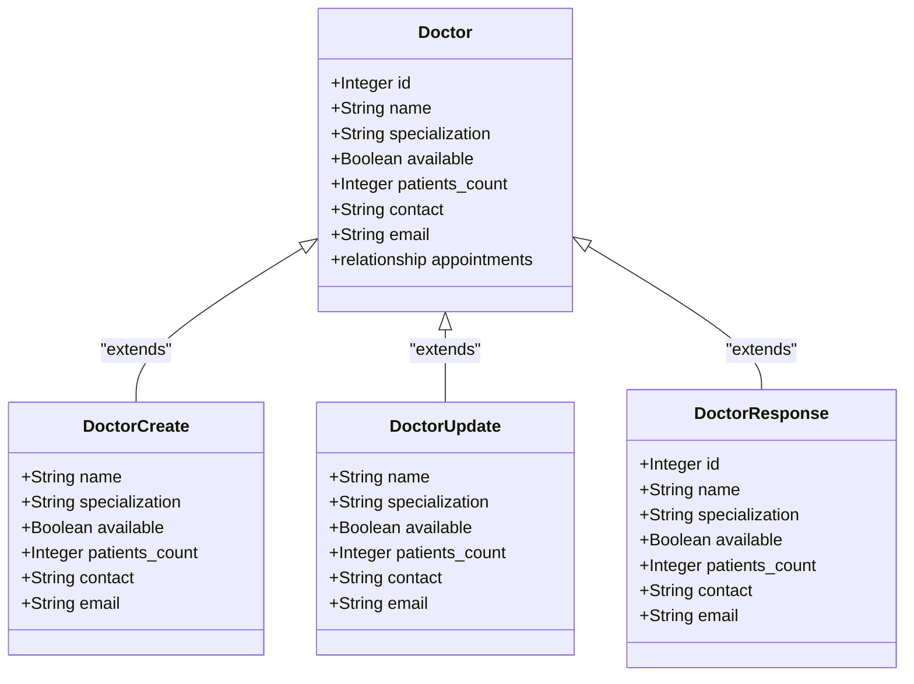
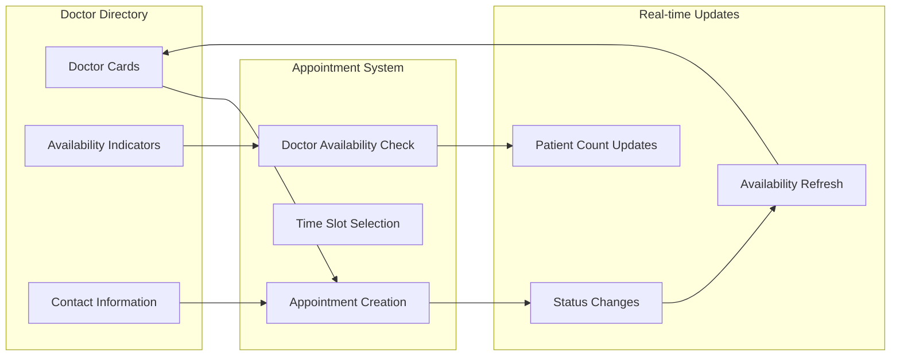
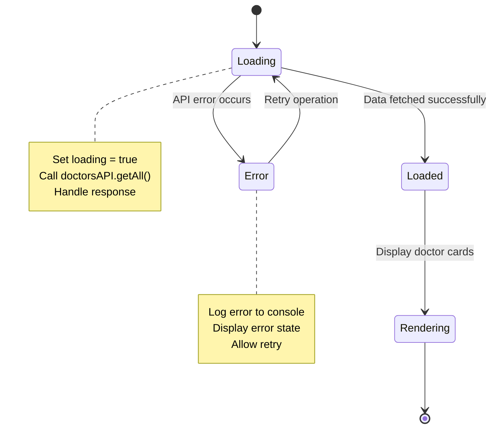
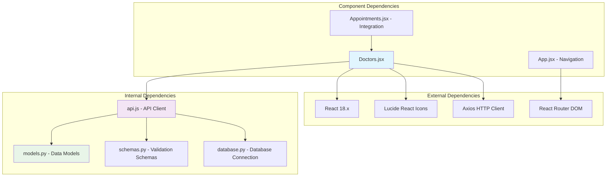

# Doctors Component

<cite>
**Referenced Files in This Document**
- [Doctors.jsx](file://frontend/src/components/Doctors.jsx)
- [api.js](file://frontend/src/api.js)
- [App.jsx](file://frontend/src/App.jsx)
- [doctors.py](file://backend/routers/doctors.py)
- [appointments.py](file://backend/routers/appointments.py)
- [models.py](file://backend/models.py)
- [schemas.py](file://backend/schemas.py)
- [main.py](file://backend/main.py)
- [database.py](file://backend/database.py)
- [seed_data.py](file://backend/seed_data.py)
</cite>

## Table of Contents
1. [Introduction](#introduction)
2. [Project Structure](#project-structure)
3. [Core Components](#core-components)
4. [Architecture Overview](#architecture-overview)
5. [Detailed Component Analysis](#detailed-component-analysis)
6. [Dependency Analysis](#dependency-analysis)
7. [Performance Considerations](#performance-considerations)
8. [Troubleshooting Guide](#troubleshooting-guide)
9. [Conclusion](#conclusion)

## Introduction
The Doctors component is a React-based interface that displays and manages doctor profiles within the Smart Healthcare Dashboard. It provides a comprehensive doctor directory with availability indicators, contact information, and patient statistics. The component integrates with a FastAPI backend to fetch doctor data, supports filtering by availability status, and serves as the foundation for appointment scheduling workflows.

The component plays a crucial role in the healthcare ecosystem by enabling patients and staff to quickly locate available doctors, view their specializations, and understand capacity through patient counts. It forms part of a larger system that includes patient management, appointment scheduling, and real-time health monitoring capabilities.

## Project Structure
The Doctors component is organized within a modern React application architecture with clear separation between frontend and backend concerns:

**Diagram sources**
- [App.jsx:1-74](file://frontend/src/App.jsx#L1-L74)
- [Doctors.jsx:1-77](file://frontend/src/components/Doctors.jsx#L1-L77)
- [api.js:1-56](file://frontend/src/api.js#L1-L56)
- [main.py:1-52](file://backend/main.py#L1-L52)

**Section sources**
- [App.jsx:1-74](file://frontend/src/App.jsx#L1-L74)
- [Doctors.jsx:1-77](file://frontend/src/components/Doctors.jsx#L1-L77)
- [api.js:1-56](file://frontend/src/api.js#L1-L56)
- [main.py:1-52](file://backend/main.py#L1-L52)

## Core Components
The Doctors component consists of several interconnected parts that work together to provide a seamless user experience:

### Frontend Component Architecture
The React component implements a clean, responsive design with state management for loading states and data fetching:

**Diagram sources**
- [Doctors.jsx:1-77](file://frontend/src/components/Doctors.jsx#L1-L77)
- [api.js:31-38](file://frontend/src/api.js#L31-L38)

### Backend API Integration
The backend provides comprehensive CRUD operations for doctor management with filtering capabilities:

**Diagram sources**
- [Doctors.jsx:13-23](file://frontend/src/components/Doctors.jsx#L13-L23)
- [api.js:33](file://frontend/src/api.js#L33)
- [doctors.py:10-26](file://backend/routers/doctors.py#L10-L26)

**Section sources**
- [Doctors.jsx:1-77](file://frontend/src/components/Doctors.jsx#L1-L77)
- [api.js:31-38](file://frontend/src/api.js#L31-L38)
- [doctors.py:10-70](file://backend/routers/doctors.py#L10-L70)

## Architecture Overview
The Doctors component operates within a client-server architecture with clear separation of concerns:

**Diagram sources**
- [Doctors.jsx:1-77](file://frontend/src/components/Doctors.jsx#L1-L77)
- [doctors.py:1-70](file://backend/routers/doctors.py#L1-L70)
- [models.py:23-35](file://backend/models.py#L23-L35)
- [schemas.py:36-61](file://backend/schemas.py#L36-L61)

The architecture follows RESTful principles with clear endpoint definitions for doctor management operations. The frontend communicates with the backend through well-defined API endpoints, while the backend maintains data integrity through SQLAlchemy ORM models and Pydantic validation schemas.

**Section sources**
- [main.py:33-38](file://backend/main.py#L33-L38)
- [database.py:1-20](file://backend/database.py#L1-L20)
- [models.py:23-35](file://backend/models.py#L23-L35)

## Detailed Component Analysis

### Doctor Listing Interface
The doctor listing interface provides a responsive grid layout displaying essential doctor information:

**Diagram sources**
- [Doctors.jsx:9-23](file://frontend/src/components/Doctors.jsx#L9-L23)
- [Doctors.jsx:35-72](file://frontend/src/components/Doctors.jsx#L35-L72)

The interface displays four key pieces of information for each doctor:
- **Availability Status**: Visual indicator showing whether the doctor is currently available
- **Contact Information**: Phone number and email address for communication
- **Specialization**: Medical specialty or department affiliation
- **Patient Statistics**: Total number of patients under care

**Section sources**
- [Doctors.jsx:35-72](file://frontend/src/components/Doctors.jsx#L35-L72)

### Filtering and Search Capabilities
The component supports advanced filtering through the backend API:

**Diagram sources**
- [doctors.py:10-26](file://backend/routers/doctors.py#L10-L26)
- [Doctors.jsx:13-23](file://frontend/src/components/Doctors.jsx#L13-L23)

The filtering system supports:
- **Availability Status**: Filter by current availability (true/false)
- **Specialization**: Filter by medical specialty
- **Pagination**: Limit results with configurable page sizes

**Section sources**
- [doctors.py:10-26](file://backend/routers/doctors.py#L10-L26)

### Doctor Profile Management
The backend provides comprehensive CRUD operations for doctor management:

**Diagram sources**
- [models.py:23-35](file://backend/models.py#L23-L35)
- [schemas.py:36-61](file://backend/schemas.py#L36-L61)

The profile management system includes:
- **Basic Information**: Name, contact details, email
- **Professional Details**: Specialization, availability status
- **Capacity Tracking**: Patient count for capacity management
- **Relationship Management**: Association with appointments

**Section sources**
- [models.py:23-35](file://backend/models.py#L23-L35)
- [schemas.py:36-61](file://backend/schemas.py#L36-L61)

### Integration with Appointment Scheduling
The Doctors component integrates seamlessly with the appointment scheduling system:

**Diagram sources**
- [appointments.py:84-125](file://backend/routers/appointments.py#L84-L125)
- [Doctors.jsx:42-48](file://frontend/src/components/Doctors.jsx#L42-L48)

The integration ensures that:
- Doctor availability status reflects real-time appointment bookings
- Patient counts update automatically when new appointments are created
- Availability indicators refresh when scheduling changes occur

**Section sources**
- [appointments.py:84-125](file://backend/routers/appointments.py#L84-L125)
- [Doctors.jsx:42-48](file://frontend/src/components/Doctors.jsx#L42-L48)

### Data Flow and State Management
The component implements robust state management for handling loading states and data updates:

**Diagram sources**
- [Doctors.jsx:6-23](file://frontend/src/components/Doctors.jsx#L6-L23)

The state management includes:
- **Loading States**: Visual feedback during data fetching
- **Error Handling**: Graceful error recovery and user notification
- **Data Persistence**: Maintaining state across component re-renders
- **Component Lifecycle**: Proper cleanup and resource management

**Section sources**
- [Doctors.jsx:6-23](file://frontend/src/components/Doctors.jsx#L6-L23)

## Dependency Analysis
The Doctors component has well-defined dependencies that support its functionality:

**Diagram sources**
- [Doctors.jsx:1-3](file://frontend/src/components/Doctors.jsx#L1-L3)
- [api.js:1-10](file://frontend/src/api.js#L1-L10)
- [App.jsx:1-8](file://frontend/src/App.jsx#L1-L8)

The dependency structure ensures:
- **Modular Design**: Clear separation between concerns
- **Testability**: Independent testing of components and APIs
- **Maintainability**: Easy updates and modifications
- **Scalability**: Support for future enhancements

**Section sources**
- [Doctors.jsx:1-3](file://frontend/src/components/Doctors.jsx#L1-L3)
- [api.js:1-10](file://frontend/src/api.js#L1-L10)
- [App.jsx:1-8](file://frontend/src/App.jsx#L1-L8)

## Performance Considerations
The Doctors component is designed with performance optimization in mind:

### Frontend Performance
- **Efficient Rendering**: Grid layout with virtualized rendering for large datasets
- **State Optimization**: Minimal state updates to reduce re-renders
- **Lazy Loading**: Images and heavy components loaded on demand
- **Memory Management**: Proper cleanup of event listeners and subscriptions

### Backend Performance
- **Database Indexing**: Optimized queries with appropriate indexing
- **Connection Pooling**: Efficient database connection management
- **Caching Strategies**: Potential for implementing caching layers
- **Query Optimization**: Efficient filtering and pagination

### Network Performance
- **API Efficiency**: Single endpoint for comprehensive data retrieval
- **Response Optimization**: Minimized payload sizes
- **Error Handling**: Graceful degradation on network failures
- **Retry Logic**: Automatic retry mechanisms for transient failures

## Troubleshooting Guide

### Common Issues and Solutions

#### Doctor Data Not Loading
**Symptoms**: Blank screen or loading indefinitely
**Causes**: 
- Backend API server not running
- Network connectivity issues
- Database connection failures

**Solutions**:
- Verify backend server is running on port 5000
- Check network connectivity between frontend and backend
- Review database initialization logs

#### Filtering Not Working
**Symptoms**: Filters applied but no results change
**Causes**:
- Incorrect filter parameters
- Backend endpoint not implemented
- Data type mismatches

**Solutions**:
- Verify filter parameters match backend expectations
- Check API endpoint implementation
- Validate data types in filter queries

#### Availability Status Incorrect
**Symptoms**: Doctor shows wrong availability status
**Causes**:
- Data synchronization delays
- Booking conflicts not resolved
- Cache inconsistencies

**Solutions**:
- Implement real-time updates for availability
- Add manual refresh functionality
- Verify appointment conflict resolution logic

**Section sources**
- [Doctors.jsx:13-23](file://frontend/src/components/Doctors.jsx#L13-L23)
- [doctors.py:10-26](file://backend/routers/doctors.py#L10-L26)

### Debugging Tools and Techniques
- **Console Logging**: Monitor API requests and responses
- **Network Inspection**: Analyze HTTP requests and status codes
- **Database Queries**: Verify SQL query execution and results
- **Component State**: Track state changes and updates

## Conclusion
The Doctors component represents a well-architected solution for managing doctor profiles within a healthcare dashboard system. Its clean separation of concerns, comprehensive filtering capabilities, and seamless integration with appointment scheduling make it a valuable component of the overall healthcare management platform.

The component successfully balances user experience with technical robustness, providing essential functionality for doctor directory management while maintaining scalability and maintainability. The integration with the broader healthcare ecosystem ensures that doctor availability and scheduling information remains current and accessible to authorized users.

Future enhancements could include real-time availability updates, advanced search capabilities, and expanded integration with electronic health record systems. The current architecture provides a solid foundation for these improvements while maintaining backward compatibility and system stability.