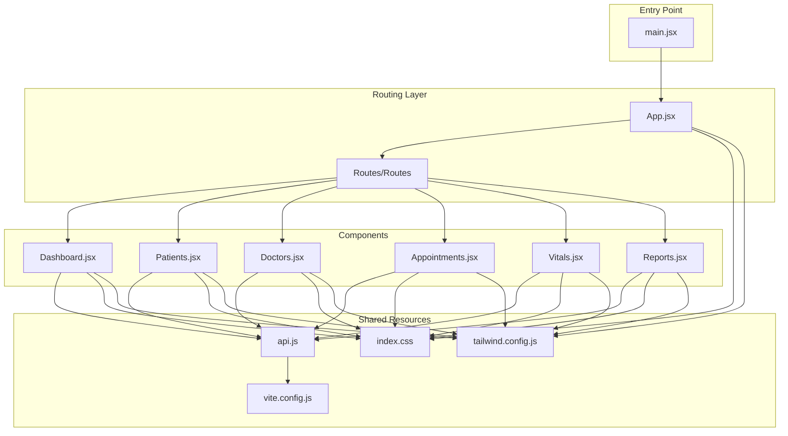
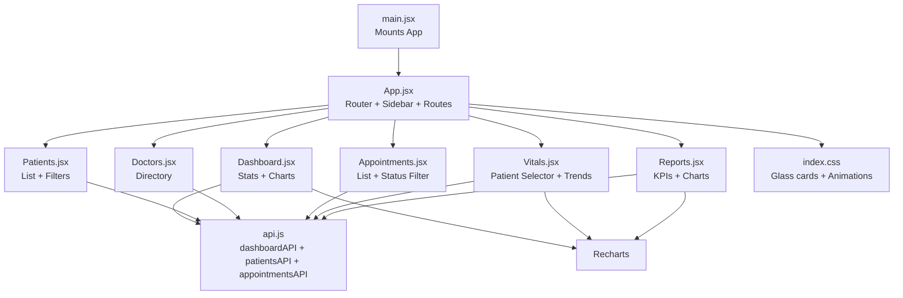
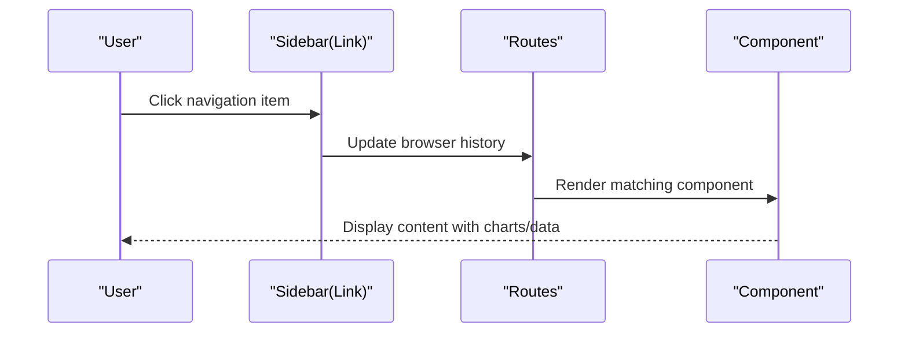
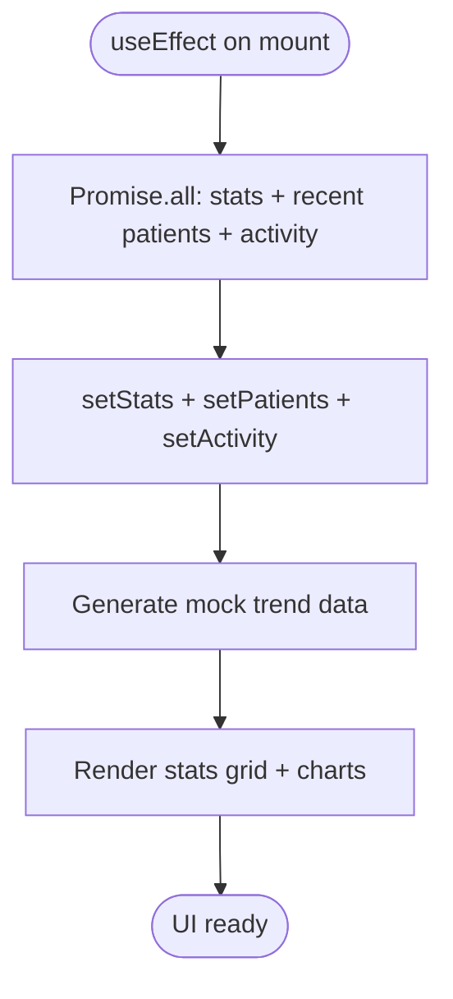
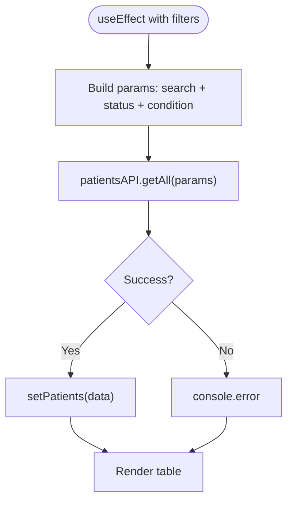
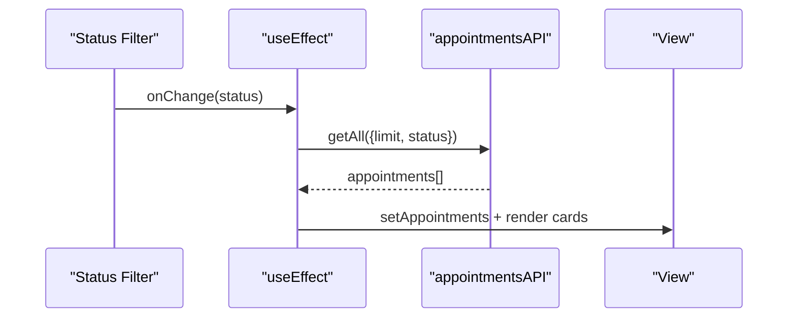
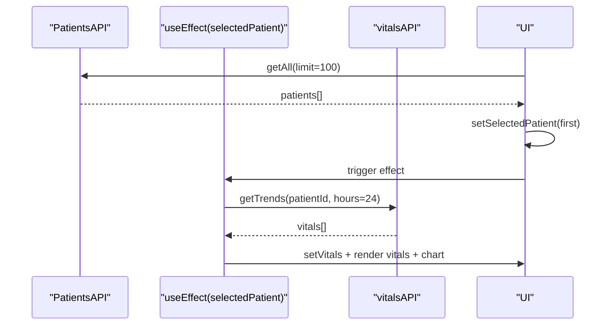
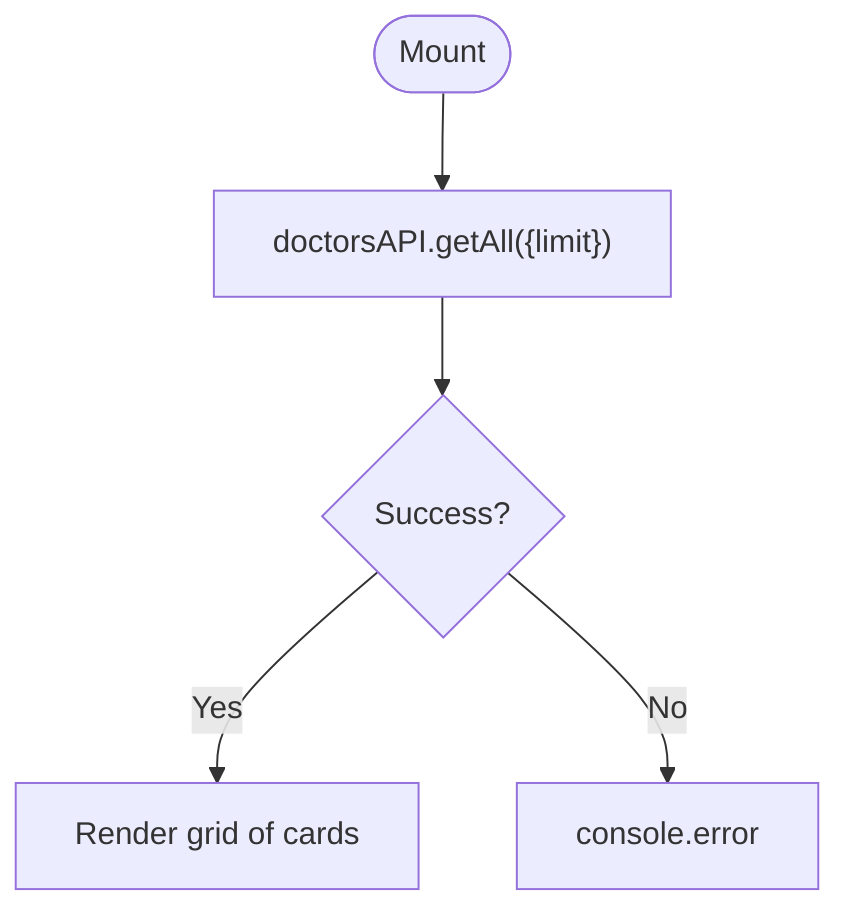
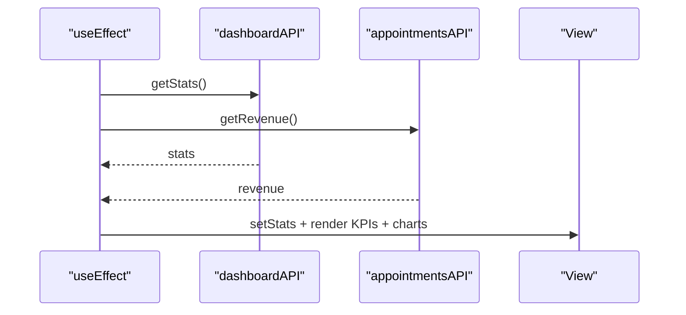
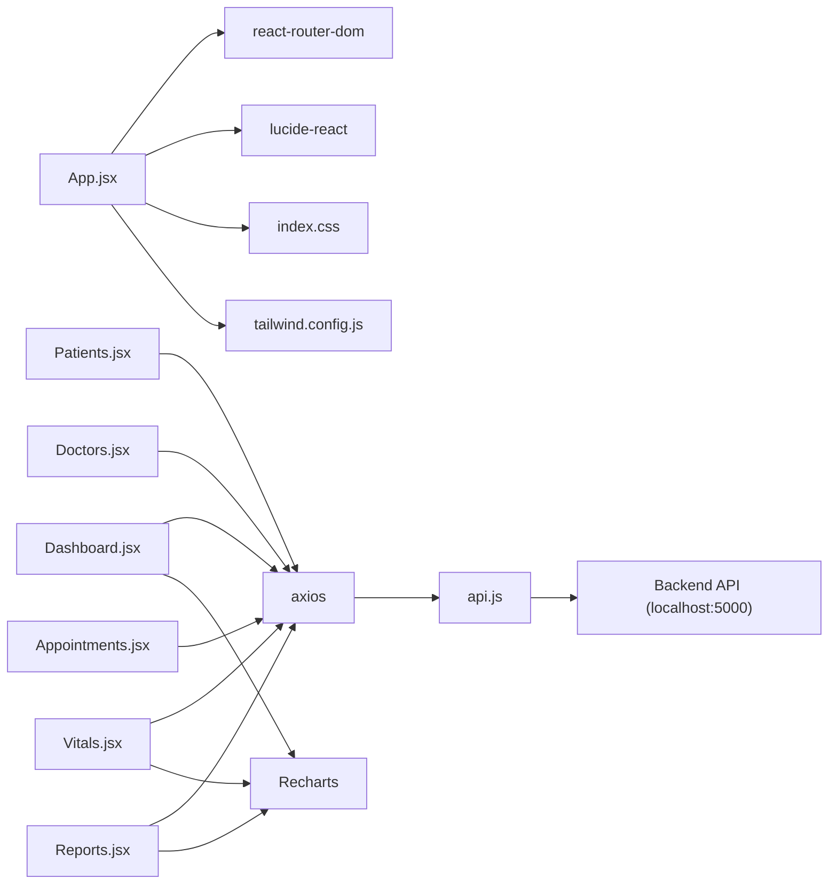

# Frontend Component Architecture

<cite>
**Referenced Files in This Document**
- [App.jsx](file://frontend/src/App.jsx)
- [main.jsx](file://frontend/src/main.jsx)
- [api.js](file://frontend/src/api.js)
- [Dashboard.jsx](file://frontend/src/components/Dashboard.jsx)
- [Patients.jsx](file://frontend/src/components/Patients.jsx)
- [Appointments.jsx](file://frontend/src/components/Appointments.jsx)
- [Vitals.jsx](file://frontend/src/components/Vitals.jsx)
- [Doctors.jsx](file://frontend/src/components/Doctors.jsx)
- [Reports.jsx](file://frontend/src/components/Reports.jsx)
- [index.css](file://frontend/src/index.css)
- [tailwind.config.js](file://frontend/tailwind.config.js)
- [vite.config.js](file://frontend/vite.config.js)
- [package.json](file://frontend/package.json)
</cite>

## Table of Contents
1. [Introduction](#introduction)
2. [Project Structure](#project-structure)
3. [Core Components](#core-components)
4. [Architecture Overview](#architecture-overview)
5. [Detailed Component Analysis](#detailed-component-analysis)
6. [Dependency Analysis](#dependency-analysis)
7. [Performance Considerations](#performance-considerations)
8. [Troubleshooting Guide](#troubleshooting-guide)
9. [Conclusion](#conclusion)

## Introduction
This document describes the React frontend component architecture for the Smart Healthcare Dashboard. It focuses on the main application structure centered around App.jsx with a routing system, the component hierarchy integrating Dashboard, Patients, Doctors, Appointments, Vitals, and Reports, the API integration layer using axios, state management patterns, styling architecture with TailwindCSS and custom animations, responsive design implementation, component reusability, and performance optimization techniques. Integration with chart libraries like Recharts is also covered.

## Project Structure
The frontend is organized as a Vite-powered React application with a clear separation between the application shell, routing, components, and shared styling. The entry point initializes the app and mounts it to the DOM. Routing is handled via react-router-dom, and components are grouped under a dedicated components directory. Styling leverages TailwindCSS with custom extensions and animations.

**Diagram sources**
- [main.jsx:1-11](file://frontend/src/main.jsx#L1-L11)
- [App.jsx:53-71](file://frontend/src/App.jsx#L53-L71)
- [api.js:1-56](file://frontend/src/api.js#L1-L56)
- [index.css:1-119](file://frontend/src/index.css#L1-L119)
- [tailwind.config.js:1-50](file://frontend/tailwind.config.js#L1-L50)
- [vite.config.js:1-17](file://frontend/vite.config.js#L1-L17)

**Section sources**
- [main.jsx:1-11](file://frontend/src/main.jsx#L1-L11)
- [App.jsx:1-74](file://frontend/src/App.jsx#L1-L74)
- [package.json:1-34](file://frontend/package.json#L1-L34)

## Core Components
- App.jsx: Defines the main application shell, sidebar navigation, and route-based rendering. It uses react-router-dom for routing and lucide-react icons for navigation items. The layout positions a fixed sidebar and a content area that renders the current route.
- Components: Each page-level component (Dashboard, Patients, Doctors, Appointments, Vitals, Reports) encapsulates its own state, data fetching, and UI rendering. They share common styling via Tailwind utility classes and custom CSS utilities.

Key responsibilities:
- App.jsx: Central routing and layout management.
- Components: Data fetching via api.js, local state management, and presentation logic.
- Styling: Shared glass-card effect, gradients, animations, and status badges.

**Section sources**
- [App.jsx:1-74](file://frontend/src/App.jsx#L1-L74)
- [Dashboard.jsx:1-194](file://frontend/src/components/Dashboard.jsx#L1-L194)
- [Patients.jsx:1-119](file://frontend/src/components/Patients.jsx#L1-L119)
- [Appointments.jsx:1-101](file://frontend/src/components/Appointments.jsx#L1-L101)
- [Vitals.jsx:1-162](file://frontend/src/components/Vitals.jsx#L1-L162)
- [Doctors.jsx:1-77](file://frontend/src/components/Doctors.jsx#L1-L77)
- [Reports.jsx:1-184](file://frontend/src/components/Reports.jsx#L1-L184)

## Architecture Overview
The application follows a conventional React SPA architecture:
- Entry point mounts the app inside React.StrictMode.
- App.jsx sets up BrowserRouter, a fixed sidebar with navigation links, and a content area with Routes.
- Each route renders a dedicated component that manages its own state and data fetching.
- api.js abstracts HTTP requests using axios with a shared base URL and per-feature API modules.
- Styling uses TailwindCSS with custom animations and reusable utilities.

**Diagram sources**
- [main.jsx:6-10](file://frontend/src/main.jsx#L6-L10)
- [App.jsx:53-71](file://frontend/src/App.jsx#L53-L71)
- [api.js:1-56](file://frontend/src/api.js#L1-L56)
- [index.css:21-119](file://frontend/src/index.css#L21-L119)

## Detailed Component Analysis

### App.jsx: Routing and Navigation
- Implements a fixed sidebar with navigation items mapped to routes.
- Uses react-router-dom Link to navigate and highlights the active route based on location.
- Renders a content area with Routes that map paths to components.
- Applies Tailwind utilities for layout and glass-card styling.

**Diagram sources**
- [App.jsx:10-51](file://frontend/src/App.jsx#L10-L51)
- [App.jsx:59-66](file://frontend/src/App.jsx#L59-L66)

**Section sources**
- [App.jsx:1-74](file://frontend/src/App.jsx#L1-L74)

### Dashboard.jsx: Analytics and Charts
- Fetches multiple datasets concurrently using Promise.all.
- Renders stat cards with icons and percentage changes.
- Displays two Recharts charts: a line chart for 24-hour trends and a bar chart for department statistics.
- Uses ResponsiveContainer for responsive chart rendering.
- Implements loading states and error logging.

**Diagram sources**
- [Dashboard.jsx:33-62](file://frontend/src/components/Dashboard.jsx#L33-L62)
- [Dashboard.jsx:111-153](file://frontend/src/components/Dashboard.jsx#L111-L153)

**Section sources**
- [Dashboard.jsx:1-194](file://frontend/src/components/Dashboard.jsx#L1-L194)

### Patients.jsx: Filtering and Listing
- Manages local state for search term, status filter, and condition filter.
- Fetches filtered patient lists based on query parameters.
- Provides a responsive table layout with Tailwind grid and overflow handling.

**Diagram sources**
- [Patients.jsx:12-30](file://frontend/src/components/Patients.jsx#L12-L30)
- [Patients.jsx:81-115](file://frontend/src/components/Patients.jsx#L81-L115)

**Section sources**
- [Patients.jsx:1-119](file://frontend/src/components/Patients.jsx#L1-L119)

### Appointments.jsx: Status Filtering and Cards
- Implements a single status filter and fetches appointment data accordingly.
- Renders each appointment as a card with patient/doctor info, date/time, and a colored status badge.

**Diagram sources**
- [Appointments.jsx:10-27](file://frontend/src/components/Appointments.jsx#L10-L27)
- [Appointments.jsx:68-96](file://frontend/src/components/Appointments.jsx#L68-L96)

**Section sources**
- [Appointments.jsx:1-101](file://frontend/src/components/Appointments.jsx#L1-L101)

### Vitals.jsx: Patient Selection and Trends
- Loads a list of patients and selects one by default.
- Fetches vitals trends for the selected patient and displays current vital values in a grid.
- Renders a Recharts line chart for heart rate, temperature, and oxygen level over time.

**Diagram sources**
- [Vitals.jsx:12-44](file://frontend/src/components/Vitals.jsx#L12-L44)
- [Vitals.jsx:80-152](file://frontend/src/components/Vitals.jsx#L80-L152)

**Section sources**
- [Vitals.jsx:1-162](file://frontend/src/components/Vitals.jsx#L1-L162)

### Doctors.jsx: Directory and Availability
- Fetches doctor listings and renders a responsive grid of cards.
- Displays availability status with dynamic badges and contact information.

**Diagram sources**
- [Doctors.jsx:9-23](file://frontend/src/components/Doctors.jsx#L9-L23)
- [Doctors.jsx:35-72](file://frontend/src/components/Doctors.jsx#L35-L72)

**Section sources**
- [Doctors.jsx:1-77](file://frontend/src/components/Doctors.jsx#L1-L77)

### Reports.jsx: KPIs and Charts
- Fetches combined stats and revenue data concurrently.
- Displays KPI metrics with trend indicators.
- Renders a revenue trend line chart and a department distribution pie chart using Recharts.

**Diagram sources**
- [Reports.jsx:12-29](file://frontend/src/components/Reports.jsx#L12-L29)
- [Reports.jsx:98-158](file://frontend/src/components/Reports.jsx#L98-L158)

**Section sources**
- [Reports.jsx:1-184](file://frontend/src/components/Reports.jsx#L1-L184)

## Dependency Analysis
- Routing: App.jsx depends on react-router-dom for navigation and Link for sidebar items.
- HTTP client: api.js wraps axios with a base URL and exposes feature-specific modules.
- Icons: lucide-react provides icons used in the sidebar and cards.
- Charts: Recharts is used across Dashboard, Vitals, and Reports for data visualization.
- Styling: TailwindCSS with custom animations and utilities defined in index.css and tailwind.config.js.

**Diagram sources**
- [App.jsx:1-8](file://frontend/src/App.jsx#L1-L8)
- [api.js:1-56](file://frontend/src/api.js#L1-L56)
- [package.json:12-18](file://frontend/package.json#L12-L18)
- [vite.config.js:9-14](file://frontend/vite.config.js#L9-L14)

**Section sources**
- [package.json:1-34](file://frontend/package.json#L1-L34)
- [vite.config.js:1-17](file://frontend/vite.config.js#L1-L17)

## Performance Considerations
- Concurrent data fetching: Components like Dashboard and Reports use Promise.all to reduce total loading time.
- Local state management: Each component manages its own state with useState/useEffect, minimizing cross-component coupling.
- Responsive charts: ResponsiveContainer ensures charts adapt to screen size without manual resize handling.
- Lazy loading: Consider implementing React.lazy and Suspense for heavy components if bundle size grows.
- Memoization: Introduce useMemo/useCallback for expensive computations or repeated renders in large lists.
- Virtualized lists: For very large datasets, consider react-window or react-virtual for improved scrolling performance.
- Bundle optimization: Leverage Vite’s tree-shaking and avoid importing unused Recharts components.

## Troubleshooting Guide
- Network errors: api.js logs errors to the console. Verify backend connectivity and CORS/proxy settings.
- Proxy configuration: Vite proxy forwards /api to http://localhost:5000. Ensure the backend server is running.
- Loading states: Components display loading messages while awaiting data. Confirm that API endpoints return expected data shapes.
- Tailwind utilities: Custom animations and glass-card styles rely on index.css. Verify Tailwind is generating utilities and animations are applied.

**Section sources**
- [api.js:37-62](file://frontend/src/api.js#L37-L62)
- [vite.config.js:7-16](file://frontend/vite.config.js#L7-L16)
- [index.css:47-119](file://frontend/src/index.css#L47-L119)

## Conclusion
The frontend architecture centers on a clean routing structure with App.jsx as the application shell, six focused page components handling distinct domains, and a cohesive API layer built on axios. Styling is standardized through TailwindCSS with custom animations and reusable utilities. Charts from Recharts enhance data visualization across multiple components. The design emphasizes responsiveness, component reusability, and performance through concurrent data fetching and modular state management.