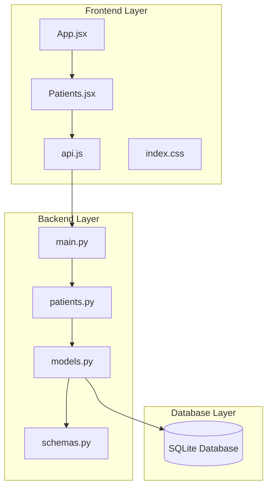
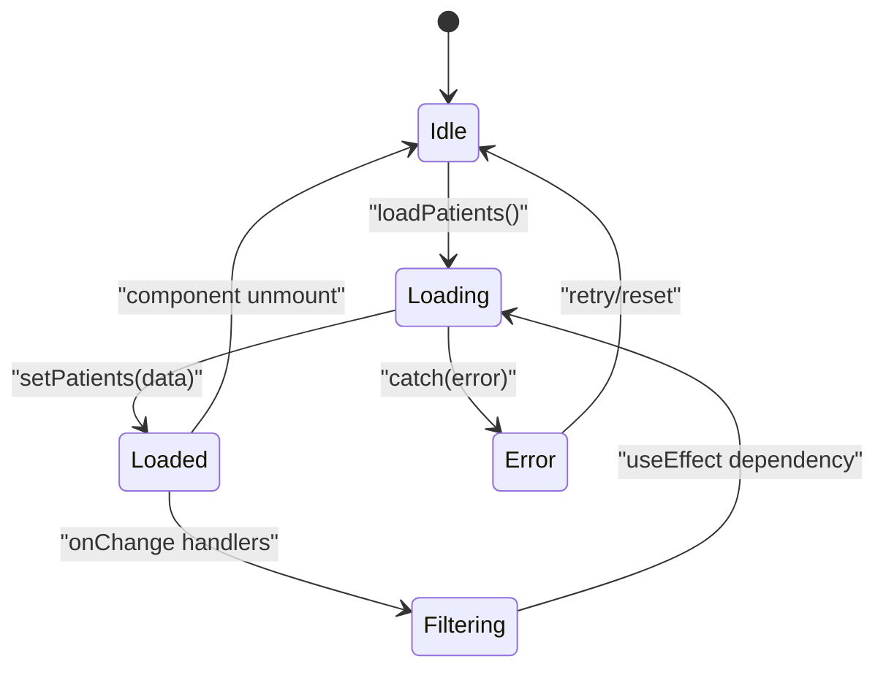
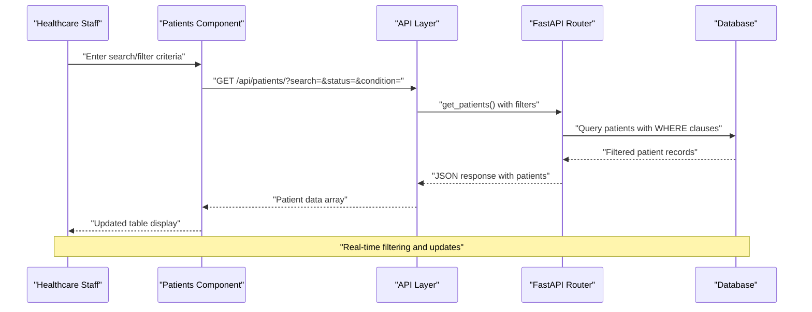
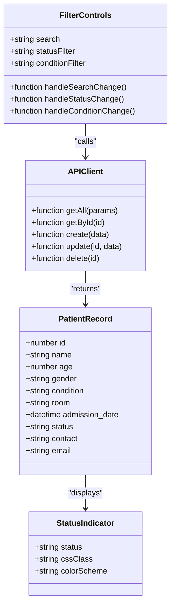
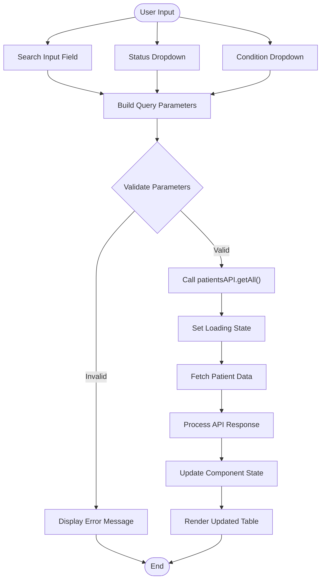
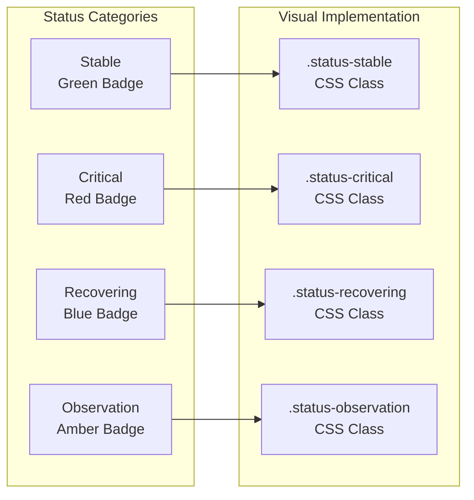
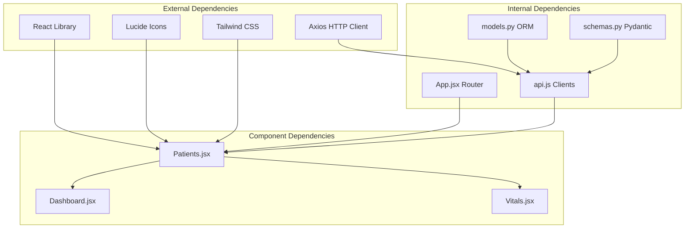

# Patients Component

<cite>
**Referenced Files in This Document**
- [Patients.jsx](file://frontend/src/components/Patients.jsx)
- [api.js](file://frontend/src/api.js)
- [App.jsx](file://frontend/src/App.jsx)
- [index.css](file://frontend/src/index.css)
- [patients.py](file://backend/routers/patients.py)
- [models.py](file://backend/models.py)
- [schemas.py](file://backend/schemas.py)
- [main.py](file://backend/main.py)
</cite>

## Table of Contents
1. [Introduction](#introduction)
2. [Project Structure](#project-structure)
3. [Core Components](#core-components)
4. [Architecture Overview](#architecture-overview)
5. [Detailed Component Analysis](#detailed-component-analysis)
6. [Dependency Analysis](#dependency-analysis)
7. [Performance Considerations](#performance-considerations)
8. [Troubleshooting Guide](#troubleshooting-guide)
9. [Conclusion](#conclusion)

## Introduction
The Patients component is a central module in the Smart Healthcare Dashboard responsible for managing patient records within the healthcare facility. It provides a comprehensive interface for viewing, searching, filtering, and interacting with patient data. The component integrates seamlessly with both the frontend React application and the backend FastAPI service to deliver real-time patient management capabilities.

The component serves as a critical hub for healthcare staff to monitor patient conditions, track admissions, and manage emergency contacts. Its design emphasizes usability with a glass-morphism aesthetic, intuitive filtering mechanisms, and responsive data presentation. The interface supports multiple patient status indicators, condition categorization, and emergency contact management, making it an essential tool for daily healthcare operations.

## Project Structure
The Patients component is structured within a modern React application architecture that follows separation of concerns and modular design principles. The component leverages a three-tier architecture with clear boundaries between presentation, business logic, and data persistence layers.

**Diagram sources**
- [App.jsx:53-71](file://frontend/src/App.jsx#L53-L71)
- [Patients.jsx:1-119](file://frontend/src/components/Patients.jsx#L1-L119)
- [api.js:13-19](file://frontend/src/api.js#L13-L19)
- [main.py:34-38](file://backend/main.py#L34-L38)

The frontend architecture utilizes React hooks for state management and lifecycle events, while the backend implements FastAPI routing with SQLAlchemy ORM for data persistence. The component maintains loose coupling between frontend and backend through well-defined API contracts and standardized data schemas.

**Section sources**
- [App.jsx:1-74](file://frontend/src/App.jsx#L1-L74)
- [Patients.jsx:1-119](file://frontend/src/components/Patients.jsx#L1-L119)
- [api.js:1-56](file://frontend/src/api.js#L1-L56)

## Core Components
The Patients component consists of several interconnected subsystems that work together to provide comprehensive patient management functionality. Each subsystem addresses specific aspects of patient data handling, from data retrieval and filtering to user interface presentation and form management.

### State Management Architecture
The component employs React's useState and useEffect hooks to manage application state efficiently. The state management system handles patient data arrays, loading states, and filter parameters with automatic synchronization between UI controls and backend queries.

**Diagram sources**
- [Patients.jsx:6-30](file://frontend/src/components/Patients.jsx#L6-L30)

### Data Flow Architecture
The component implements a unidirectional data flow pattern that ensures predictable state updates and efficient re-rendering. Data flows from backend APIs through the component's state management to the user interface, with automatic updates triggered by state changes.

**Section sources**
- [Patients.jsx:12-30](file://frontend/src/components/Patients.jsx#L12-L30)
- [api.js:13-19](file://frontend/src/api.js#L13-L19)

## Architecture Overview
The Patients component follows a client-server architecture pattern with clear separation between frontend presentation logic and backend business logic. The architecture supports real-time data synchronization through RESTful API endpoints and implements robust error handling mechanisms.

**Diagram sources**
- [Patients.jsx:16-30](file://frontend/src/components/Patients.jsx#L16-L30)
- [patients.py:11-39](file://backend/routers/patients.py#L11-L39)

The architecture ensures scalability through parameterized queries, efficient pagination support, and optimized database indexing. The component handles concurrent requests gracefully and maintains data consistency through proper transaction management.

**Section sources**
- [patients.py:11-39](file://backend/routers/patients.py#L11-L39)
- [models.py:6-22](file://backend/models.py#L6-L22)

## Detailed Component Analysis

### Patient Data Display System
The component presents patient information through a responsive table interface that adapts to various screen sizes and device orientations. The table displays essential patient metrics including name, age, medical condition, room assignment, and current status indicators.

**Diagram sources**
- [models.py:6-18](file://backend/models.py#L6-L18)
- [schemas.py:29-34](file://backend/schemas.py#L29-L34)
- [Patients.jsx:98-110](file://frontend/src/components/Patients.jsx#L98-L110)

The table interface implements hover effects, row highlighting, and responsive design principles to enhance user experience across different devices. Status indicators utilize color-coded badges with predefined CSS classes for consistent visual representation.

### Search and Filtering Mechanisms
The component provides sophisticated search and filtering capabilities that enable healthcare staff to quickly locate specific patient records. The filtering system supports multiple criteria including fuzzy text matching, categorical filtering, and status-based queries.

**Diagram sources**
- [Patients.jsx:16-30](file://frontend/src/components/Patients.jsx#L16-L30)
- [patients.py:22-38](file://backend/routers/patients.py#L22-L38)

The search functionality implements fuzzy matching against patient names and medical conditions, allowing for flexible query patterns. Status and condition filters provide categorical selection with predefined options that align with healthcare terminology.

### Status Indicator System
The component implements a comprehensive status indicator system that visually communicates patient condition levels through color-coded badges. Each status category (Stable, Critical, Recovering, Observation) has associated visual styling and semantic meaning.

**Diagram sources**
- [Patients.jsx:104-108](file://frontend/src/components/Patients.jsx#L104-L108)
- [index.css:76-99](file://frontend/src/index.css#L76-L99)

The status indicators dynamically adjust their appearance based on patient condition data, providing immediate visual feedback to healthcare staff. The implementation uses Tailwind CSS utility classes for consistent styling and responsive design.

### Emergency Contact Management
The component supports emergency contact information display alongside primary patient details. The contact management system accommodates both phone numbers and email addresses, with appropriate fallback handling for missing information.

**Section sources**
- [Patients.jsx:100-107](file://frontend/src/components/Patients.jsx#L100-L107)
- [models.py:17-18](file://backend/models.py#L17-L18)
- [index.css:76-99](file://frontend/src/index.css#L76-L99)

## Dependency Analysis
The Patients component exhibits strong modularity with well-defined dependencies that facilitate maintainability and testability. The component's dependencies cascade from UI presentation to data access layers, maintaining clear separation of concerns.

**Diagram sources**
- [Patients.jsx:1-3](file://frontend/src/components/Patients.jsx#L1-L3)
- [api.js:1-10](file://frontend/src/api.js#L1-L10)
- [App.jsx:1-8](file://frontend/src/App.jsx#L1-L8)

The dependency graph reveals a clean architectural separation where the Patients component depends on shared utilities and services but remains independent from other domain-specific components. This design enables easy testing and potential reuse across different application contexts.

**Section sources**
- [Patients.jsx:1-119](file://frontend/src/components/Patients.jsx#L1-L119)
- [api.js:1-56](file://frontend/src/api.js#L1-L56)

## Performance Considerations
The Patients component implements several performance optimization strategies to ensure responsive user experience even with large datasets. These optimizations focus on efficient data fetching, rendering, and memory management.

### Data Fetching Optimization
The component employs intelligent caching and debouncing mechanisms to minimize unnecessary API calls. The useEffect dependency array ensures that requests are only triggered when filter parameters change, preventing redundant network operations.

### Rendering Performance
The table rendering system utilizes efficient list rendering with stable key assignments to minimize DOM manipulation. The component implements conditional rendering for loading states and empty results, reducing unnecessary re-renders.

### Memory Management
State management follows React best practices with proper cleanup of effect dependencies and controlled component lifecycle. The component avoids memory leaks through careful management of event listeners and asynchronous operations.

## Troubleshooting Guide
Common issues encountered with the Patients component typically relate to API connectivity, data validation, and UI responsiveness. The troubleshooting approach focuses on systematic diagnosis and resolution of these issues.

### API Connectivity Issues
Verify that the backend service is running and accessible at the configured endpoint. Check CORS configuration in the backend application to ensure cross-origin requests are properly permitted from the frontend origin.

### Data Validation Errors
Review the patient data schema requirements and ensure that incoming data conforms to expected formats. Pay special attention to required fields, data types, and constraint validations implemented in the backend.

### UI Rendering Problems
Examine the component's state management logic to identify potential race conditions or inconsistent state updates. Verify that all conditional rendering paths properly handle loading, error, and success states.

**Section sources**
- [patients.py:48-66](file://backend/routers/patients.py#L48-L66)
- [Patients.jsx:25-29](file://frontend/src/components/Patients.jsx#L25-L29)

## Conclusion
The Patients component represents a comprehensive solution for healthcare patient management within the Smart Healthcare Dashboard ecosystem. Its architecture demonstrates strong adherence to modern web development principles, combining robust backend services with responsive frontend interfaces.

The component successfully addresses the core requirements of patient data display, search and filtering, status management, and emergency contact handling. Its modular design facilitates future enhancements and maintenance while providing a solid foundation for healthcare workflow automation.

Through careful attention to performance optimization, error handling, and user experience design, the component delivers reliable functionality that supports daily healthcare operations. The integration with the broader dashboard ecosystem positions it as a critical component in the overall healthcare management strategy.