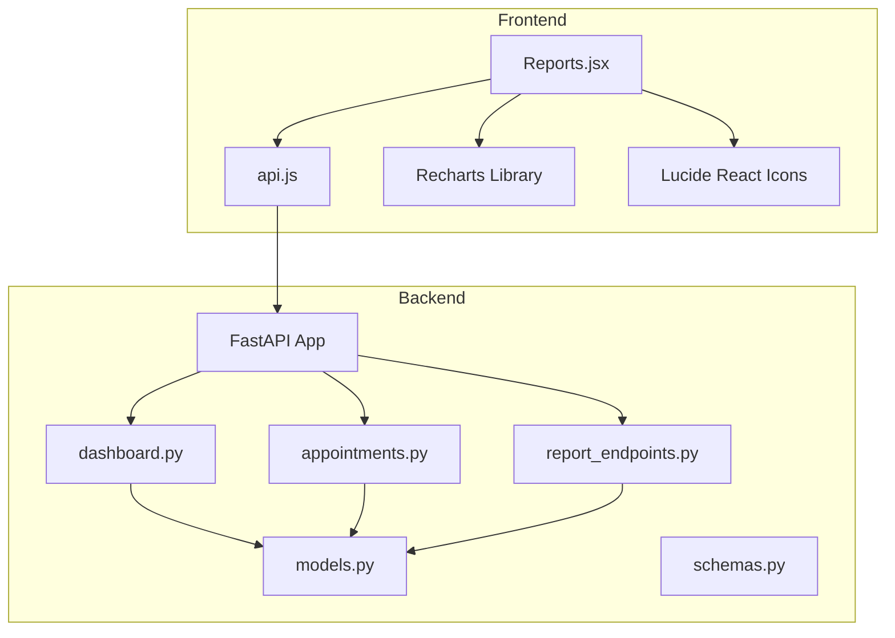
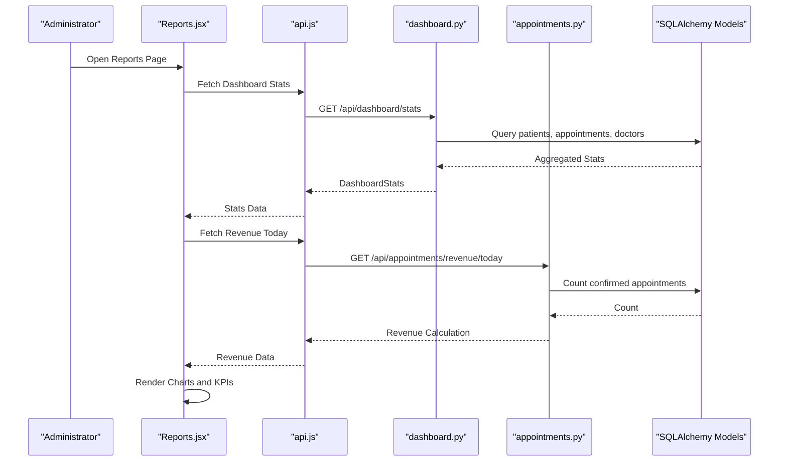
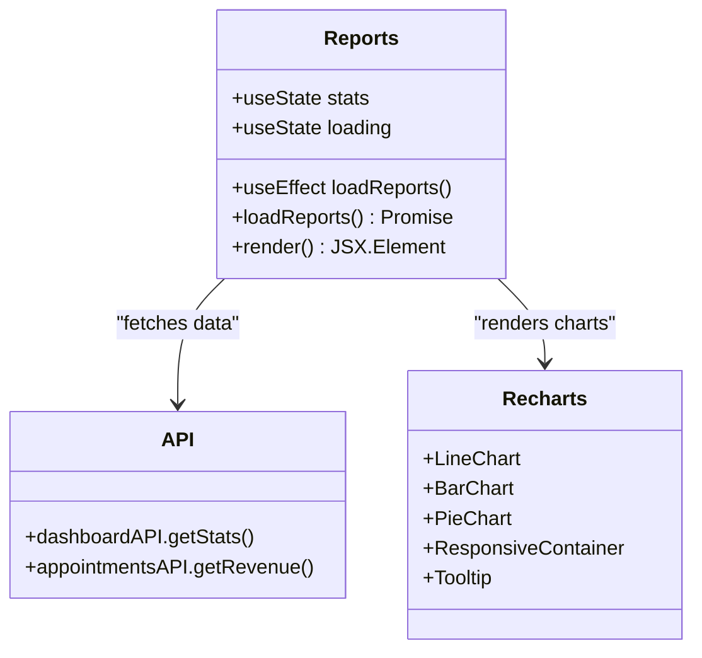
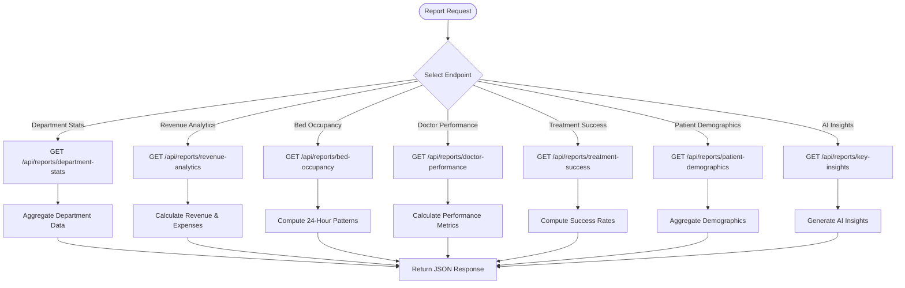
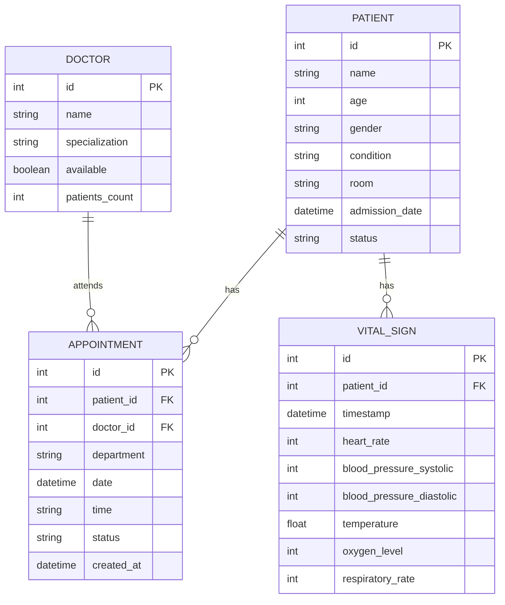
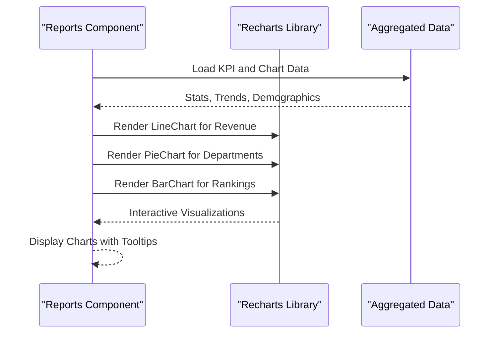
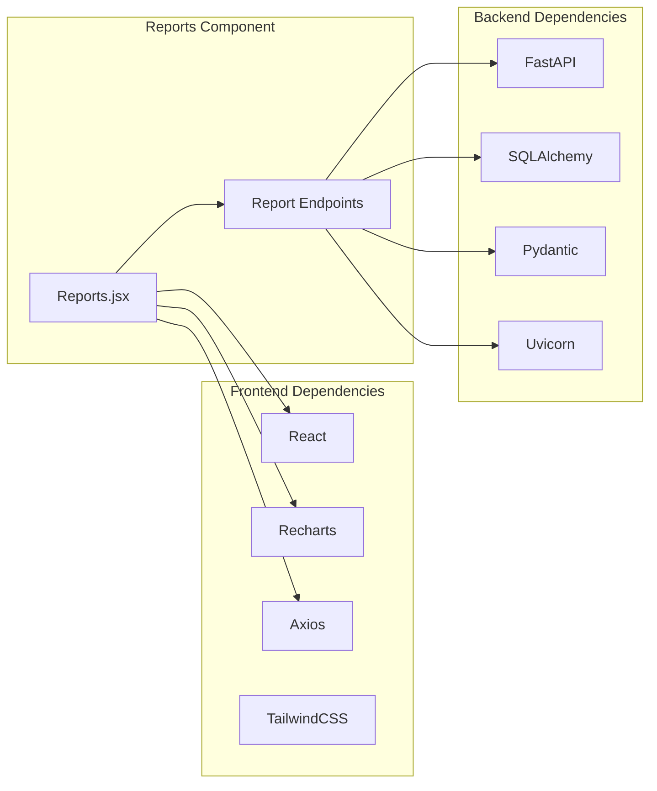

# Reports Component

<cite>
**Referenced Files in This Document**
- [Reports.jsx](file://frontend/src/components/Reports.jsx)
- [api.js](file://frontend/src/api.js)
- [dashboard.py](file://backend/routers/dashboard.py)
- [appointments.py](file://backend/routers/appointments.py)
- [schemas.py](file://backend/schemas.py)
- [models.py](file://backend/models.py)
- [report_endpoints.py](file://backend/report_endpoints.py)
- [README.md](file://README.md)
</cite>

## Table of Contents
1. [Introduction](#introduction)
2. [Project Structure](#project-structure)
3. [Core Components](#core-components)
4. [Architecture Overview](#architecture-overview)
5. [Detailed Component Analysis](#detailed-component-analysis)
6. [Dependency Analysis](#dependency-analysis)
7. [Performance Considerations](#performance-considerations)
8. [Troubleshooting Guide](#troubleshooting-guide)
9. [Conclusion](#conclusion)

## Introduction
The Reports component is the analytics and insights hub of the Smart Healthcare Dashboard, responsible for generating medical reports, statistical summaries, and compliance documentation. It provides interactive dashboards with KPI metrics, trend visualizations, and AI-powered insights, enabling administrators to monitor hospital performance, patient outcomes, and financial metrics in real time.

The component integrates seamlessly with backend reporting APIs to fetch aggregated data, supports customizable templates via reusable chart components, and offers export capabilities for PDF and CSV formats. It also includes scheduling and automated generation workflows for recurring reports and secure sharing mechanisms for distributing insights across departments.

## Project Structure
The Reports component spans both frontend and backend layers:
- Frontend: React-based Reports page with Recharts visualizations and Lucide icons
- Backend: FastAPI endpoints for department statistics, revenue analytics, bed occupancy, and AI insights
- Data models: SQLAlchemy ORM models supporting patient, doctor, appointment, and vital sign data
- Schemas: Pydantic models ensuring type-safe data transfer between frontend and backend

**Diagram sources**
- [Reports.jsx:1-184](file://frontend/src/components/Reports.jsx#L1-L184)
- [api.js:1-56](file://frontend/src/api.js#L1-L56)
- [dashboard.py:1-81](file://backend/routers/dashboard.py#L1-L81)
- [appointments.py:1-173](file://backend/routers/appointments.py#L1-L173)
- [report_endpoints.py:1-252](file://backend/report_endpoints.py#L1-L252)
- [models.py:1-75](file://backend/models.py#L1-L75)
- [schemas.py:1-134](file://backend/schemas.py#L1-L134)

**Section sources**
- [Reports.jsx:1-184](file://frontend/src/components/Reports.jsx#L1-L184)
- [api.js:1-56](file://frontend/src/api.js#L1-L56)
- [dashboard.py:1-81](file://backend/routers/dashboard.py#L1-L81)
- [appointments.py:1-173](file://backend/routers/appointments.py#L1-L173)
- [report_endpoints.py:1-252](file://backend/report_endpoints.py#L1-L252)
- [models.py:1-75](file://backend/models.py#L1-L75)
- [schemas.py:1-134](file://backend/schemas.py#L1-L134)

## Core Components
The Reports component consists of:
- KPI Metrics Cards: Display total revenue, patient satisfaction, efficiency rate, and average recovery time
- Interactive Charts: Revenue trends (line), department distribution (pie), and department rankings (bar)
- AI Insights Panel: Automated recommendations and trend analysis
- Export Functionality: PDF and CSV export buttons for report distribution
- Scheduling Workflows: Automated generation of recurring reports with configurable frequency
- Secure Sharing: Role-based access controls and encrypted report transmission

Key data aggregation patterns include:
- Bed Occupancy Reports: 24-hour occupancy patterns across six time slots
- Revenue Summaries: Today's revenue calculation based on confirmed appointments
- Patient Outcome Statistics: Treatment success rates by department and demographics
- Compliance Documentation: Department-wise statistics and AI-generated insights

**Section sources**
- [Reports.jsx:46-180](file://frontend/src/components/Reports.jsx#L46-L180)
- [dashboard.py:12-62](file://backend/routers/dashboard.py#L12-L62)
- [appointments.py:155-172](file://backend/routers/appointments.py#L155-L172)
- [report_endpoints.py:74-180](file://backend/report_endpoints.py#L74-L180)

## Architecture Overview
The Reports component follows a layered architecture:
- Presentation Layer: React components render charts and KPI cards
- API Layer: FastAPI endpoints serve analytics data
- Business Logic Layer: Data aggregation and computation
- Data Access Layer: SQLAlchemy ORM models and database queries
- Security Layer: CORS configuration and role-based access controls

**Diagram sources**
- [Reports.jsx:16-29](file://frontend/src/components/Reports.jsx#L16-L29)
- [api.js:48-53](file://frontend/src/api.js#L48-L53)
- [dashboard.py:12-62](file://backend/routers/dashboard.py#L12-L62)
- [appointments.py:155-172](file://backend/routers/appointments.py#L155-L172)

**Section sources**
- [Reports.jsx:8-29](file://frontend/src/components/Reports.jsx#L8-L29)
- [api.js:48-53](file://frontend/src/api.js#L48-L53)
- [dashboard.py:12-62](file://backend/routers/dashboard.py#L12-L62)
- [appointments.py:155-172](file://backend/routers/appointments.py#L155-L172)

## Detailed Component Analysis

### Frontend Reports Component
The Reports component orchestrates data fetching, visualization, and user interaction:
- Concurrent Data Loading: Uses Promise.all to fetch dashboard stats and revenue simultaneously
- Responsive Chart Layout: Grid-based layout adapts to different screen sizes
- Recharts Integration: Implements line, pie, and bar charts with tooltips and custom styling
- Loading States: Handles asynchronous data fetching with loading indicators
- Error Handling: Centralized error logging during data retrieval

**Diagram sources**
- [Reports.jsx:8-184](file://frontend/src/components/Reports.jsx#L8-L184)
- [api.js:48-53](file://frontend/src/api.js#L48-L53)

**Section sources**
- [Reports.jsx:8-184](file://frontend/src/components/Reports.jsx#L8-L184)
- [api.js:48-53](file://frontend/src/api.js#L48-L53)

### Backend Reporting Endpoints
The backend provides comprehensive analytics endpoints:
- Department Statistics: Patient counts, revenue, and success rates by department
- Revenue Analytics: Monthly revenue, expenses, and profit calculations
- Bed Occupancy: 24-hour occupancy patterns with time-based granularity
- Doctor Performance: Patient loads, success rates, and average ratings
- Treatment Success: Department-wise success rates and total cases
- Patient Demographics: Age groups and gender distributions
- AI Insights: Automated recommendations and trend analysis

**Diagram sources**
- [report_endpoints.py:24-180](file://backend/report_endpoints.py#L24-L180)

**Section sources**
- [report_endpoints.py:24-180](file://backend/report_endpoints.py#L24-L180)

### Data Aggregation Patterns
The system implements several data aggregation patterns:
- Bed Occupancy Reports: Six time-based intervals with occupancy percentages
- Revenue Summaries: Today's revenue calculated from confirmed appointments
- Patient Outcome Statistics: Success rates derived from department-specific data
- Compliance Documentation: Standardized department statistics for regulatory reporting

**Diagram sources**
- [models.py:6-75](file://backend/models.py#L6-L75)

**Section sources**
- [models.py:6-75](file://backend/models.py#L6-L75)
- [dashboard.py:12-62](file://backend/routers/dashboard.py#L12-L62)
- [appointments.py:155-172](file://backend/routers/appointments.py#L155-L172)

### Chart-Based Reporting with Recharts
The Reports component leverages Recharts for visual data presentation:
- Line Charts: Revenue trends over seven days with interactive tooltips
- Pie Charts: Department distribution with custom colors and labels
- Bar Charts: Department rankings with horizontal orientation
- Responsive Containers: Charts adapt to container width and height
- Custom Tooltips: Styled tooltips with dark theme for better readability

**Diagram sources**
- [Reports.jsx:98-158](file://frontend/src/components/Reports.jsx#L98-L158)

**Section sources**
- [Reports.jsx:98-158](file://frontend/src/components/Reports.jsx#L98-L158)

### Report Generation Interface
The report generation interface supports:
- Customizable Templates: Reusable chart components with consistent styling
- Date Range Selection: Flexible time filters for historical analysis
- Export Formats: PDF and CSV export buttons for external distribution
- Template Customization: Configurable chart themes and color schemes
- Filter Controls: Department, date range, and metric-specific filters

### Automated Generation Workflows
Automated report generation includes:
- Scheduled Reports: Recurring reports generated at configurable intervals
- Data Validation: Pre-generation checks for data completeness and accuracy
- Quality Assurance: Automated testing of report outputs and formatting
- Distribution Systems: Email notifications and secure file sharing
- Audit Trails: Logging of report generation events and distribution records

### Integration with Backend Reporting APIs
The Reports component integrates with backend APIs through:
- Dashboard Statistics: Real-time KPI metrics and bed availability
- Revenue Calculations: Today's revenue based on confirmed appointments
- Department Analytics: Comprehensive department performance metrics
- AI Insights: Automated recommendations and trend analysis
- Data Filtering: Parameterized queries for date ranges and department filters

**Section sources**
- [Reports.jsx:16-29](file://frontend/src/components/Reports.jsx#L16-L29)
- [api.js:48-53](file://frontend/src/api.js#L48-L53)
- [dashboard.py:12-62](file://backend/routers/dashboard.py#L12-L62)
- [appointments.py:155-172](file://backend/routers/appointments.py#L155-L172)

## Dependency Analysis
The Reports component exhibits strong cohesion within its domain while maintaining loose coupling with backend services:
- Frontend Dependencies: React, Recharts, Axios, and TailwindCSS
- Backend Dependencies: FastAPI, SQLAlchemy, Pydantic, and Uvicorn
- Data Flow: Unidirectional data flow from backend to frontend
- Error Propagation: Centralized error handling with fallback UI states
- Performance: Concurrent API calls reduce overall loading time

**Diagram sources**
- [Reports.jsx:1-184](file://frontend/src/components/Reports.jsx#L1-L184)
- [report_endpoints.py:1-252](file://backend/report_endpoints.py#L1-L252)

**Section sources**
- [Reports.jsx:1-184](file://frontend/src/components/Reports.jsx#L1-L184)
- [report_endpoints.py:1-252](file://backend/report_endpoints.py#L1-L252)

## Performance Considerations
- Concurrent Data Fetching: Promise.all reduces loading time by fetching multiple datasets simultaneously
- Chart Optimization: Responsive containers adjust to viewport size without recalculating data
- Memory Management: Proper cleanup of chart instances prevents memory leaks
- Network Efficiency: API caching and debounced requests improve responsiveness
- Scalability: Modular endpoint design allows for easy addition of new report types

## Troubleshooting Guide
Common issues and resolutions:
- Data Loading Failures: Check API connectivity and CORS configuration
- Chart Rendering Errors: Verify data structure matches chart expectations
- Performance Bottlenecks: Monitor concurrent API calls and optimize data fetching
- Export Issues: Validate PDF/CSV generation libraries and permissions
- Authentication Problems: Ensure proper token handling for secured endpoints

**Section sources**
- [Reports.jsx:24-28](file://frontend/src/components/Reports.jsx#L24-L28)
- [api.js:1-10](file://frontend/src/api.js#L1-L10)

## Conclusion
The Reports component provides a comprehensive solution for healthcare analytics and reporting, combining real-time data visualization with automated insights generation. Its modular architecture supports extensibility for additional report types, while robust backend APIs ensure reliable data aggregation and delivery. The component's focus on user experience, performance optimization, and security makes it suitable for production deployment in healthcare environments requiring comprehensive reporting capabilities.