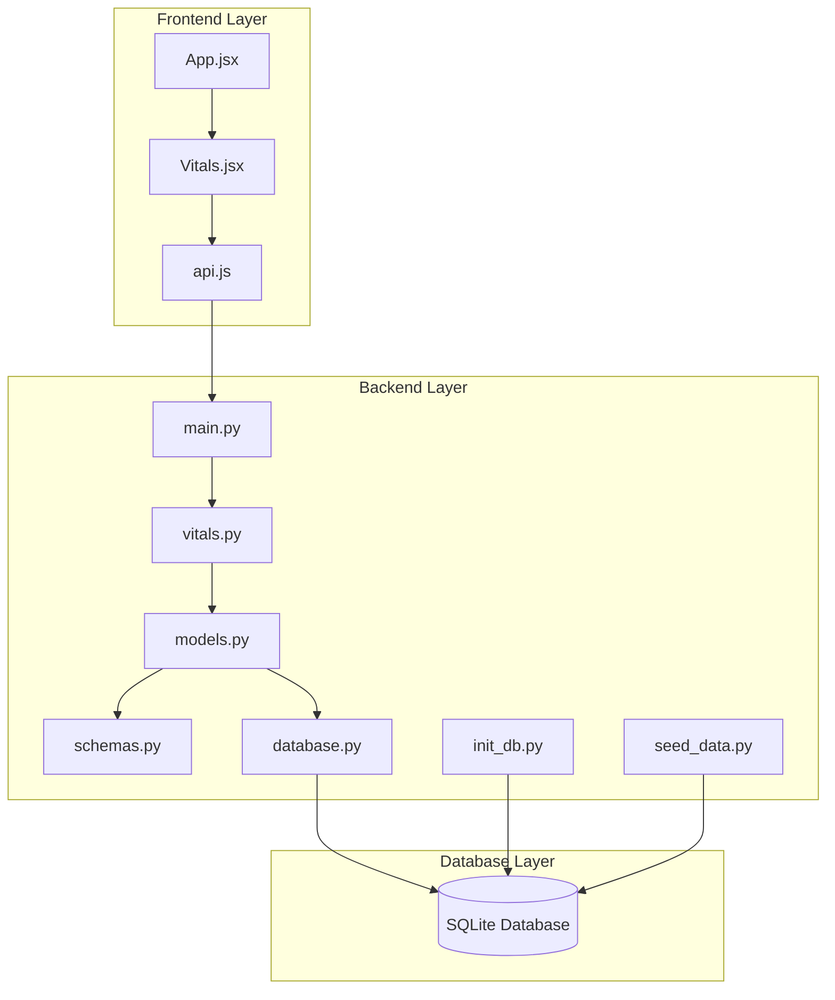
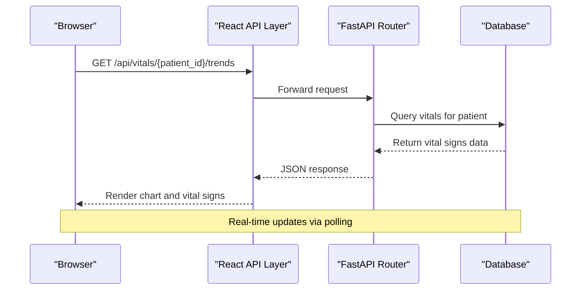
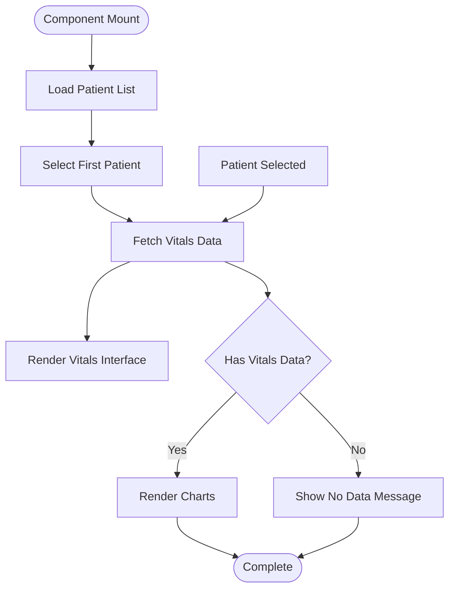
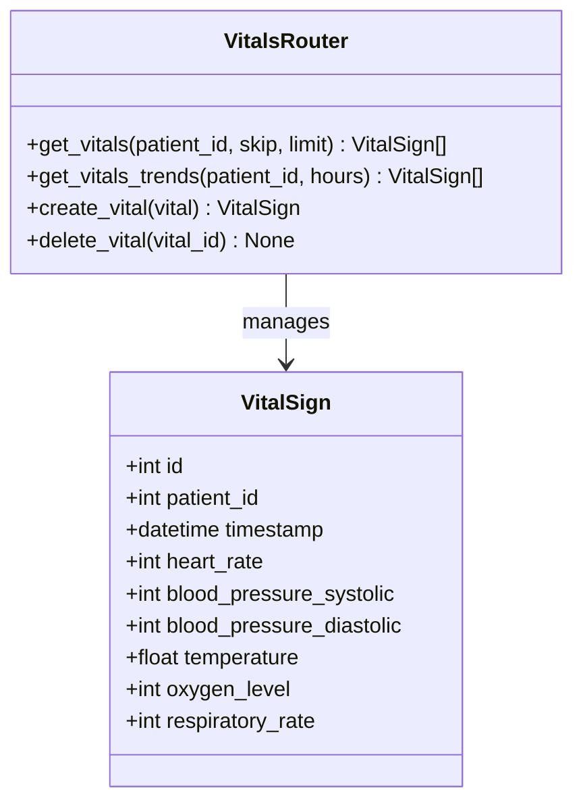
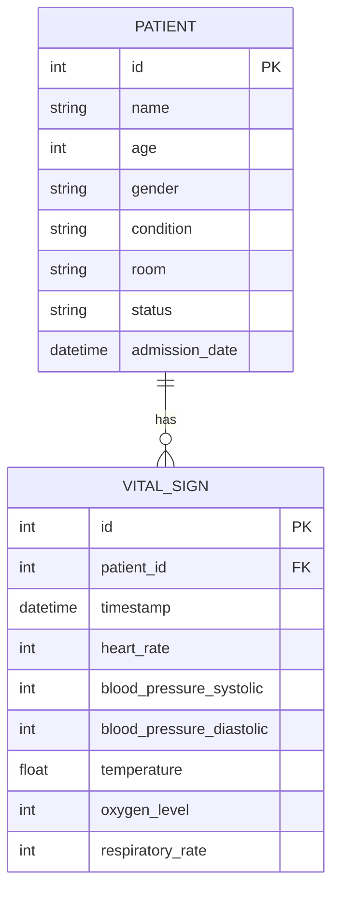
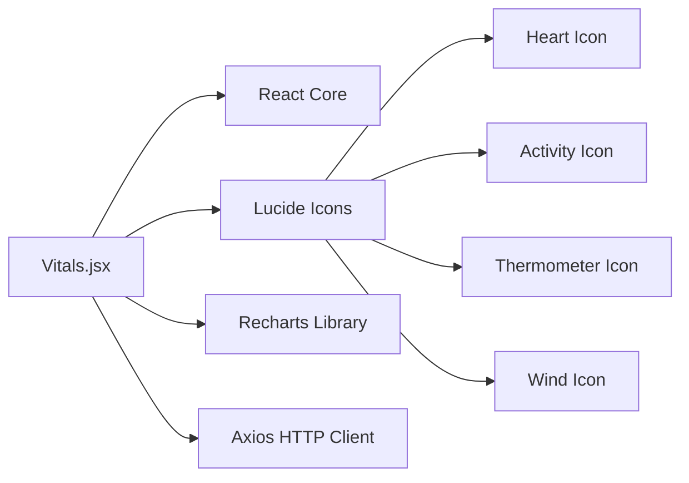
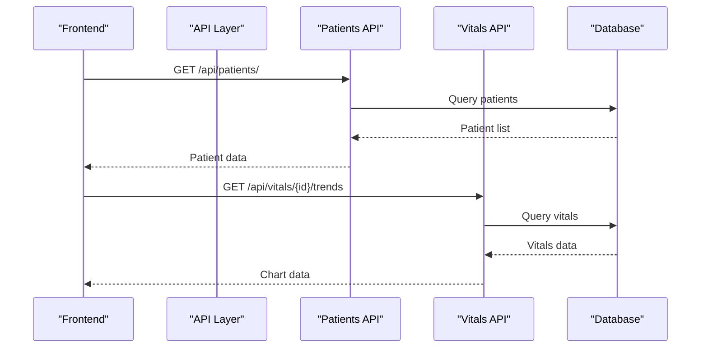

# Vitals Component

<cite>
**Referenced Files in This Document**
- [Vitals.jsx](file://frontend/src/components/Vitals.jsx)
- [api.js](file://frontend/src/api.js)
- [App.jsx](file://frontend/src/App.jsx)
- [vitals.py](file://backend/routers/vitals.py)
- [models.py](file://backend/models.py)
- [schemas.py](file://backend/schemas.py)
- [main.py](file://backend/main.py)
- [database.py](file://backend/database.py)
- [init_db.py](file://backend/init_db.py)
- [seed_data.py](file://backend/seed_data.py)
</cite>

## Table of Contents
1. [Introduction](#introduction)
2. [Project Structure](#project-structure)
3. [Core Components](#core-components)
4. [Architecture Overview](#architecture-overview)
5. [Detailed Component Analysis](#detailed-component-analysis)
6. [Dependency Analysis](#dependency-analysis)
7. [Performance Considerations](#performance-considerations)
8. [Troubleshooting Guide](#troubleshooting-guide)
9. [Conclusion](#conclusion)

## Introduction
The Vitals component is a comprehensive health monitoring system designed to display and track patient vital signs in real-time. It provides healthcare professionals with critical patient data visualization, trend analysis, and alert capabilities essential for continuous patient care monitoring.

The component integrates seamlessly with both frontend React applications and backend FastAPI services, offering a complete solution for vital signs management including patient selection, real-time data visualization, historical trend analysis, and emergency notification protocols.

## Project Structure
The Vitals component follows a modern full-stack architecture with clear separation between frontend presentation logic and backend data management:

**Diagram sources**
- [Vitals.jsx:1-162](file://frontend/src/components/Vitals.jsx#L1-L162)
- [api.js:1-56](file://frontend/src/api.js#L1-L56)
- [main.py:1-52](file://backend/main.py#L1-L52)
- [vitals.py:1-72](file://backend/routers/vitals.py#L1-L72)
- [models.py:1-75](file://backend/models.py#L1-L75)
- [database.py:1-20](file://backend/database.py#L1-L20)

**Section sources**
- [Vitals.jsx:1-162](file://frontend/src/components/Vitals.jsx#L1-L162)
- [api.js:1-56](file://frontend/src/api.js#L1-L56)
- [main.py:1-52](file://backend/main.py#L1-L52)

## Core Components

### Frontend Vitals Component
The Vitals component serves as the primary user interface for vital signs monitoring, featuring:

- **Patient Selection Interface**: Dropdown selector for choosing patients from the system
- **Real-time Vital Signs Display**: Current values for heart rate, blood pressure, temperature, and oxygen saturation
- **Interactive Trend Visualization**: Recharts-based line charts showing 24-hour vital sign trends
- **Responsive Design**: Glass-morphism card-based layout with adaptive grid system

### Backend Vitals API
The backend provides comprehensive CRUD operations for vital signs management:

- **GET /api/vitals/{patient_id}**: Retrieve complete vital signs history for a patient
- **GET /api/vitals/{patient_id}/trends**: Fetch recent trends with configurable time window
- **POST /api/vitals/**: Create new vital signs entries
- **DELETE /api/vitals/{vital_id}**: Remove specific vital signs records

### Database Model Architecture
The system utilizes SQLAlchemy ORM for robust data persistence:

- **Patient Model**: Core patient information with admission details and status tracking
- **VitalSign Model**: Comprehensive vital signs data including heart rate, blood pressure, temperature, and oxygen saturation
- **Relationship Management**: Automatic foreign key relationships and cascading operations

**Section sources**
- [Vitals.jsx:6-162](file://frontend/src/components/Vitals.jsx#L6-L162)
- [vitals.py:9-72](file://backend/routers/vitals.py#L9-L72)
- [models.py:52-66](file://backend/models.py#L52-L66)

## Architecture Overview

The Vitals component implements a client-server architecture with clear separation of concerns:

**Diagram sources**
- [Vitals.jsx:34-44](file://frontend/src/components/Vitals.jsx#L34-L44)
- [api.js:40-46](file://frontend/src/api.js#L40-L46)
- [vitals.py:29-48](file://backend/routers/vitals.py#L29-L48)

The architecture ensures scalability through:
- **Modular Design**: Clear separation between frontend and backend concerns
- **RESTful API**: Standardized endpoints for easy integration
- **Database Abstraction**: SQLAlchemy ORM for flexible data management
- **CORS Configuration**: Secure cross-origin resource sharing for development

**Section sources**
- [main.py:17-38](file://backend/main.py#L17-L38)
- [database.py:5-19](file://backend/database.py#L5-L19)

## Detailed Component Analysis

### Frontend Implementation Details

#### Patient Selection and Data Loading
The component implements efficient state management for patient selection and data fetching:

**Diagram sources**
- [Vitals.jsx:12-44](file://frontend/src/components/Vitals.jsx#L12-L44)

#### Real-time Data Visualization
The component utilizes Recharts for sophisticated data visualization:

- **LineChart Component**: Displays 24-hour trends for multiple vital signs
- **ResponsiveContainer**: Adapts chart size to container dimensions
- **Custom Tooltips**: Enhanced user interaction with formatted timestamps
- **Color-coded Metrics**: Heart rate (red), temperature (orange), oxygen level (green)

#### Data Structure and Types
The component expects standardized vital signs data structure:

| Field | Type | Description |
|-------|------|-------------|
| `heart_rate` | Integer | Beats per minute |
| `blood_pressure_systolic` | Integer | Systolic pressure in mmHg |
| `blood_pressure_diastolic` | Integer | Diastolic pressure in mmHg |
| `temperature` | Float | Body temperature in Celsius |
| `oxygen_level` | Integer | Oxygen saturation percentage |
| `timestamp` | DateTime | Recording timestamp |

**Section sources**
- [Vitals.jsx:80-152](file://frontend/src/components/Vitals.jsx#L80-L152)
- [schemas.py:88-106](file://backend/schemas.py#L88-L106)

### Backend API Implementation

#### Endpoint Specifications
The backend provides comprehensive API endpoints for vital signs management:

**Diagram sources**
- [vitals.py:11-71](file://backend/routers/vitals.py#L11-L71)
- [models.py:52-65](file://backend/models.py#L52-L65)

#### Data Validation and Error Handling
The backend implements robust validation and error handling:

- **Patient Existence Verification**: Ensures referenced patients exist before operations
- **Timestamp Filtering**: Supports configurable time windows for trend analysis
- **HTTP Status Codes**: Proper error responses for invalid requests
- **Database Transactions**: Atomic operations with proper rollback handling

**Section sources**
- [vitals.py:18-27](file://backend/routers/vitals.py#L18-L27)
- [vitals.py:40-48](file://backend/routers/vitals.py#L40-L48)

### Database Integration

#### Model Relationships
The database schema establishes clear relationships between entities:

**Diagram sources**
- [models.py:6-21](file://backend/models.py#L6-L21)
- [models.py:52-65](file://backend/models.py#L52-L65)

#### Data Seeding and Initialization
The system includes comprehensive data seeding for demonstration:

- **Automated Database Setup**: Creates tables and seeds initial data on first run
- **Realistic Test Data**: Generates 24 hours of vital signs data for multiple patients
- **Randomized Values**: Simulates realistic patient vitals with appropriate ranges

**Section sources**
- [init_db.py:4-24](file://backend/init_db.py#L4-L24)
- [seed_data.py:88-104](file://backend/seed_data.py#L88-L104)

## Dependency Analysis

### Frontend Dependencies
The Vitals component relies on several key libraries:

**Diagram sources**
- [Vitals.jsx:1-4](file://frontend/src/components/Vitals.jsx#L1-L4)

### Backend Dependencies
The backend service requires specific Python packages:

- **FastAPI**: Web framework for API development
- **SQLAlchemy**: ORM for database operations
- **Pydantic**: Data validation and serialization
- **Uvicorn**: ASGI server for production deployment

**Section sources**
- [requirements.txt:1-9](file://backend/requirements.txt#L1-L9)

### API Integration Points
The component integrates with multiple system endpoints:

**Diagram sources**
- [api.js:13-46](file://frontend/src/api.js#L13-L46)
- [vitals.py:11-48](file://backend/routers/vitals.py#L11-L48)

**Section sources**
- [App.jsx:53-71](file://frontend/src/App.jsx#L53-L71)
- [main.py:33-38](file://backend/main.py#L33-L38)

## Performance Considerations

### Data Loading Optimization
The component implements several performance optimizations:

- **Lazy Loading**: Patient data loads only when needed
- **Efficient Queries**: Backend limits results to prevent excessive data transfer
- **Responsive Charts**: Optimized rendering for smooth user experience
- **Memory Management**: Proper cleanup of event listeners and timers

### Scalability Features
The architecture supports growth through:

- **Database Indexing**: Proper indexing on frequently queried fields
- **Pagination Support**: Backend supports offset/limit for large datasets
- **Connection Pooling**: Efficient database connection management
- **Caching Opportunities**: Potential for implementing caching layers

### Real-time Updates
Current implementation uses polling for data updates, with potential for enhancement:

- **Polling Interval**: Configurable update intervals for different scenarios
- **WebSocket Integration**: Future enhancement for true real-time updates
- **Delta Updates**: Send only changed data to reduce bandwidth usage

## Troubleshooting Guide

### Common Issues and Solutions

#### API Connection Problems
- **Symptom**: "Failed to fetch" errors in browser console
- **Cause**: CORS configuration or backend server not running
- **Solution**: Ensure backend server runs on port 5000 and CORS allows frontend origins

#### Data Loading Failures
- **Symptom**: Empty vitals charts despite existing data
- **Cause**: Incorrect patient ID or database connectivity issues
- **Solution**: Verify patient exists in database and check network connectivity

#### Chart Rendering Issues
- **Symptom**: Charts not displaying properly
- **Cause**: Missing Recharts dependencies or incorrect data format
- **Solution**: Install Recharts and ensure data contains required fields

### Debugging Tools
The component includes built-in debugging capabilities:

- **Console Logging**: Error messages for failed API calls
- **Loading States**: Visual feedback during data fetching
- **Fallback Values**: "--" display for missing data points

**Section sources**
- [Vitals.jsx:29-31](file://frontend/src/components/Vitals.jsx#L29-L31)
- [main.py:24-31](file://backend/main.py#L24-L31)

## Conclusion

The Vitals component represents a comprehensive solution for healthcare monitoring systems, combining modern frontend technologies with robust backend services. Its modular architecture, real-time data visualization capabilities, and comprehensive API support make it suitable for various healthcare environments.

Key strengths include:
- **Real-time Monitoring**: Live vital signs tracking with trend visualization
- **Scalable Architecture**: Modular design supporting future enhancements
- **Comprehensive Data Management**: Full CRUD operations for vital signs
- **Professional UI**: Modern, responsive interface designed for healthcare workflows

Future enhancements could include WebSocket integration for true real-time updates, advanced alert systems with customizable thresholds, and expanded export capabilities for medical reporting requirements.