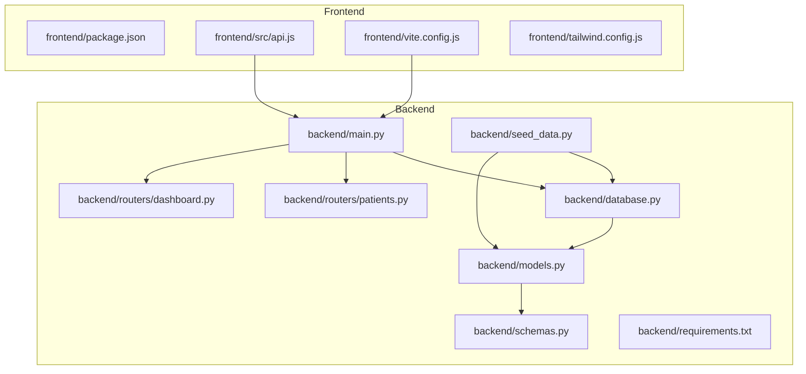
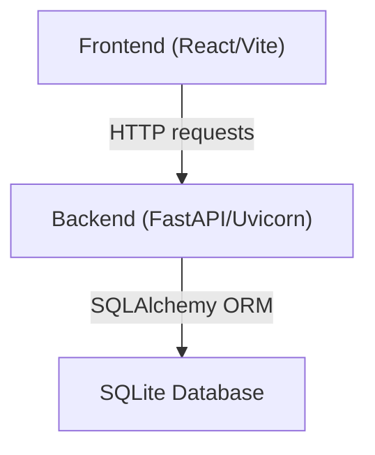

# Getting Started

<cite>
**Referenced Files in This Document**
- [README.md](file://README.md)
- [backend/main.py](file://backend/main.py)
- [backend/database.py](file://backend/database.py)
- [backend/models.py](file://backend/models.py)
- [backend/schemas.py](file://backend/schemas.py)
- [backend/seed_data.py](file://backend/seed_data.py)
- [backend/routers/patients.py](file://backend/routers/patients.py)
- [backend/routers/dashboard.py](file://backend/routers/dashboard.py)
- [backend/requirements.txt](file://backend/requirements.txt)
- [frontend/package.json](file://frontend/package.json)
- [frontend/src/api.js](file://frontend/src/api.js)
- [frontend/vite.config.js](file://frontend/vite.config.js)
- [frontend/tailwind.config.js](file://frontend/tailwind.config.js)
</cite>

## Table of Contents
1. [Introduction](#introduction)
2. [Prerequisites](#prerequisites)
3. [Project Structure](#project-structure)
4. [Installation](#installation)
5. [Running the Application](#running-the-application)
6. [Initial Data Seeding](#initial-data-seeding)
7. [Verification Steps](#verification-steps)
8. [Architecture Overview](#architecture-overview)
9. [Troubleshooting Guide](#troubleshooting-guide)
10. [Cross-Platform Considerations](#cross-platform-considerations)
11. [Conclusion](#conclusion)

## Introduction
This guide helps you set up and run the Smart Healthcare Dashboard locally. It covers prerequisites, installation steps for both backend and frontend, database initialization, running development servers, and verifying your setup. The system consists of:
- Backend: FastAPI server with SQLite database
- Frontend: React application with Vite dev server

## Prerequisites
- Node.js 18+
- Python 3.11+

These requirements are enforced by the project's technology stack and scripts.

**Section sources**
- [README.md:69-72](file://README.md#L69-L72)

## Project Structure
The repository follows a clear separation between backend and frontend:
- Backend: FastAPI application with SQLAlchemy ORM, Pydantic models, and modular routers
- Frontend: React application configured with Vite, TailwindCSS, and Recharts

**Diagram sources**
- [backend/main.py:1-43](file://backend/main.py#L1-L43)
- [backend/database.py:1-20](file://backend/database.py#L1-L20)
- [backend/models.py:1-75](file://backend/models.py#L1-L75)
- [backend/schemas.py:1-134](file://backend/schemas.py#L1-L134)
- [backend/seed_data.py:1-138](file://backend/seed_data.py#L1-L138)
- [backend/routers/patients.py:1-95](file://backend/routers/patients.py#L1-L95)
- [backend/routers/dashboard.py:1-81](file://backend/routers/dashboard.py#L1-L81)
- [backend/requirements.txt:1-9](file://backend/requirements.txt#L1-L9)
- [frontend/package.json:1-34](file://frontend/package.json#L1-L34)
- [frontend/src/api.js:1-56](file://frontend/src/api.js#L1-L56)
- [frontend/vite.config.js:1-17](file://frontend/vite.config.js#L1-L17)
- [frontend/tailwind.config.js:1-50](file://frontend/tailwind.config.js#L1-L50)

**Section sources**
- [README.md:106-136](file://README.md#L106-L136)

## Installation

### Backend Setup
1. Navigate to the backend directory.
2. Create a Python virtual environment:
   - Windows: python -m venv venv, then venv\Scripts\activate
   - macOS/Linux: python -m venv venv, then source venv/bin/activate
3. Install Python dependencies:
   - pip install -r requirements.txt
4. Initialize the database:
   - The FastAPI app creates tables automatically on startup via SQLAlchemy.

Notes:
- The backend uses SQLite by default, so no external database service is required.
- The database file path is defined in the database module.

**Section sources**
- [README.md:73-88](file://README.md#L73-L88)
- [backend/database.py:5](file://backend/database.py#L5)
- [backend/main.py:6-7](file://backend/main.py#L6-L7)
- [backend/requirements.txt:1-9](file://backend/requirements.txt#L1-L9)

### Frontend Setup
1. Navigate to the frontend directory.
2. Install JavaScript dependencies:
   - npm install
3. Start the development server:
   - npm run dev

The frontend runs on port 3000 and proxies API requests to the backend at http://localhost:5000.

**Section sources**
- [README.md:92-104](file://README.md#L92-L104)
- [frontend/package.json:6-11](file://frontend/package.json#L6-L11)
- [frontend/vite.config.js:7-16](file://frontend/vite.config.js#L7-L16)
- [frontend/src/api.js:3](file://frontend/src/api.js#L3)

## Running the Application
- Backend server runs on http://localhost:5000
- Frontend dev server runs on http://localhost:3000

Start both servers concurrently:
1. Backend: python -m backend.main (or run the script as configured)
2. Frontend: npm run dev

CORS is pre-configured to allow connections from the frontend origin.

**Section sources**
- [README.md:90](file://README.md#L90)
- [README.md:104](file://README.md#L104)
- [backend/main.py:15-22](file://backend/main.py#L15-L22)
- [backend/main.py:40-43](file://backend/main.py#L40-L43)
- [frontend/vite.config.js:7-16](file://frontend/vite.config.js#L7-L16)
- [frontend/src/api.js:3](file://frontend/src/api.js#L3)

## Initial Data Seeding
The backend seeds the database with realistic sample data (patients, doctors, appointments, vitals, and activities) when the seed script runs. The FastAPI app also creates tables on startup.

Two ways to seed:
1. Automatic on startup:
   - The FastAPI app creates tables on launch.
2. Manual seeding:
   - Run the seed script to populate the database with sample records.

Important:
- The seed script checks for existing data and skips seeding if records are present.
- The seed script creates 24 hours of vitals data per patient.

**Section sources**
- [backend/main.py:6-7](file://backend/main.py#L6-L7)
- [backend/seed_data.py:6-16](file://backend/seed_data.py#L6-L16)
- [backend/seed_data.py:18-128](file://backend/seed_data.py#L18-L128)

## Verification Steps
After starting both servers, verify the setup:

1. Backend health endpoint:
   - Visit http://localhost:5000/api/health
   - Expect a JSON response indicating the service is healthy.

2. Frontend dashboard:
   - Open http://localhost:3000 in your browser.
   - Confirm the dashboard loads and displays statistics.

3. API endpoints:
   - Patients: http://localhost:5000/api/patients
   - Appointments: http://localhost:5000/api/appointments
   - Doctors: http://localhost:5000/api/doctors
   - Dashboard stats: http://localhost:5000/api/dashboard/stats
   - Recent activity: http://localhost:5000/api/recent-activity

4. Database connectivity:
   - Ensure the SQLite database file is created in the backend directory.

**Section sources**
- [backend/routers/dashboard.py:73-80](file://backend/routers/dashboard.py#L73-L80)
- [backend/routers/patients.py:11](file://backend/routers/patients.py#L11)
- [backend/database.py:5](file://backend/database.py#L5)
- [frontend/src/api.js:13-53](file://frontend/src/api.js#L13-L53)

## Architecture Overview
The system uses a thin-client frontend and a RESTful backend. The frontend communicates with the backend via Axios, while the backend serves endpoints through FastAPI and persists data in SQLite.

**Diagram sources**
- [frontend/src/api.js:1-56](file://frontend/src/api.js#L1-L56)
- [backend/main.py:1-43](file://backend/main.py#L1-L43)
- [backend/database.py:1-20](file://backend/database.py#L1-L20)

## Troubleshooting Guide

Common issues and resolutions:
- Port conflicts:
  - Backend port 5000: Change in the backend server configuration if needed.
  - Frontend port 3000: Adjust in the Vite config if conflicting with another service.
- CORS errors:
  - Ensure the frontend runs on http://localhost:3000 and the backend allows this origin.
- Database connection failures:
  - Verify the SQLite file path and permissions.
- Missing dependencies:
  - Reinstall Python packages from requirements.txt.
  - Reinstall Node packages from package.json.

Environment-specific tips:
- Windows: Use command prompt or PowerShell; ensure virtual environment activation scripts are executable.
- macOS/Linux: Use terminal; ensure shell scripts are executable.

**Section sources**
- [backend/main.py:15-22](file://backend/main.py#L15-L22)
- [backend/main.py:40-43](file://backend/main.py#L40-L43)
- [frontend/vite.config.js:7-16](file://frontend/vite.config.js#L7-L16)
- [backend/database.py:5](file://backend/database.py#L5)
- [backend/requirements.txt:1-9](file://backend/requirements.txt#L1-L9)
- [frontend/package.json:12-32](file://frontend/package.json#L12-L32)

## Cross-Platform Considerations
- Windows:
  - Use Command Prompt or PowerShell.
  - Activate the virtual environment using venv\Scripts\activate.
- macOS:
  - Use Terminal.
  - Use source venv/bin/activate.
- Linux:
  - Use Terminal.
  - Use source venv/bin/activate.

Ensure Node.js and Python 3.11+ are installed and accessible from your terminal.

**Section sources**
- [README.md:78-81](file://README.md#L78-L81)

## Conclusion
You now have the Smart Healthcare Dashboard running locally with both backend and frontend servers. Use the verification steps to confirm everything is working, and consult the troubleshooting section if you encounter issues. For production deployment, refer to the deployment instructions in the repository.