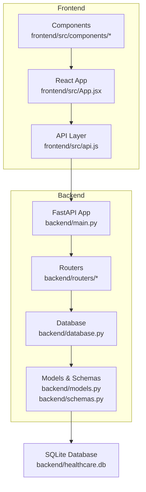
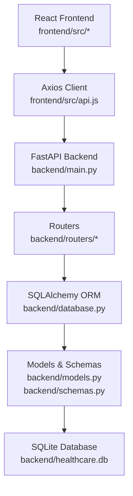
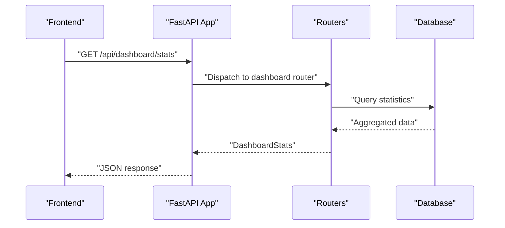
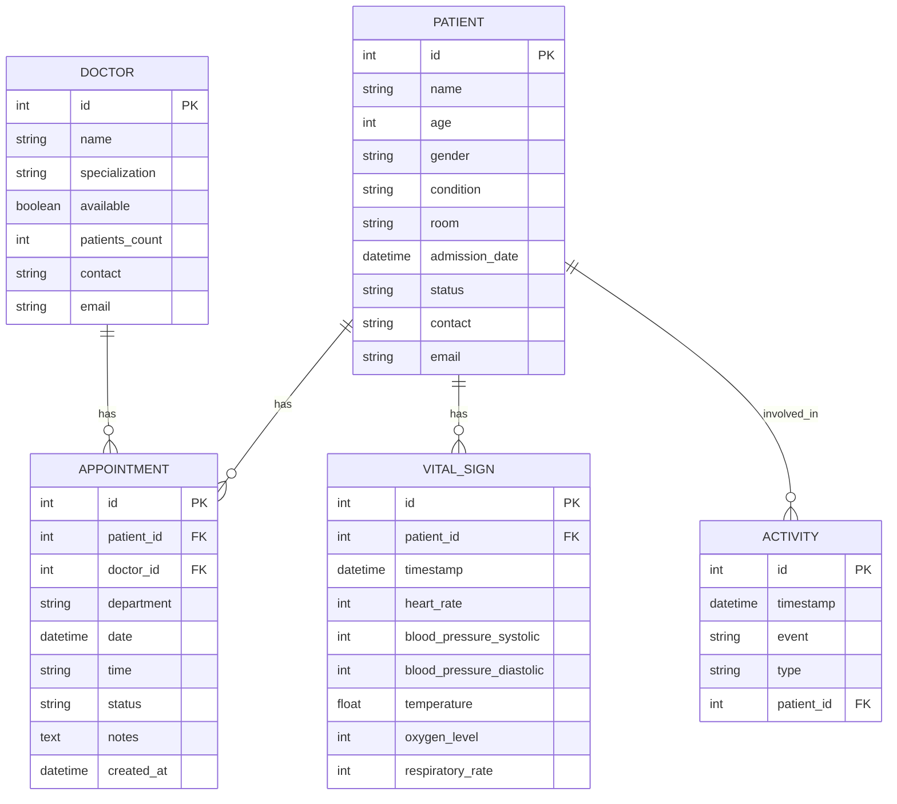
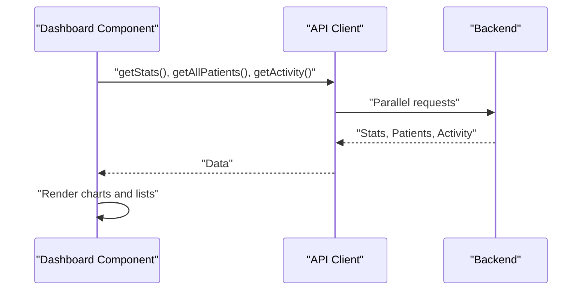
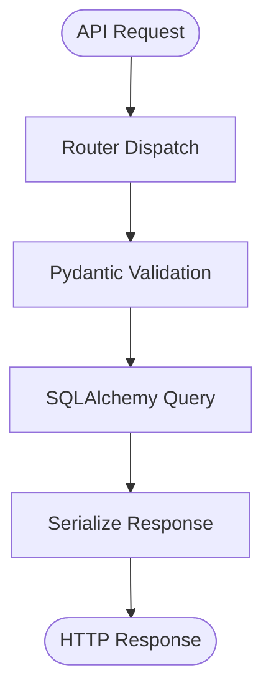
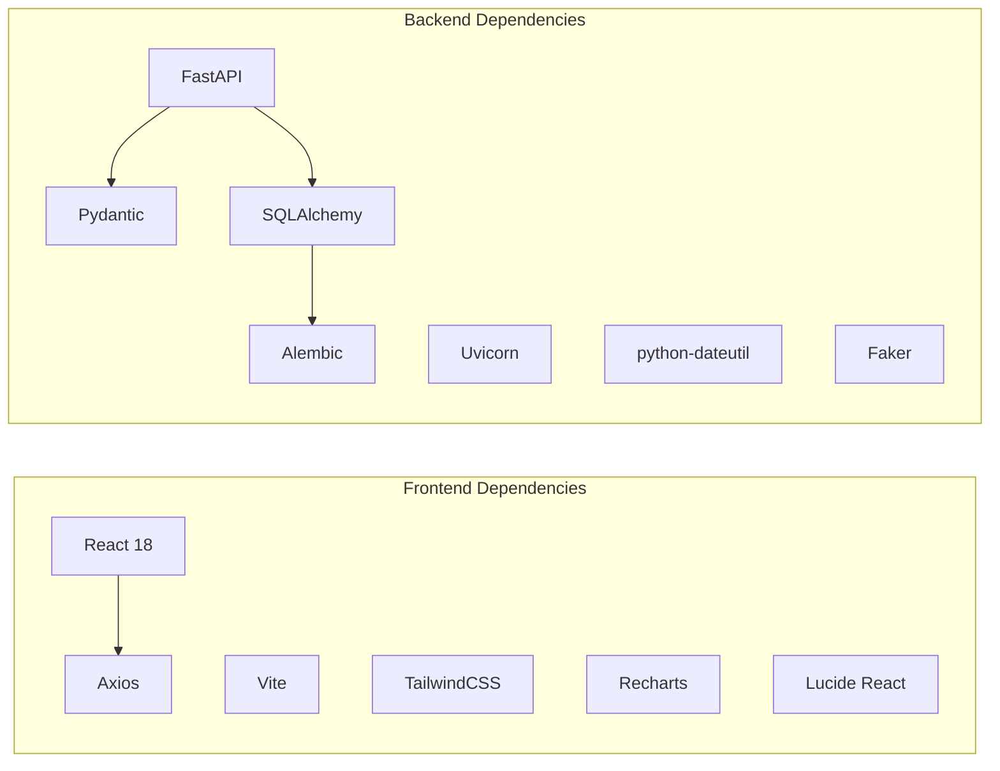

# Project Overview

<cite>
**Referenced Files in This Document**
- [README.md](file://README.md)
- [main.py](file://backend/main.py)
- [database.py](file://backend/database.py)
- [models.py](file://backend/models.py)
- [schemas.py](file://backend/schemas.py)
- [dashboard.py](file://backend/routers/dashboard.py)
- [patients.py](file://backend/routers/patients.py)
- [doctors.py](file://backend/routers/doctors.py)
- [vitals.py](file://backend/routers/vitals.py)
- [appointments.py](file://backend/routers/appointments.py)
- [App.jsx](file://frontend/src/App.jsx)
- [Dashboard.jsx](file://frontend/src/components/Dashboard.jsx)
- [api.js](file://frontend/src/api.js)
- [package.json](file://frontend/package.json)
- [requirements.txt](file://backend/requirements.txt)
</cite>

## Table of Contents
1. [Introduction](#introduction)
2. [Project Structure](#project-structure)
3. [Core Components](#core-components)
4. [Architecture Overview](#architecture-overview)
5. [Detailed Component Analysis](#detailed-component-analysis)
6. [Dependency Analysis](#dependency-analysis)
7. [Performance Considerations](#performance-considerations)
8. [Troubleshooting Guide](#troubleshooting-guide)
9. [Conclusion](#conclusion)
10. [Appendices](#appendices)

## Introduction
Smart Healthcare Dashboard is a full-stack healthcare management solution designed to streamline hospital operations through a modern, real-time platform. Its core value proposition lies in centralizing critical workflows—patient management, appointments, vitals monitoring, and comprehensive analytics—into a single, intuitive interface. The system targets hospital administrators, doctors, nurses, and receptionists, enabling them to monitor capacity, track patient vitals, manage schedules, and derive actionable insights from interactive dashboards.

Key differentiators include:
- Real-time monitoring: Live statistics, recent activity feeds, and vitals trends
- Comprehensive analytics: Interactive charts, KPIs, and time-based filters
- Modern UI/UX: Glassmorphism design, smooth animations, and responsive layouts

The project evolved to version 2.0.0, introducing a production-ready FastAPI backend, structured database models, and a cohesive frontend built with React and TailwindCSS. It maintains extensibility for future enhancements such as WebSocket real-time updates, user authentication, and mobile applications.

**Section sources**
- [README.md:1-232](file://README.md#L1-L232)

## Project Structure
The repository follows a clear separation of concerns:
- Backend: FastAPI application with modular routers, SQLAlchemy models, Pydantic schemas, and SQLite persistence
- Frontend: React application with routing, reusable components, and chart integrations
- Documentation and deployment: README with quick start, tech stack, API endpoints, and deployment instructions

**Diagram sources**
- [main.py:1-43](file://backend/main.py#L1-L43)
- [database.py:1-20](file://backend/database.py#L1-L20)
- [models.py:1-75](file://backend/models.py#L1-L75)
- [schemas.py:1-134](file://backend/schemas.py#L1-L134)
- [App.jsx:1-74](file://frontend/src/App.jsx#L1-L74)
- [api.js:1-56](file://frontend/src/api.js#L1-L56)

**Section sources**
- [README.md:106-136](file://README.md#L106-L136)
- [package.json:1-34](file://frontend/package.json#L1-L34)
- [requirements.txt:1-9](file://backend/requirements.txt#L1-L9)

## Core Components
- Backend API server with CORS configuration and modular routers for patients, appointments, doctors, vitals, and dashboard
- Database layer using SQLAlchemy with declarative models for patients, doctors, appointments, vitals, and activity logs
- Frontend application with navigation, dashboard statistics, charts, and component-driven architecture
- API client module abstracting HTTP requests to the backend

Key capabilities:
- Real-time statistics and recent activity retrieval
- Patient lifecycle management with search and filtering
- Appointment scheduling with validation and automatic status updates
- Vitals tracking with historical trend queries
- Doctor directory with availability and specialization filters

**Section sources**
- [main.py:1-43](file://backend/main.py#L1-L43)
- [database.py:1-20](file://backend/database.py#L1-L20)
- [models.py:1-75](file://backend/models.py#L1-L75)
- [schemas.py:1-134](file://backend/schemas.py#L1-L134)
- [dashboard.py:1-81](file://backend/routers/dashboard.py#L1-L81)
- [patients.py:1-95](file://backend/routers/patients.py#L1-L95)
- [appointments.py:1-173](file://backend/routers/appointments.py#L1-L173)
- [vitals.py:1-72](file://backend/routers/vitals.py#L1-L72)
- [doctors.py:1-70](file://backend/routers/doctors.py#L1-L70)
- [Dashboard.jsx:1-194](file://frontend/src/components/Dashboard.jsx#L1-L194)
- [api.js:1-56](file://frontend/src/api.js#L1-L56)

## Architecture Overview
The system employs a clean separation between the React frontend and the FastAPI backend, communicating via REST APIs. The backend persists data using an SQLite database through SQLAlchemy ORM. The frontend consumes typed API endpoints and renders interactive dashboards with Recharts.

**Diagram sources**
- [App.jsx:1-74](file://frontend/src/App.jsx#L1-L74)
- [api.js:1-56](file://frontend/src/api.js#L1-L56)
- [main.py:1-43](file://backend/main.py#L1-L43)
- [database.py:1-20](file://backend/database.py#L1-L20)
- [models.py:1-75](file://backend/models.py#L1-L75)
- [schemas.py:1-134](file://backend/schemas.py#L1-L134)

## Detailed Component Analysis

### Backend API Server
The FastAPI application initializes database tables, configures CORS for local development, and mounts routers for core features. Health checks and versioning are exposed for operational monitoring.

**Diagram sources**
- [main.py:1-43](file://backend/main.py#L1-L43)
- [dashboard.py:12-62](file://backend/routers/dashboard.py#L12-L62)

**Section sources**
- [main.py:1-43](file://backend/main.py#L1-L43)
- [dashboard.py:12-81](file://backend/routers/dashboard.py#L12-L81)

### Database Models and Relationships
The backend defines core entities and their relationships, enabling normalized storage and efficient querying across departments.

**Diagram sources**
- [models.py:6-75](file://backend/models.py#L6-L75)

**Section sources**
- [models.py:1-75](file://backend/models.py#L1-L75)
- [schemas.py:1-134](file://backend/schemas.py#L1-L134)

### Frontend Application and Dashboard
The React frontend provides a glassmorphism UI with navigation, responsive layout, and integrated charts. The dashboard component fetches statistics, recent patients, and activity, rendering interactive visualizations.

**Diagram sources**
- [Dashboard.jsx:33-62](file://frontend/src/components/Dashboard.jsx#L33-L62)
- [api.js:48-53](file://frontend/src/api.js#L48-L53)
- [dashboard.py:12-71](file://backend/routers/dashboard.py#L12-L71)

**Section sources**
- [App.jsx:1-74](file://frontend/src/App.jsx#L1-L74)
- [Dashboard.jsx:1-194](file://frontend/src/components/Dashboard.jsx#L1-L194)
- [api.js:1-56](file://frontend/src/api.js#L1-L56)

### API Endpoints and Data Contracts
The backend exposes REST endpoints for CRUD operations and specialized queries, validated by Pydantic models. The frontend consumes these endpoints through a centralized API module.

**Diagram sources**
- [patients.py:11-46](file://backend/routers/patients.py#L11-L46)
- [appointments.py:53-75](file://backend/routers/appointments.py#L53-L75)
- [vitals.py:11-27](file://backend/routers/vitals.py#L11-L27)
- [doctors.py:10-26](file://backend/routers/doctors.py#L10-L26)
- [schemas.py:5-34](file://backend/schemas.py#L5-L34)

**Section sources**
- [patients.py:1-95](file://backend/routers/patients.py#L1-L95)
- [appointments.py:1-173](file://backend/routers/appointments.py#L1-L173)
- [vitals.py:1-72](file://backend/routers/vitals.py#L1-L72)
- [doctors.py:1-70](file://backend/routers/doctors.py#L1-L70)
- [schemas.py:1-134](file://backend/schemas.py#L1-L134)

## Dependency Analysis
The system’s dependencies are scoped to the tech stack declared in the project:
- Frontend: React 18, Vite, TailwindCSS, Recharts, Lucide React, Axios
- Backend: FastAPI, Uvicorn, Pydantic, SQLAlchemy, Alembic, python-dateutil, faker

**Diagram sources**
- [package.json:12-32](file://frontend/package.json#L12-L32)
- [requirements.txt:1-9](file://backend/requirements.txt#L1-L9)

**Section sources**
- [package.json:1-34](file://frontend/package.json#L1-L34)
- [requirements.txt:1-9](file://backend/requirements.txt#L1-L9)

## Performance Considerations
- Database efficiency: Use indexed fields for frequent filters (e.g., patient name, status, appointment date). Pagination parameters are already leveraged in routers to limit result sets.
- API responsiveness: Parallelize frontend requests where possible to reduce load times (as seen in the dashboard component).
- Rendering performance: Prefer virtualized lists for large datasets and optimize chart rendering by limiting data points.
- Caching: Introduce lightweight caching for frequently accessed dashboard metrics to reduce database load.
- Connection pooling: Ensure database connection reuse and appropriate session lifecycle management.

[No sources needed since this section provides general guidance]

## Troubleshooting Guide
Common issues and resolutions:
- CORS errors: Confirm frontend origin is included in backend CORS configuration during development.
- Database initialization: Ensure tables are created before starting the server; the application creates tables on startup.
- Endpoint mismatches: Verify endpoint paths align with router prefixes and that the base URL matches the backend host/port.
- Authentication and authorization: Not implemented yet; plan to integrate after establishing secure endpoints.
- Real-time updates: WebSocket support is planned; implement alongside backend event producers and frontend subscribers.

**Section sources**
- [main.py:15-22](file://backend/main.py#L15-L22)
- [database.py:6-9](file://backend/database.py#L6-L9)
- [api.js:3](file://frontend/src/api.js#L3)

## Conclusion
Smart Healthcare Dashboard 2.0.0 delivers a robust foundation for healthcare facility operations with real-time insights, comprehensive analytics, and a modern UI/UX. Its modular backend and component-driven frontend enable scalability and maintainability. Planned enhancements—such as database integration, authentication, WebSocket updates, and mobile support—position the system for continued growth and industry alignment.

[No sources needed since this section summarizes without analyzing specific files]

## Appendices

### Target Audience and Use Cases
- Hospital administrators: Monitor occupancy, revenue, and critical cases; review department performance and recent activity.
- Doctors: Access patient vitals trends, filter appointments by status, and coordinate schedules.
- Nurses: Track patient conditions, update vitals, and manage daily rounds with status indicators.
- Receptionists: Manage appointments, verify availability, and handle scheduling conflicts.

[No sources needed since this section provides general guidance]

### Compliance and Standards
- Data protection: Implement encryption at rest and in transit; adopt role-based access controls.
- Auditability: Maintain activity logs and transaction histories for compliance reporting.
- Interoperability: Consider HL7 FHIR or similar standards for future integration with EMR systems.

[No sources needed since this section provides general guidance]

### Evolution to Version 2.0.0
- Backend: Production-ready FastAPI with structured routers, SQLAlchemy models, and Pydantic schemas
- Frontend: React-based UI with glassmorphism design, responsive layout, and interactive charts
- API: Stable endpoint contracts with health checks and versioning
- Deployment: Clear instructions for Render, Railway, and Vercel

**Section sources**
- [README.md:5](file://README.md#L5)
- [main.py:9-13](file://backend/main.py#L9-L13)
- [package.json:4](file://frontend/package.json#L4)