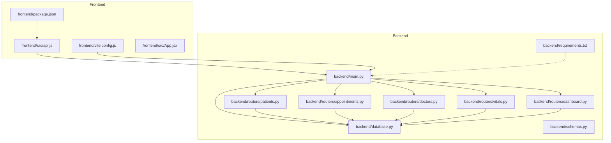
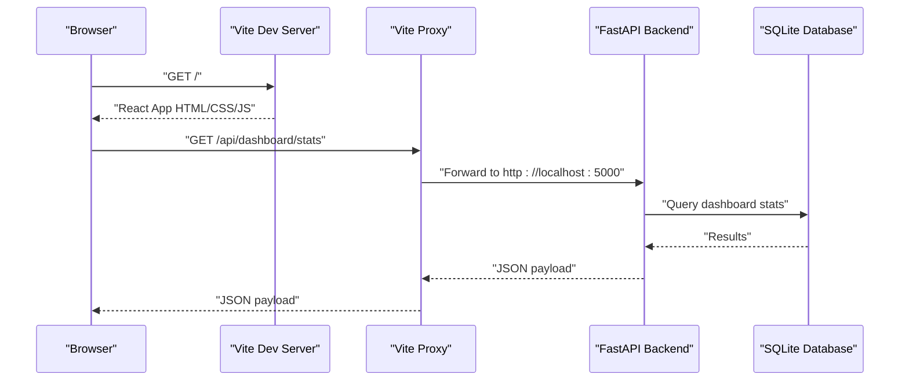

# Troubleshooting & FAQ

<cite>
**Referenced Files in This Document**
- [README.md](file://README.md)
- [backend/main.py](file://backend/main.py)
- [backend/database.py](file://backend/database.py)
- [backend/requirements.txt](file://backend/requirements.txt)
- [backend/routers/patients.py](file://backend/routers/patients.py)
- [backend/routers/appointments.py](file://backend/routers/appointments.py)
- [backend/routers/doctors.py](file://backend/routers/doctors.py)
- [backend/routers/vitals.py](file://backend/routers/vitals.py)
- [backend/routers/dashboard.py](file://backend/routers/dashboard.py)
- [backend/schemas.py](file://backend/schemas.py)
- [frontend/src/api.js](file://frontend/src/api.js)
- [frontend/vite.config.js](file://frontend/vite.config.js)
- [frontend/package.json](file://frontend/package.json)
- [frontend/src/App.jsx](file://frontend/src/App.jsx)
</cite>

## Table of Contents
1. [Introduction](#introduction)
2. [Project Structure](#project-structure)
3. [Core Components](#core-components)
4. [Architecture Overview](#architecture-overview)
5. [Detailed Component Analysis](#detailed-component-analysis)
6. [Dependency Analysis](#dependency-analysis)
7. [Performance Considerations](#performance-considerations)
8. [Troubleshooting Guide](#troubleshooting-guide)
9. [Conclusion](#conclusion)
10. [Appendices](#appendices)

## Introduction
This document provides a comprehensive troubleshooting guide for the Smart Healthcare Dashboard. It covers setup issues (dependencies, ports, environment), runtime problems (database, API endpoints, frontend rendering), debugging techniques, logging strategies, performance tuning, cross-platform and browser compatibility, and community/support resources. The goal is to help developers quickly diagnose and resolve common issues while maintaining a smooth development and deployment experience.

## Project Structure
The project is a full-stack application composed of:
- Backend: FastAPI server with SQLAlchemy ORM, SQLite database, and modular routers for patients, appointments, doctors, vitals, and dashboard.
- Frontend: React application using Vite, TailwindCSS, Recharts, and Axios for API communication.

**Diagram sources**
- [backend/main.py:1-43](file://backend/main.py#L1-L43)
- [backend/database.py:1-20](file://backend/database.py#L1-L20)
- [backend/routers/patients.py:1-95](file://backend/routers/patients.py#L1-L95)
- [backend/routers/appointments.py:1-173](file://backend/routers/appointments.py#L1-L173)
- [backend/routers/doctors.py:1-70](file://backend/routers/doctors.py#L1-L70)
- [backend/routers/vitals.py:1-72](file://backend/routers/vitals.py#L1-L72)
- [backend/routers/dashboard.py:1-81](file://backend/routers/dashboard.py#L1-L81)
- [backend/schemas.py:1-134](file://backend/schemas.py#L1-L134)
- [backend/requirements.txt:1-9](file://backend/requirements.txt#L1-L9)
- [frontend/src/api.js:1-56](file://frontend/src/api.js#L1-L56)
- [frontend/vite.config.js:1-17](file://frontend/vite.config.js#L1-L17)
- [frontend/package.json:1-34](file://frontend/package.json#L1-L34)
- [frontend/src/App.jsx:1-74](file://frontend/src/App.jsx#L1-L74)

**Section sources**
- [README.md:106-136](file://README.md#L106-L136)
- [backend/main.py:1-43](file://backend/main.py#L1-L43)
- [frontend/vite.config.js:1-17](file://frontend/vite.config.js#L1-L17)

## Core Components
- Backend server and CORS configuration, router registration, and health endpoints.
- Database initialization and session management with SQLite.
- API routers for patients, appointments, doctors, vitals, and dashboard statistics.
- Pydantic schemas for request/response validation.
- Frontend API client configured to communicate with the backend.
- Vite dev server with proxy to backend.

Key runtime endpoints:
- Health check and docs discovery.
- Dashboard statistics and recent activity.
- CRUD operations for patients, appointments, doctors, and vitals.

**Section sources**
- [backend/main.py:1-43](file://backend/main.py#L1-L43)
- [backend/database.py:1-20](file://backend/database.py#L1-L20)
- [backend/routers/dashboard.py:12-81](file://backend/routers/dashboard.py#L12-L81)
- [backend/routers/patients.py:11-95](file://backend/routers/patients.py#L11-L95)
- [backend/routers/appointments.py:53-173](file://backend/routers/appointments.py#L53-L173)
- [backend/routers/doctors.py:10-70](file://backend/routers/doctors.py#L10-L70)
- [backend/routers/vitals.py:11-72](file://backend/routers/vitals.py#L11-L72)
- [backend/schemas.py:5-134](file://backend/schemas.py#L5-L134)
- [frontend/src/api.js:3-56](file://frontend/src/api.js#L3-L56)
- [frontend/vite.config.js:7-15](file://frontend/vite.config.js#L7-L15)

## Architecture Overview
High-level flow:
- Frontend runs on Vite dev server and proxies API requests to the backend.
- Backend FastAPI serves endpoints and interacts with the SQLAlchemy-managed SQLite database.
- Requests are validated via Pydantic models before persistence.

**Diagram sources**
- [frontend/vite.config.js:9-14](file://frontend/vite.config.js#L9-L14)
- [backend/main.py:31-38](file://backend/main.py#L31-L38)
- [backend/routers/dashboard.py:12-62](file://backend/routers/dashboard.py#L12-L62)
- [backend/database.py:14-19](file://backend/database.py#L14-L19)

## Detailed Component Analysis

### Backend Startup and CORS
Common issues:
- Port binding conflicts on 5000.
- CORS errors when frontend origin differs from configured origins.
- Missing database initialization.

Resolution steps:
- Ensure port 5000 is free or change host/port in the server entry.
- Confirm frontend origin matches configured allow_origins.
- Verify database engine and table creation occur during startup.

**Section sources**
- [backend/main.py:15-22](file://backend/main.py#L15-L22)
- [backend/main.py:40-42](file://backend/main.py#L40-L42)
- [backend/database.py:5-12](file://backend/database.py#L5-L12)

### Database Connectivity and Initialization
Common issues:
- SQLite file path or permissions errors.
- Engine connection arguments causing thread-safety warnings.
- Missing tables after fresh installs.

Resolution steps:
- Confirm the SQLite file path is writable.
- Use the provided engine configuration for single-threaded development.
- Ensure table creation runs at startup.

**Section sources**
- [backend/database.py:5-12](file://backend/database.py#L5-L12)

### API Routers and Validation
Common issues:
- 404 Not Found for missing IDs.
- 409 Conflict for duplicates or booking conflicts.
- 400 Bad Request for invalid inputs or constraints.

Resolution steps:
- Validate resource existence before update/delete.
- Respect business rules (time slots, uniqueness).
- Use Pydantic validation to catch malformed requests early.

**Section sources**
- [backend/routers/patients.py:41-95](file://backend/routers/patients.py#L41-L95)
- [backend/routers/appointments.py:84-125](file://backend/routers/appointments.py#L84-L125)
- [backend/routers/doctors.py:28-70](file://backend/routers/doctors.py#L28-L70)
- [backend/routers/vitals.py:11-72](file://backend/routers/vitals.py#L11-L72)
- [backend/schemas.py:16-106](file://backend/schemas.py#L16-L106)

### Frontend API Client and Proxy
Common issues:
- Proxy misconfiguration leading to CORS or 404 errors.
- Incorrect base URL for API calls.
- Vite dev server port conflicts.

Resolution steps:
- Ensure Vite proxy forwards /api to backend host/port.
- Keep API base URL aligned with proxy target.
- Change Vite port if 3000 is in use.

**Section sources**
- [frontend/src/api.js:3-10](file://frontend/src/api.js#L3-L10)
- [frontend/vite.config.js:7-15](file://frontend/vite.config.js#L7-L15)

### Dashboard and Health Endpoints
Common issues:
- Health endpoint unreachable due to proxy misconfiguration.
- Empty or stale dashboard statistics.

Resolution steps:
- Verify health route exists and returns expected payload.
- Confirm database has seeded data for accurate stats.

**Section sources**
- [backend/main.py:31-38](file://backend/main.py#L31-L38)
- [backend/routers/dashboard.py:73-81](file://backend/routers/dashboard.py#L73-L81)

## Dependency Analysis
Runtime dependencies:
- Backend: FastAPI, Uvicorn, Pydantic, SQLAlchemy, Alembic, python-dateutil, faker.
- Frontend: React, React DOM, React Router, Axios, Recharts, TailwindCSS, Vite.

Potential conflicts:
- Node and Python version mismatches.
- Incompatible versions of React/Vite/Axios.
- FastAPI/Uvicorn version skew.

Resolution steps:
- Pin versions as per requirements.
- Use a virtual environment for Python.
- Use Node version matching prerequisites.

**Section sources**
- [backend/requirements.txt:1-9](file://backend/requirements.txt#L1-L9)
- [frontend/package.json:12-19](file://frontend/package.json#L12-L19)
- [README.md:69-88](file://README.md#L69-L88)

## Performance Considerations
- Database queries: Use pagination and filters to avoid large result sets.
- Frontend rendering: Lazy-load heavy chart components; debounce search/filter inputs.
- Network: Minimize unnecessary re-renders; cache stable API responses.
- Memory: Dispose of subscriptions and timers; avoid large in-memory datasets.

[No sources needed since this section provides general guidance]

## Troubleshooting Guide

### Setup Problems

- Dependency installation fails
  - Symptom: pip install or npm install throws errors.
  - Causes: Outdated pip/npm, incompatible OS/architecture, missing build tools.
  - Resolution: Upgrade pip and Node; ensure Python 3.11+ and Node 18+; install system build dependencies if needed.

- Port binding conflicts
  - Symptom: Backend fails to start on 5000 or Vite fails on 3000.
  - Causes: Another process occupies the port.
  - Resolution: Stop the conflicting service or change ports in backend and Vite config.

- Environment configuration errors
  - Symptom: Module not found or import errors.
  - Causes: Missing virtual environment activation, wrong working directory.
  - Resolution: Activate backend virtual environment; run commands from project root.

**Section sources**
- [README.md:69-104](file://README.md#L69-L104)
- [backend/requirements.txt:1-9](file://backend/requirements.txt#L1-L9)
- [frontend/package.json:1-34](file://frontend/package.json#L1-L34)

### Runtime Issues

- Database connection failures
  - Symptom: Operational errors when querying or creating tables.
  - Causes: Incorrect database URL, permission issues, missing file path.
  - Resolution: Verify SQLite path is writable; confirm engine configuration; restart app.

- API endpoint errors
  - Symptom: 404, 409, 400 responses.
  - Causes: Non-existent IDs, duplicate entries, invalid constraints/time slots.
  - Resolution: Validate inputs; ensure referenced resources exist; adhere to allowed time slots.

- Frontend rendering problems
  - Symptom: Blank pages, missing charts, navigation issues.
  - Causes: Missing proxy configuration, incorrect base URL, unhandled route.
  - Resolution: Confirm Vite proxy targets backend; keep API base URL consistent; verify routes.

**Section sources**
- [backend/database.py:5-12](file://backend/database.py#L5-L12)
- [backend/routers/patients.py:48-66](file://backend/routers/patients.py#L48-L66)
- [backend/routers/appointments.py:84-125](file://backend/routers/appointments.py#L84-L125)
- [frontend/src/api.js:3-10](file://frontend/src/api.js#L3-L10)
- [frontend/vite.config.js:9-14](file://frontend/vite.config.js#L9-L14)
- [frontend/src/App.jsx:53-71](file://frontend/src/App.jsx#L53-L71)

### Debugging Techniques

- Backend debugging
  - Enable FastAPI debug logs; use uvicorn with reload flag during development.
  - Add structured logging around database sessions and router handlers.
  - Validate Pydantic models by testing request payloads independently.

- Frontend debugging
  - Use React DevTools and browser network tab to inspect API calls.
  - Temporarily bypass proxy to test direct backend endpoints.
  - Add console logs for route transitions and data fetching.

- Cross-cutting diagnostics
  - Health endpoint: hit the backend health route to confirm service availability.
  - Proxy verification: ensure /api requests are proxied to backend.

**Section sources**
- [backend/main.py:31-38](file://backend/main.py#L31-L38)
- [frontend/vite.config.js:9-14](file://frontend/vite.config.js#L9-L14)
- [frontend/src/api.js:3-10](file://frontend/src/api.js#L3-L10)

### Logging Strategies

- Backend
  - Use Python logging module; configure level and format; emit logs around critical paths (DB sessions, router handlers).
  - Log request IDs and correlation IDs for distributed tracing if extended.

- Frontend
  - Centralize API error handling; log errors to console and optionally send to backend for centralized storage.
  - Use feature flags to toggle verbose logging in development.

[No sources needed since this section provides general guidance]

### Error Diagnosis Methods

- Health checks
  - Call the backend health endpoint to confirm service status.
  - Validate that the root endpoint returns expected metadata.

- Database diagnostics
  - Confirm database file exists and is accessible.
  - Verify table creation occurs at startup.

- API contract verification
  - Compare frontend API calls with documented endpoints.
  - Validate request/response shapes against Pydantic models.

**Section sources**
- [backend/main.py:31-38](file://backend/main.py#L31-L38)
- [backend/database.py:5-12](file://backend/database.py#L5-L12)
- [backend/schemas.py:5-134](file://backend/schemas.py#L5-L134)

### Performance Optimization Tips

- Backend
  - Use pagination and filtering on endpoints.
  - Optimize queries with proper indexing and joins.
  - Avoid N+1 queries; use eager loading where appropriate.

- Frontend
  - Lazy-load heavy components; split bundles.
  - Debounce search and filter operations.
  - Cache data where safe and beneficial.

[No sources needed since this section provides general guidance]

### Memory Usage Monitoring and Bottleneck Identification

- Backend
  - Monitor process memory and CPU; profile slow endpoints.
  - Watch for long-running transactions and unclosed DB sessions.

- Frontend
  - Use browser devtools to track memory growth; inspect for leaks in components and subscriptions.
  - Measure render times and network latency.

[No sources needed since this section provides general guidance]

### Cross-Platform Compatibility and Browser-Specific Problems

- Cross-platform
  - Use POSIX-compatible paths in scripts; prefer platform-agnostic commands.
  - Test on Windows, macOS, and Linux; adjust shell commands accordingly.

- Browser compatibility
  - Ensure modern browsers support ES modules and fetch API.
  - Use polyfills if supporting legacy browsers; test responsiveness.

[No sources needed since this section provides general guidance]

### Network Connectivity Challenges

- Proxy misconfiguration
  - Symptoms: 404 or CORS errors for /api routes.
  - Resolution: Verify Vite proxy target and changeOrigin settings.

- Origin mismatch
  - Symptoms: CORS errors when frontend runs on different ports.
  - Resolution: Add the actual frontend origin to backend allow_origins.

**Section sources**
- [frontend/vite.config.js:9-14](file://frontend/vite.config.js#L9-L14)
- [backend/main.py:15-22](file://backend/main.py#L15-L22)

## Conclusion
By following this troubleshooting guide, most setup and runtime issues can be resolved quickly. Focus on verifying environment prerequisites, ensuring correct port and proxy configurations, validating database connectivity, and confirming API contracts. Adopt structured logging and performance monitoring to maintain reliability as the system evolves.

[No sources needed since this section summarizes without analyzing specific files]

## Appendices

### Quick Fix Checklist
- Backend
  - Confirm virtual environment is activated.
  - Ensure port 5000 is free.
  - Verify database file path and permissions.
- Frontend
  - Confirm Node 18+ and npm install succeeded.
  - Ensure Vite runs on port 3000 and proxy targets backend.
  - Validate API base URL matches proxy target.

**Section sources**
- [README.md:69-104](file://README.md#L69-L104)
- [backend/main.py:40-42](file://backend/main.py#L40-L42)
- [frontend/vite.config.js:7-15](file://frontend/vite.config.js#L7-L15)
- [frontend/src/api.js:3-10](file://frontend/src/api.js#L3-L10)

### Community Resources and Support
- Reporting bugs and requesting features: Contributions are welcome via pull requests.
- License: MIT.

**Section sources**
- [README.md:215-227](file://README.md#L215-L227)