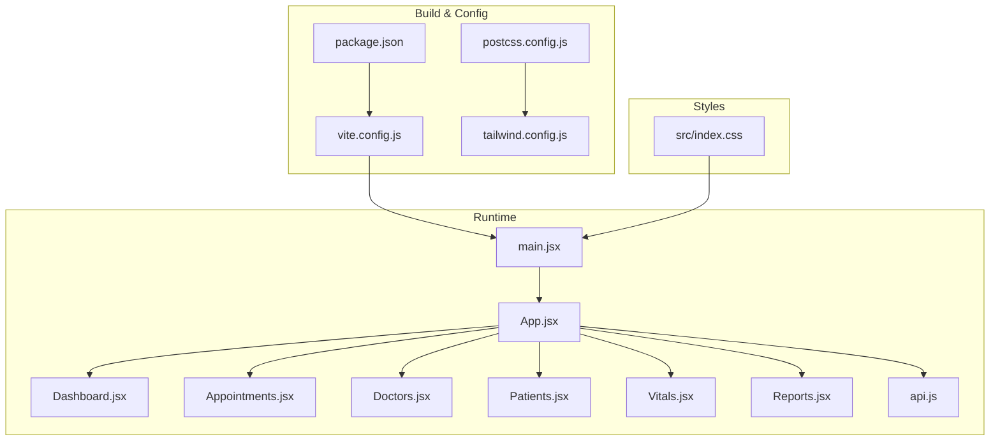
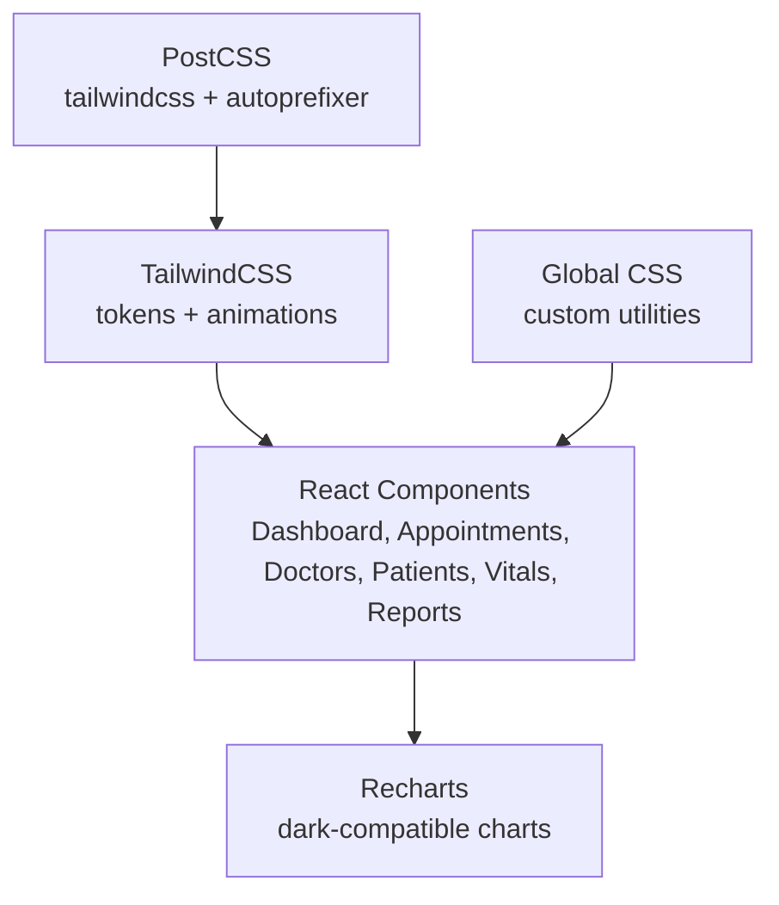
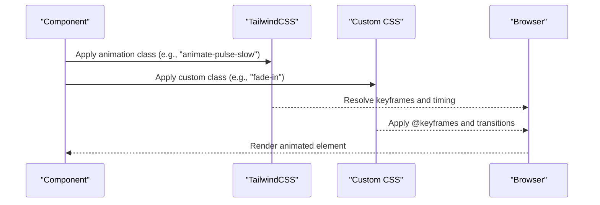
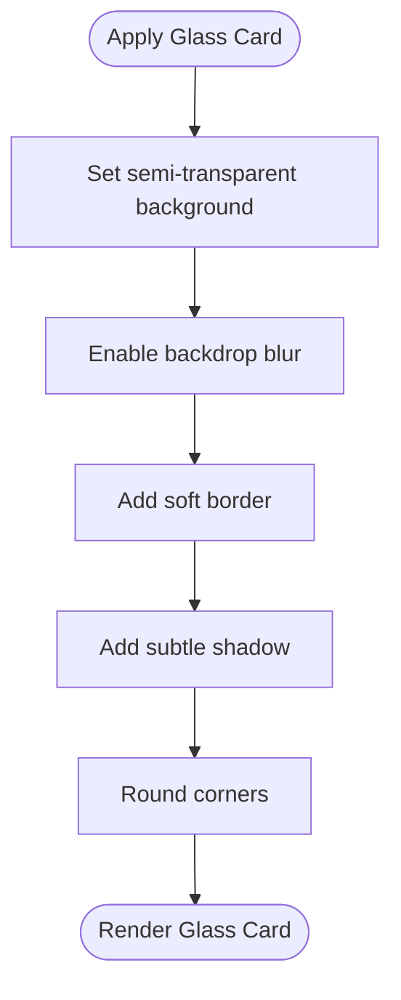
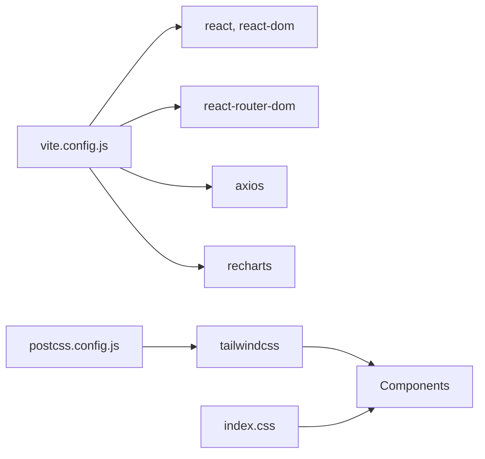

# UI/UX Design & Styling

<cite>
**Referenced Files in This Document**
- [tailwind.config.js](file://frontend/tailwind.config.js)
- [index.css](file://frontend/src/index.css)
- [package.json](file://frontend/package.json)
- [postcss.config.js](file://frontend/postcss.config.js)
- [vite.config.js](file://frontend/vite.config.js)
- [main.jsx](file://frontend/src/main.jsx)
- [App.jsx](file://frontend/src/App.jsx)
- [Dashboard.jsx](file://frontend/src/components/Dashboard.jsx)
- [Appointments.jsx](file://frontend/src/components/Appointments.jsx)
- [Doctors.jsx](file://frontend/src/components/Doctors.jsx)
- [Patients.jsx](file://frontend/src/components/Patients.jsx)
- [Vitals.jsx](file://frontend/src/components/Vitals.jsx)
- [Reports.jsx](file://frontend/src/components/Reports.jsx)
- [api.js](file://frontend/src/api.js)
</cite>

## Table of Contents
1. [Introduction](#introduction)
2. [Project Structure](#project-structure)
3. [Core Components](#core-components)
4. [Architecture Overview](#architecture-overview)
5. [Detailed Component Analysis](#detailed-component-analysis)
6. [Dependency Analysis](#dependency-analysis)
7. [Performance Considerations](#performance-considerations)
8. [Troubleshooting Guide](#troubleshooting-guide)
9. [Conclusion](#conclusion)
10. [Appendices](#appendices)

## Introduction
This document describes the UI/UX design system and styling architecture for the Smart Healthcare Dashboard frontend. It covers TailwindCSS configuration, custom utility classes, design tokens, glassmorphism effects, gradients, animations, responsive strategies, color and typography systems, component styling patterns, accessibility considerations, cross-browser compatibility, performance optimization for animations, and guidelines for extending the design system while maintaining visual consistency.

## Project Structure
The frontend is a Vite-powered React application with TailwindCSS configured via PostCSS. Styles are centralized in a global stylesheet and component-level Tailwind classes. The design system emphasizes a dark theme with glassmorphism cards, gradient backgrounds, and subtle animations.

**Diagram sources**
- [vite.config.js:1-17](file://frontend/vite.config.js#L1-L17)
- [postcss.config.js:1-7](file://frontend/postcss.config.js#L1-L7)
- [tailwind.config.js:1-50](file://frontend/tailwind.config.js#L1-L50)
- [package.json:1-34](file://frontend/package.json#L1-L34)
- [main.jsx:1-11](file://frontend/src/main.jsx#L1-L11)
- [App.jsx:1-74](file://frontend/src/App.jsx#L1-L74)
- [Dashboard.jsx:1-194](file://frontend/src/components/Dashboard.jsx#L1-L194)
- [Appointments.jsx:1-101](file://frontend/src/components/Appointments.jsx#L1-L101)
- [Doctors.jsx:1-77](file://frontend/src/components/Doctors.jsx#L1-L77)
- [Patients.jsx:1-119](file://frontend/src/components/Patients.jsx#L1-L119)
- [Vitals.jsx:1-162](file://frontend/src/components/Vitals.jsx#L1-L162)
- [Reports.jsx:1-184](file://frontend/src/components/Reports.jsx#L1-L184)
- [api.js:1-56](file://frontend/src/api.js#L1-L56)
- [index.css:1-119](file://frontend/src/index.css#L1-L119)

**Section sources**
- [vite.config.js:1-17](file://frontend/vite.config.js#L1-L17)
- [postcss.config.js:1-7](file://frontend/postcss.config.js#L1-L7)
- [tailwind.config.js:1-50](file://frontend/tailwind.config.js#L1-L50)
- [package.json:1-34](file://frontend/package.json#L1-L34)
- [main.jsx:1-11](file://frontend/src/main.jsx#L1-L11)
- [index.css:1-119](file://frontend/src/index.css#L1-L119)

## Core Components
- TailwindCSS configuration defines design tokens (colors, animation keyframes), enabling consistent theming and animation primitives across components.
- Global CSS establishes base styles, glassmorphism utilities, gradient backgrounds, status badges, and scrollbar styling.
- Components apply Tailwind utilities and custom classes to achieve a cohesive, modern UI with dark theme and glass effects.

Key design system elements:
- Color palette: primary palette, healthcare brand colors, and status-based color tokens.
- Animation primitives: pulse, float, glow, plus custom fade-in and slide-in animations.
- Glassmorphism card effect: backdrop blur, semi-transparent backgrounds, soft borders, and subtle shadows.
- Gradient backgrounds: predefined gradient classes for hero and section backgrounds.
- Status badges: color-coded indicators for patient conditions and appointment statuses.
- Scrollbar styling: themed scrollbars for dark mode consistency.

**Section sources**
- [tailwind.config.js:7-49](file://frontend/tailwind.config.js#L7-L49)
- [index.css:11-119](file://frontend/src/index.css#L11-L119)

## Architecture Overview
The design system architecture centers on:
- TailwindCSS for utility-first styling and design tokens.
- PostCSS pipeline to process Tailwind and vendor prefixes.
- Global CSS for custom utilities and base styles.
- Component-level Tailwind classes and custom classes (.glass-card, .fade-in, .slide-in, status-*).
- Recharts for data visualization with dark-mode compatible chart themes.

**Diagram sources**
- [tailwind.config.js:1-50](file://frontend/tailwind.config.js#L1-L50)
- [postcss.config.js:1-7](file://frontend/postcss.config.js#L1-L7)
- [index.css:1-119](file://frontend/src/index.css#L1-L119)
- [Dashboard.jsx:1-194](file://frontend/src/components/Dashboard.jsx#L1-L194)
- [Appointments.jsx:1-101](file://frontend/src/components/Appointments.jsx#L1-L101)
- [Doctors.jsx:1-77](file://frontend/src/components/Doctors.jsx#L1-L77)
- [Patients.jsx:1-119](file://frontend/src/components/Patients.jsx#L1-L119)
- [Vitals.jsx:1-162](file://frontend/src/components/Vitals.jsx#L1-L162)
- [Reports.jsx:1-184](file://frontend/src/components/Reports.jsx#L1-L184)

## Detailed Component Analysis

### TailwindCSS Configuration and Design Tokens
- Colors:
  - Primary palette with light-to-dark scale for consistent blues.
  - Healthcare brand palette with semantic colors (blue, green, purple, pink, orange, red).
- Animation primitives:
  - Pulse slow: a steady, low-frequency pulse suitable for subtle emphasis.
  - Float: vertical bobbing motion for floating cards and decorative elements.
  - Glow: alternating glow intensity for attention-grabbing elements.
- Keyframes:
  - Float: up/down movement.
  - Glow: soft radial glow variation.

These tokens enable consistent theming across components and ensure predictable animation behavior.

**Section sources**
- [tailwind.config.js:9-45](file://frontend/tailwind.config.js#L9-L45)

### Global Styles and Custom Utilities
- Base reset and font smoothing for readability and crisp rendering.
- Body gradient background for visual depth.
- Glassmorphism card utility (.glass-card) with backdrop blur, border, and shadow.
- Gradient background utilities (.gradient-blue, .gradient-green, .gradient-orange, .gradient-purple).
- Fade-in and slide-in animations via @keyframes and .fade-in/.slide-in classes.
- Status badge utilities (.status-stable, .status-critical, .status-recovering, .status-observation) with translucent backgrounds and colored borders.
- Themed scrollbar styling for WebKit browsers.

**Section sources**
- [index.css:5-119](file://frontend/src/index.css#L5-L119)

### Component Styling Patterns
- Sidebar and navigation:
  - Fixed sidebar with glass-card, white text, and hover/active states using Tailwind utilities.
  - Active state highlights with semi-transparent backgrounds.
- Dashboard overview:
  - Stat cards using .glass-card, fade-in, and color tokens for icons.
  - Charts with dark-compatible axes, tooltips, and gridlines.
  - Responsive grid layouts (1 column on small screens, expanding to 4 on larger screens).
- Appointments:
  - Filter bar and list items using .glass-card and status-* classes.
  - Select dropdowns styled with dark-mode compatible backgrounds and borders.
- Doctors:
  - Grid layout with .glass-card, availability badges, and contact icons.
- Patients:
  - Filter controls with search icon, select dropdowns, and a button with hover transitions.
  - Data table with hover states and dark-mode borders.
- Vitals:
  - Patient selector, vitals grid, and trends chart with dark-mode compatible styling.
- Reports:
  - KPI metrics with icons and trend indicators inside .glass-card.
  - Revenue trend and pie distribution charts with dark-compatible themes.

**Section sources**
- [App.jsx:10-51](file://frontend/src/App.jsx#L10-L51)
- [Dashboard.jsx:6-24](file://frontend/src/components/Dashboard.jsx#L6-L24)
- [Dashboard.jsx:80-108](file://frontend/src/components/Dashboard.jsx#L80-L108)
- [Dashboard.jsx:111-153](file://frontend/src/components/Dashboard.jsx#L111-L153)
- [Dashboard.jsx:156-190](file://frontend/src/components/Dashboard.jsx#L156-L190)
- [Appointments.jsx:47-61](file://frontend/src/components/Appointments.jsx#L47-L61)
- [Appointments.jsx:68-96](file://frontend/src/components/Appointments.jsx#L68-L96)
- [Doctors.jsx:35-72](file://frontend/src/components/Doctors.jsx#L35-L72)
- [Patients.jsx:40-79](file://frontend/src/components/Patients.jsx#L40-L79)
- [Patients.jsx:85-115](file://frontend/src/components/Patients.jsx#L85-L115)
- [Vitals.jsx:56-68](file://frontend/src/components/Vitals.jsx#L56-L68)
- [Vitals.jsx:85-126](file://frontend/src/components/Vitals.jsx#L85-L126)
- [Vitals.jsx:129-152](file://frontend/src/components/Vitals.jsx#L129-L152)
- [Reports.jsx:47-95](file://frontend/src/components/Reports.jsx#L47-L95)
- [Reports.jsx:98-158](file://frontend/src/components/Reports.jsx#L98-L158)

### Animation System
- Built-in Tailwind animations:
  - pulse-slow: suitable for subtle, continuous emphasis.
  - float: vertical bobbing for floating cards and decorative elements.
  - glow: pulsating glow for interactive or highlighted elements.
- Custom animations:
  - fadeIn: fade-in with slight upward movement.
  - slideIn: horizontal slide-in for panels or modals.
- Usage:
  - Components apply .fade-in and .slide-in to animate content appearance.
  - Animation durations and easing are defined in the Tailwind configuration and custom CSS.

**Diagram sources**
- [tailwind.config.js:31-45](file://frontend/tailwind.config.js#L31-L45)
- [index.css:48-74](file://frontend/src/index.css#L48-L74)

**Section sources**
- [tailwind.config.js:31-45](file://frontend/tailwind.config.js#L31-L45)
- [index.css:48-74](file://frontend/src/index.css#L48-L74)

### Glassmorphism Design Pattern
- Implementation:
  - Semi-transparent background with backdrop blur.
  - Subtle border and soft shadow for depth.
  - Rounded corners for modern feel.
- Usage:
  - Applied to cards, filters, and informational containers across components.
- Visual effects:
  - Frosted glass appearance with layered transparency and blur.

**Diagram sources**
- [index.css:22-28](file://frontend/src/index.css#L22-L28)

**Section sources**
- [index.css:22-28](file://frontend/src/index.css#L22-L28)

### Gradient Backgrounds
- Predefined gradient utilities for hero and section backgrounds.
- Consistent with dark theme and glassmorphism by using translucent overlays.

**Section sources**
- [index.css:31-45](file://frontend/src/index.css#L31-L45)

### Status Badges
- Color-coded badges for patient conditions and appointment statuses.
- Translucent backgrounds with colored borders for readability and contrast.

**Section sources**
- [index.css:77-99](file://frontend/src/index.css#L77-L99)

### Responsive Design Strategy
- Breakpoints and grids:
  - Components use responsive grid classes (e.g., grid-cols-1 md:grid-cols-2 lg:grid-cols-4) to adapt to screen sizes.
- Sidebar layout:
  - Fixed sidebar with fixed width and content area offset to prevent overlap.
- Typography and spacing:
  - Consistent use of Tailwind spacing utilities and font weights across components.
- Accessibility:
  - Sufficient color contrast for text and status indicators.
  - Focus-visible states for interactive elements (e.g., select dropdowns).

**Section sources**
- [App.jsx:58-68](file://frontend/src/App.jsx#L58-L68)
- [Dashboard.jsx:80-108](file://frontend/src/components/Dashboard.jsx#L80-L108)
- [Patients.jsx:41-78](file://frontend/src/components/Patients.jsx#L41-L78)

### Color Palette and Typography
- Color palette:
  - Primary palette for blues.
  - Healthcare brand colors for semantic accents.
  - Status colors for critical, stable, recovering, observation states.
- Typography:
  - System font stack for cross-platform readability.
  - Bold headings and readable body text sizes.
- Spacing:
  - Consistent padding and margins using Tailwind spacing utilities.

**Section sources**
- [tailwind.config.js:9-29](file://frontend/tailwind.config.js#L9-L29)
- [index.css:12-17](file://frontend/src/index.css#L12-L17)
- [Dashboard.jsx:20-21](file://frontend/src/components/Dashboard.jsx#L20-L21)

### Component Styling Patterns
- Consistent use of .glass-card for container elements.
- Status classes for dynamic state indicators.
- Hover and focus states for interactive elements.
- Dark-mode compatible chart themes via Recharts.

**Section sources**
- [Dashboard.jsx:8-8](file://frontend/src/components/Dashboard.jsx#L8-L8)
- [Appointments.jsx:69-69](file://frontend/src/components/Appointments.jsx#L69-L69)
- [Doctors.jsx:37-37](file://frontend/src/components/Doctors.jsx#L37-L37)
- [Patients.jsx:85-85](file://frontend/src/components/Patients.jsx#L85-L85)
- [Vitals.jsx:86-86](file://frontend/src/components/Vitals.jsx#L86-L86)
- [Reports.jsx:48-48](file://frontend/src/components/Reports.jsx#L48-L48)

## Dependency Analysis
- Build and toolchain:
  - Vite manages development server and bundling.
  - PostCSS applies Tailwind and autoprefixer.
  - Tailwind scans templates and components for class usage.
- Runtime dependencies:
  - React and React Router DOM for routing and UI composition.
  - Axios for API communication.
  - Recharts for data visualization.
- Styling dependencies:
  - TailwindCSS for utility classes.
  - PostCSS and Autoprefixer for vendor prefixing.

**Diagram sources**
- [vite.config.js:1-17](file://frontend/vite.config.js#L1-L17)
- [postcss.config.js:1-7](file://frontend/postcss.config.js#L1-L7)
- [tailwind.config.js:1-50](file://frontend/tailwind.config.js#L1-L50)
- [package.json:12-18](file://frontend/package.json#L12-L18)
- [index.css:1-3](file://frontend/src/index.css#L1-L3)

**Section sources**
- [package.json:12-32](file://frontend/package.json#L12-L32)
- [postcss.config.js:1-7](file://frontend/postcss.config.js#L1-L7)
- [tailwind.config.js:1-6](file://frontend/tailwind.config.js#L1-L6)

## Performance Considerations
- Animation performance:
  - Prefer transform and opacity for GPU-accelerated animations.
  - Limit animation duration and frequency for heavy pages.
  - Use reduced-motion preferences to disable animations for sensitive users.
- Rendering:
  - Use virtualized lists for large datasets.
  - Lazy-load images and heavy components.
- Bundle size:
  - Tree-shake unused Tailwind utilities by scoping content paths.
  - Minimize third-party dependencies.
- Accessibility:
  - Ensure sufficient contrast and focus visibility.
  - Provide alternatives for motion-sensitive users.

[No sources needed since this section provides general guidance]

## Troubleshooting Guide
- Tailwind classes not applying:
  - Verify content paths in Tailwind configuration scan the correct directories.
  - Ensure PostCSS is configured to process Tailwind and Autoprefixer.
- Glassmorphism not visible:
  - Confirm backdrop-filter support in the target browser.
  - Adjust background and border transparency for contrast.
- Animations not playing:
  - Check animation class names match Tailwind configuration.
  - Ensure @keyframes are defined in global CSS if using custom animations.
- Scrollbar styling not working:
  - Confirm WebKit-based browser rendering.
  - Verify custom scrollbar selectors are not overridden by other styles.

**Section sources**
- [tailwind.config.js:3-6](file://frontend/tailwind.config.js#L3-L6)
- [postcss.config.js:1-7](file://frontend/postcss.config.js#L1-L7)
- [index.css:22-28](file://frontend/src/index.css#L22-L28)
- [index.css:48-74](file://frontend/src/index.css#L48-L74)
- [index.css:102-118](file://frontend/src/index.css#L102-L118)

## Conclusion
The Smart Healthcare Dashboard employs a cohesive design system built on TailwindCSS, custom utilities, and glassmorphism. The configuration centralizes design tokens and animations, while global CSS provides consistent theming and custom utilities. Components consistently apply these patterns for a unified, modern UI with strong responsiveness and accessibility. Extending the system involves adding new tokens, animations, and utilities following established conventions.

[No sources needed since this section summarizes without analyzing specific files]

## Appendices

### Design Token Reference
- Colors:
  - Primary palette: light-to-dark blues for consistent branding.
  - Healthcare brand colors: semantic accents for UI elements.
  - Status colors: critical, stable, recovering, observation.
- Animation tokens:
  - pulse-slow, float, glow for consistent motion.
  - fadeIn, slideIn for content transitions.
- Utilities:
  - .glass-card for frosted glass containers.
  - .gradient-* for hero and section backgrounds.
  - .status-* for condition and status indicators.

**Section sources**
- [tailwind.config.js:9-45](file://frontend/tailwind.config.js#L9-L45)
- [index.css:22-45](file://frontend/src/index.css#L22-L45)
- [index.css:77-99](file://frontend/src/index.css#L77-L99)
- [index.css:48-74](file://frontend/src/index.css#L48-L74)

### Extending the Design System
- Adding new colors:
  - Extend the colors map in Tailwind configuration.
  - Define semantic aliases for consistent usage.
- Adding animations:
  - Define keyframes in global CSS.
  - Register animation names in Tailwind configuration.
- Creating new utilities:
  - Add custom classes in global CSS.
  - Ensure they align with existing spacing and color scales.
- Maintaining consistency:
  - Use semantic class names (e.g., .status-critical).
  - Prefer Tailwind utilities over ad-hoc styles.
  - Keep animation durations and easing uniform across components.

**Section sources**
- [tailwind.config.js:7-49](file://frontend/tailwind.config.js#L7-L49)
- [index.css:48-119](file://frontend/src/index.css#L48-L119)